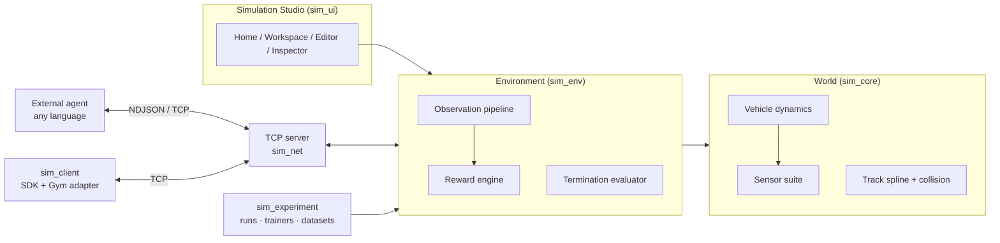

<div align="center">

# Autonomous Systems Simulator

**A modular 3D simulation platform for autonomous-vehicle research,
reinforcement learning, and environment authoring.**


[Quick Start](#quick-start) ·
[Documentation](docs/README.md) ·
[External Agents](#external-agents) ·
[Track Editor](docs/track-editor/track-editor.md)

</div>

---

## What is it?

Autonomous Systems Simulator is a standalone 3D environment built around one
separation of concerns:

```
Simulator = Environment          Your model = Agent
```

The platform owns the world — track geometry, vehicle dynamics, sensors,
observations, actions, rewards, termination, scenarios, recording, and
evaluation. Your AI stays outside: it connects over a high-throughput NDJSON
TCP protocol (any language) or through a standard `gymnasium.Env` adapter
(PyTorch / SB3 / CleanRL / custom). The simulator never dictates your
algorithm — it is strictly the environment.

Everything is a **data-driven component**, not hard-coded game logic: tracks,
sensors, reward terms, termination rules, scenarios, and randomization are all
authored visually or described in a serializable `.sim.json` project document,
versioned by content fingerprint.

## What can it do?

| Capability | Status |
|---|---|
| 3D simulation (ModernGL) | ✅ Chase / hood / top-down / orbit cameras |
| Visual track authoring | ✅ 2D editor — splines, entities, undo/redo |
| Track templates & library | ✅ 7 templates + bundled presets, thumbnails, favorites |
| Vehicle dynamics | ✅ Single-track dynamic model, friction-ellipse tires, 240 Hz substeps |
| Sensors | ✅ RGB camera (offscreen FBO), 2D LiDAR, IMU, vehicle-state — per-sensor rate/latency/noise |
| RL environment contract | ✅ Declarative obs/action/reward/termination + leakage guard |
| Gymnasium adapter | ✅ `SimGymEnv` (Box/Discrete/Dict spaces) |
| External agents over TCP | ✅ NDJSON protocol 2.1, any language |
| Headless training | ✅ `--headless`, `--num-envs N` (one port, N envs) |
| Trainers | ✅ PPO / SAC / DQN / BC (torch) + PID/random reference agents |
| Experiments | ✅ Fingerprinted manifests, runs, batches, workers, metrics |
| Scenarios & domain randomization | ✅ 6 built-in scenarios + seeded randomization |
| Recording & replay | ✅ Episode recording, timeline scrub/step, eval replays |
| Datasets | ✅ `transitions_v1` export, validation, splits, BC training |
| Validation | ✅ Environment validator — RL-readiness gating |
| Vehicle dynamics lab | ✅ DYNAMICS tab maneuver suite + export |
| Standalone Windows build | ✅ PyInstaller onedir — no Python on target |
| Continual multi-track RL (`agentRL/`) | 🧪 Standalone library — torch PPO/SAC agents, continual trainer, E001–E010 experiment matrix; not wired into `sim_experiment` |

## The Studio workflow

```
Launch → Track Library → Create / Open track → Track Editor
  → Configure agent · sensors · rewards · scenario (Environment Inspector)
  → Run Simulation → Record episodes → Replay → Experiments → Datasets
```

<table>
<tr>
  <td><br/><sub>Track editor — spline authoring canvas</sub></td>
  <td><br/><sub>Live simulation — telemetry + reward decomposition</sub></td>
</tr>
<tr>
  <td><br/><sub>Environment Inspector — reward composer</sub></td>
  <td><br/><sub>Replay player — timeline transport</sub></td>
</tr>
<tr>
  <td><br/><sub>Sensor authoring</sub></td>
  <td><br/><sub>Vehicle dynamics validation lab</sub></td>
</tr>
</table>

Dark and light themes included — see the
[full screenshot tour](docs/user-guide/studio-home.md).

---

## Quick start

```bash
git clone https://github.com/Ziad-Abaza/Autonomous-Systems-Simulator.git
cd Autonomous-Systems-Simulator
pip install numpy pygame moderngl opencv-python gymnasium

python main.py                  # Simulation Studio (home → workspace)
```

Then: **New Track → pick a template → SIMULATE tab → drive with WASD**.

```bash
python main.py --track oval             # open a track straight into the studio
python main.py --headless               # headless env server on port 8765
python main.py --headless --num-envs 8  # 8 parallel envs on one port
python main.py --track serpentine --width 1600 --height 900
```

Full CLI flags and launch modes: [Getting Started](docs/getting-started/quickstart.md).

## External agents

Start a headless server, then drive it from any Python process:

```python
from sim_client import SimGymEnv

env = SimGymEnv(host="127.0.0.1", port=8765)   # connects on construction
obs, info = env.reset(seed=42)                # obs: float32 Box(23)

for step in range(1000):
    action = env.action_space.sample()        # [steer -1..1, throttle 0..1, brake 0..1]
    obs, reward, terminated, truncated, info = env.step(action)
    if terminated or truncated:
        obs, info = env.reset()
env.close()
```

Or let the included PID driver take the wheel (works against the live Studio
too — the interactive app always hosts the TCP server):

```bash
python -m sim_client.agents.pid_driver 127.0.0.1 8765
```

Non-Python agents: the wire protocol is newline-delimited JSON — see the
[TCP protocol reference](docs/agents/tcp-protocol.md).

## Training

```bash
python -m sim_experiment.cli validate-env --project presets/oval_circuit.sim.json
python -m sim_experiment.cli create --project presets/oval_circuit.sim.json \
    --algorithm ppo --timesteps 50000 --seed 42 --name lane_keep_v1
python -m sim_experiment.cli launch <experiment_id> --wait 30
python -m sim_experiment.cli evaluate <experiment_id> <run_id>
```

PPO, SAC, DQN, and behavioral-cloning trainers are included (PyTorch).
Experiments are immutable, fingerprinted manifests with run tracking,
checkpoints, evaluation suites, batch seed sweeps, and dataset export —
orchestrated from the CLI or the Studio's **TRAIN** inspector tab.
See [Reinforcement Learning](docs/reinforcement-learning/rl-overview.md) and
[Training](docs/reinforcement-learning/training.md).

---

## Documentation

| | |
|---|---|
| **Get started** | [Installation](docs/getting-started/installation.md) · [Quick Start](docs/getting-started/quickstart.md) · [First Simulation](docs/getting-started/first-simulation.md) |
| **Using the Studio** | [Home & Library](docs/user-guide/studio-home.md) · [Simulation](docs/user-guide/simulation.md) · [Environment Inspector](docs/user-guide/environment-inspector.md) · [Keyboard & Mouse](docs/user-guide/keyboard-shortcuts.md) |
| **Authoring** | [Track Editor](docs/track-editor/track-editor.md) · [Project file schema (.sim.json)](docs/configuration/project-schema.md) |
| **Simulation internals** | [Sensors](docs/sensors/sensors.md) · [Vehicle Dynamics](docs/vehicle-dynamics/vehicle-model.md) · [Performance](docs/performance/performance.md) |
| **AI / RL** | [RL Environment](docs/reinforcement-learning/rl-overview.md) · [Training](docs/reinforcement-learning/training.md) · [External Agents](docs/agents/external-agents.md) · [TCP Protocol](docs/agents/tcp-protocol.md) |
| **Research workflow** | [Experiments](docs/experiments/experiments.md) · [CLI Reference](docs/experiments/cli-reference.md) · [Datasets](docs/datasets/datasets.md) · [Recording & Replay](docs/recording-replay/recording-and-replay.md) |
| **Reference** | [Settings](docs/configuration/settings-reference.md) · [Glossary](docs/reference/glossary.md) · [FAQ](docs/reference/faq.md) · [Compatibility](docs/reference/compatibility.md) · [Troubleshooting](docs/troubleshooting/troubleshooting.md) |
| **Contributing** | [Architecture](docs/architecture/architecture.md) · [Development Guide](docs/development/development.md) · [Standalone Build](docs/development/standalone-build.md) |

---

## Architecture



Packages: `sim_core` (physics/sensors/track), `sim_env` (RL contract),
`sim_render` (ModernGL), `sim_ui` (studio), `sim_net` (TCP),
`sim_client` (SDK + agents), `sim_recorder`, `sim_project` (documents),
`sim_experiment` (training platform), `agentRL` (experimental continual RL).

Details: [Architecture](docs/architecture/architecture.md).

## Tests

```bash
python -m pytest tests/ -q          # 542 tests (~8 min)
python tools/smoke_interactions.py  # studio UI interaction harness
python tools/tcp_recording_e2e.py   # TCP recording end-to-end
python tools/ui_shots.py            # render every screen → assets/screenshots/qa/
```

## Standalone Windows build

```bash
python build/package_windows.py
# → dist/AI_Environment_Simulator/AI_Environment_Simulator.exe
```

No Python or runtimes required on the target machine. Note: torch-based
trainers are excluded from the bundle — training requires a source install.
See [Standalone Build](docs/development/standalone-build.md).

## Contributing

[Development guide](docs/development/development.md) covers the repo layout,
test suite, and extension points (sensors, reward components, termination
rules, entities, trainers, UI).

## License

No license file is currently declared in this repository — all rights
reserved by the author unless one is added.
