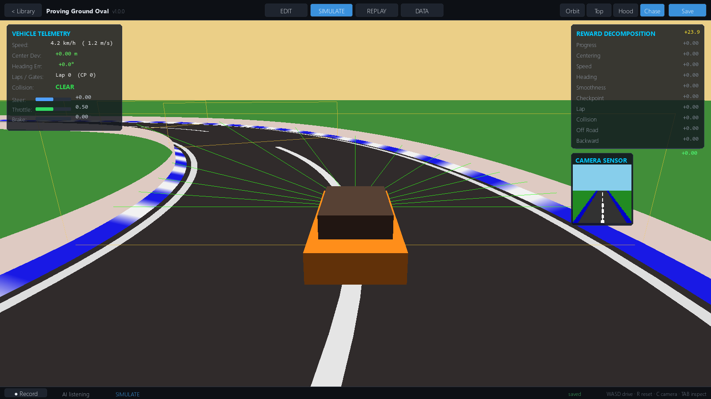
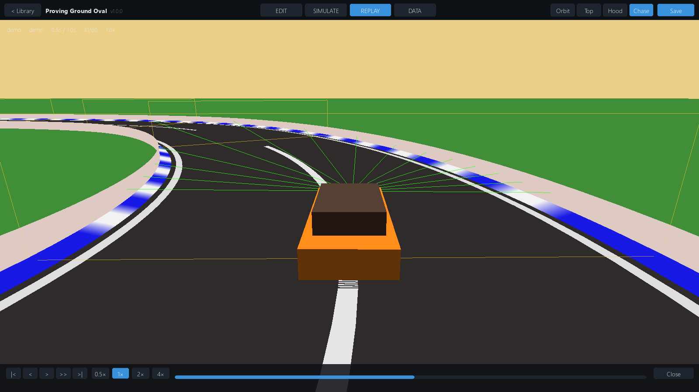
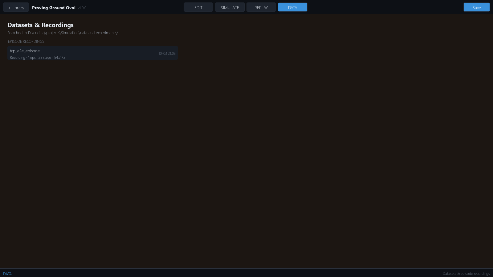
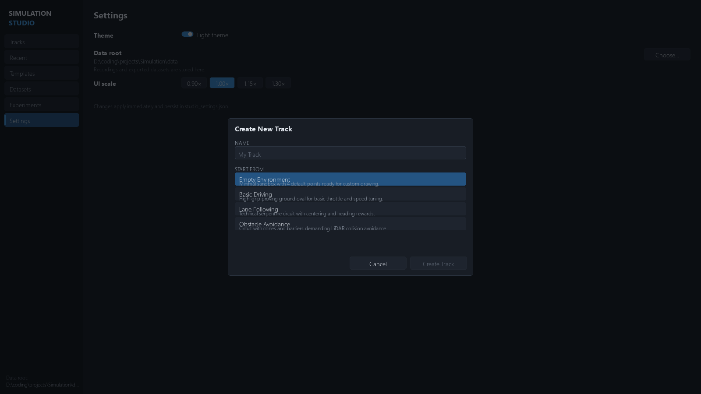

# Simulation Studio — Autonomous Vehicle RL Platform

A standalone 3D simulation environment for **reinforcement learning, autonomous
vehicle training, and visual environment authoring**.

Everything — vehicle physics, road geometry, sensors, observations, actions,
rewards, termination, scenarios — is a **modular, data-driven component**, not
hard-coded racing-game logic. The simulator is strictly the *Environment*;
your model is the *Agent*. It connects over a high-throughput TCP protocol or a
standard `gymnasium.Env` interface, and packages into a zero-dependency Windows
executable.

<p align="center">
  
</p>

---

## Screenshots

<p align="center">
  
  
  
  
  
  
  
  
</p>

---

## The Studio Workflow

```
Launch → Track Library → Create or Open a Track → Track Editor
  → Configure Environment / Agent / Rewards → Run Simulation
  → Record Episodes → Inspect Replay → Manage Training Data → Experiments
```

- **Track Library** — cards with generated thumbnails, templates, favorites,
  recents, rename/duplicate/delete.
- **Track Editor** — dedicated 2D authoring canvas: drag control points,
  insert on edges, place entities, snap-to-grid, fit-all/fit-selection,
  outline rail, undo/redo (full-document snapshots).
- **Environment Inspector** — agent, observation, action, reward,
  termination, scenario, validation, and training panels with live
  readiness gating and issue navigation.
- **Simulation** — chase/hood/top-down/orbit cameras, telemetry + reward
  decomposition HUD, WASD driving or external TCP agent.
- **Recording & Replay** — per-episode recording with manifest, transport
  timeline, scrub/step/speed control.
- **Datasets & Experiments** — browse recorded episodes, exported training
  datasets, and experiment manifests in one place.
- **Dark + light themes**, persistent settings.

---

## Core Features

**Track & Road Authoring**
- Catmull-Rom spline with uniform arc-length parameterization.
- Variable road width, 3D elevation and banking per control point.
- Guardrails, concrete walls, curbs, or open boundaries.
- Real-time procedural 3D mesh generation.

**Vehicle Dynamics**
- 4-wheel dynamic model, non-linear brush tire slip (Pacejka-style).
- Low-speed kinematic ↔ high-speed dynamic blending.
- Aero drag, rolling resistance, steering-rate limits, OBB collision.

**Sensor Suite** (independent update rates, noise models)
- Synthetic RGB camera (offscreen FBO), multi-beam LiDAR/rangefinder,
  vehicle-state & kinematics sensor, 6-axis IMU with bias drift.

**Reward & Termination**
- Composable weighted terms (progress, centering, speed, heading,
  smoothness, checkpoints, collision) — every component decomposed in
  `info["reward_breakdown"]`.
- Explicit termination reasons (`collision`, `off_road`,
  `wrong_direction`, `checkpoint_timeout`, `lap_completed`).

**External AI & Training**
- TCP server streaming NDJSON packets (`TCP_NODELAY`), plus a
  `SimGymEnv` gymnasium adapter for PyTorch / SB3 / CleanRL.
- Ready-made agents: `pid_driver`, `random_agent`, `ppo_train`.
- Multi-environment headless mode (`--num-envs`) for parallel training.
- Experiment manifests, run manager, dataset export (`transitions_v1`).

**Recording & Replay**
- Step trajectories with actions, decomposed rewards, collisions;
  manual *and* external-TCP-step recording.

**Scenarios & Randomization**
- Seedable domain randomization (mass, friction, noise, spawn).
- Weather / lighting / obstacle scenarios decoupled from road geometry.

---

## Quickstart

```bash
python main.py                    # Simulation Studio (home → workspace)
python main.py --track oval       # open a track straight into the studio
python main.py --headless         # headless single-env server (port 8765)
python main.py --headless --num-envs 8   # parallel environments for training
```

**Simulate tab controls:** `WASD` / arrows to drive · `R` reset ·
`C` cycle camera · `Tab` observation inspector · `Space` handbrake.

**Edit tab shortcuts:** `Ctrl+S` save · `Ctrl+Z / Ctrl+Y` undo/redo ·
`A` fit-all · `F` fit-selection · `Del` delete selection · `Esc` cancel.

---

## Connect an External Agent

```python
from sim_client import SimGymEnv

env = SimGymEnv(host="127.0.0.1", port=8765)
obs, info = env.reset(seed=42)

for step in range(1000):
    action = env.action_space.sample()          # or model.predict(obs)
    obs, reward, terminated, truncated, info = env.step(action)
    print(info["reward_breakdown"])             # live reward decomposition
    if terminated or truncated:
        obs, info = env.reset()
env.close()
```

Or run the included autonomous driver against a running simulator:

```bash
python -m sim_client.agents.pid_driver 127.0.0.1 8765
```

---

## Tests

```bash
python -m pytest tests/ -q          # full suite — 390+ tests
python tools/smoke_interactions.py  # studio UI interaction harness (25 checks)
python tools/tcp_recording_e2e.py   # TCP external-step recording E2E (15 checks)
python tools/ui_shots.py            # render all screens to docs/phase7_shots/
```

Coverage: spline math, mesh generation, vehicle physics, sensors, reward
decomposition, domain randomization, persistence, TCP protocol, multi-env
server, gymnasium compliance, track library, widget layer, edit history.

## Build (Standalone Windows)

```bash
python build/package_windows.py
# → dist/AI_Environment_Simulator/AI_Environment_Simulator.exe
```

No Python, Docker, or runtimes required on the target machine.

---

## Architecture

```
sim_core/     physics, spline/track geometry, sensors, world entities
sim_env/      RL environment contract — spaces, rewards, termination, scenarios
sim_render/   ModernGL renderer, cameras, offscreen sensor FBO
sim_ui/       Simulation Studio — home, workspace, editor, inspector,
              replay, datasets, dialogs, widget layer, theme tokens
sim_net/      TCP protocol + single/multi-env servers
sim_client/   Python SDK, gymnasium adapter, reference agents
sim_recorder/ episode recording + replay
sim_project/  *.sim.json documents, library service, settings, presets
sim_experiment/ experiment manifests, runs, datasets, orchestration
```

`Environment = World + Simulation + Agent + Sensors + Actions +
Observations + Rewards + Termination + Scenario`

The simulator stays completely decoupled from any specific RL algorithm —
it is the environment; the model lives outside.
