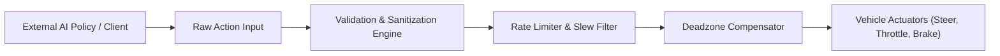

# Action Schema & Designer Specification

**Google DeepMind Advanced Agentic Coding — Phase 3 Specification**  
**Component:** Agent Action Space & Actuation Pipeline  
**Source Implementation:** [`sim_env/action_designer.py`](file:///D:/coding/projects/Simulation/sim_env/action_designer.py)  

---

## 1. Action Space Architecture

The **Action Designer** defines the contract between the external RL agent and the simulated vehicle actuators. It supports continuous multivariate control as well as discrete discrete target setpoints.



---

## 2. Space Types & Channel Configurations

### Continuous Action Space
A continuous action space defines independent scalar channels:

```python
@dataclass
class ActionChannelConfig:
    name: str                           # Channel identifier ("steering", "throttle", "brake")
    min_value: float = -1.0             # Lower bound
    max_value: float = 1.0              # Upper bound
    default_value: float = 0.0          # Fallback value on reset or error
    scale: float = 1.0                  # Linear multiplier
    deadzone: float = 0.0               # Absolute threshold below which output is 0.0
    rate_limit: float = 0.0             # Maximum change per second (0.0 = unlimited)
    description: str = ""
```

**Standard Vehicle Default Continuous Channels:**
1. **`steering`**: Range $[-1.0, 1.0]$, default $0.0$, deadzone $0.02$, rate limit $4.0\text{ rad/s}$.
2. **`throttle`**: Range $[0.0, 1.0]$, default $0.0$, deadzone $0.0$, rate limit $10.0\text{ /s}$.
3. **`brake`**: Range $[0.0, 1.0]$, default $0.0$, deadzone $0.0$, rate limit $15.0\text{ /s}$.

### Discrete Action Space
A discrete action space maps integer tokens $0 \le a < N$ to preconfigured multi-channel setpoints:

```python
@dataclass
class DiscreteActionOption:
    action_index: int
    name: str
    values: Dict[str, float]
    description: str = ""
```

**Standard Vehicle Default Discrete Options:**
- Index `0`: `coast` $\rightarrow$ `{steering: 0.0, throttle: 0.0, brake: 0.0}`
- Index `1`: `accelerate_straight` $\rightarrow$ `{steering: 0.0, throttle: 1.0, brake: 0.0}`
- Index `2`: `steer_left` $\rightarrow$ `{steering: -0.5, throttle: 0.4, brake: 0.0}`
- Index `3`: `steer_right` $\rightarrow$ `{steering: 0.5, throttle: 0.4, brake: 0.0}`
- Index `4`: `brake_hard` $\rightarrow$ `{steering: 0.0, throttle: 0.0, brake: 1.0}`

---

## 3. Defensive Action Sanitization & Validation

Invalid actions from external AI frameworks or network clients must never corrupt physical simulation state. The `CompiledActionDecoder` executes defensive filtering:

```python
def decode(self, raw_action: Any, dt: float) -> Tuple[Dict[str, float], bool, str]:
    # Returns (decoded_actions, is_valid, error_reason)
```

### Safety Rules Enforced

| Malformed Input Type | Test Case Behavior | Engine Reaction |
| :--- | :--- | :--- |
| **`NaN` / `Infinity`** | `np.array([np.nan, 0.5, 0.0])` | Sanitized to `default_value` via `np.nan_to_num`. Flags `is_valid = False` with warning. |
| **Out-of-Range** | `np.array([2.5, -0.5, 3.0])` | Safely clamped to channel `[min_value, max_value]`. Simulation continues. |
| **Wrong Dimension** | `np.array([0.5])` (1 vs 3) | Padded with channel defaults. Flags `is_valid = False`. |
| **Excess Dimensions** | `np.array([0.1, 0.2, 0.3, 0.9])` | Sliced to expected dimensions. Flags `is_valid = False`. |
| **Invalid Discrete Index**| `raw_action = 99` (only 5 actions) | Clamped to index 0 (`coast`). Flags `is_valid = False`. |
| **Type Mismatch** | String `"accel"` or None | Replaced by default vector. Flags `is_valid = False`. |

---

## 4. Rate Limiting & Deadzone Compensation

### Deadzone Mapping
Small neural network fluctuations around zero are eliminated to prevent actuator flutter:
$$\text{val}_{\text{dz}} = \begin{cases} 0.0 & \text{if } |val| \le \text{deadzone} \\ val & \text{otherwise} \end{cases}$$

### Rate Limiting (Slew-Rate Filtering)
For continuous channels, physical actuators cannot change position instantaneously:
$$\Delta_{\max} = \text{rate\_limit} \times dt$$
$$\text{val}_{\text{new}} = \text{val}_{\text{prev}} + \text{clamp}(\text{val} - \text{val}_{\text{prev}}, -\Delta_{\max}, \Delta_{\max})$$
*Note:* Discrete action options bypass rate limiting to respect discrete setpoints directly.

---

## 5. Machine-Readable Action Schema Export

External clients query the action schema via the TCP protocol `DISCOVER_CONTRACT` or inspection export:

```json
{
  "space_type": "continuous",
  "action_dim": 3,
  "channels": [
    {
      "name": "steering",
      "min_value": -1.0,
      "max_value": 1.0,
      "default_value": 0.0,
      "scale": 1.0,
      "deadzone": 0.02,
      "rate_limit": 4.0,
      "description": "Normalized steering angle [-1: max left, +1: max right]"
    },
    {
      "name": "throttle",
      "min_value": 0.0,
      "max_value": 1.0,
      "default_value": 0.0,
      "scale": 1.0,
      "deadzone": 0.0,
      "rate_limit": 10.0,
      "description": "Normalized throttle effort [0: idle, 1: full drive]"
    },
    {
      "name": "brake",
      "min_value": 0.0,
      "max_value": 1.0,
      "default_value": 0.0,
      "scale": 1.0,
      "deadzone": 0.0,
      "rate_limit": 15.0,
      "description": "Normalized braking effort [0: released, 1: full brake]"
    }
  ]
}
```
