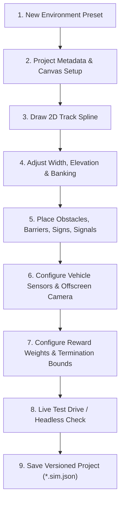

# Interactive Environment Authoring Guide

This guide details the complete authoring workflow in the **AI Environment Simulation Studio (Phase 2)**. The platform enables AI researchers and robotics engineers to design, inspect, configure, and validate rich continuous driving environments without editing source code.

---

## 1. End-to-End Authoring Workflow

The authoring studio follows a systematic lifecycle designed to establish deterministic, reproducible simulation contracts:



---

## 2. Track Spline Authoring & Geometry

The 2D Track Editor provides direct manipulation of Catmull-Rom parametric splines with real-time continuous geometry rebuilds.

### Control Point Operations
- **Add Point**: Double-click or click with the Add Point tool active on empty canvas space. New points are appended sequentially or inserted between nearest segment nodes.
- **Select Point**: Left-click on any control point node or handle.
- **Move Point**: Left-drag a selected point to reposition it in continuous world coordinates.
- **Delete Point**: Press `Delete` or `Backspace` to remove selected point (minimum 3 points maintained for loop validity).
- **Road Width Handle**: Drag the perpendicular width handle to adjust local road cross-section dynamically.
- **Close/Open Circuit**: Press `C` or toggle "Closed Track" in the Inspector to cycle between open point-to-point stages and closed circuits.

---

## 3. Visual Editing Gizmos

The editor provides real-time visual diagnostics communicating environment mechanics:

| Gizmo | Visual Representation | Semantic Purpose |
| :--- | :--- | :--- |
| **Curvature Spectrum** | Segment color coded **Green** ($\kappa < 0.02$), **Yellow** ($\kappa < 0.05$), **Red** ($\kappa \ge 0.05$) | Instantly identifies severe cornering radiuses that exceed vehicle lateral tire grip. |
| **Direction Chevrons** | Directional arrows along spline centerline | Visualizes track travel direction, checkpoint sequencing, and progress vector. |
| **Road Width Preview** | Dynamic parallel boundary outlines | Displays actual tarmac boundaries and road margins. |
| **Elevation / Slope Badge** | Text badge showing `Z: ±X.Xm (Slope: Y%)` | Informs user of 3D topological climbs and descents. |
| **Banking Indicators** | Transverse angle line at node | Visualizes superelevation and camber (in degrees). |
| **Spawn Orientation Arrow** | Yellow vehicle silhouette with heading vector | Confirms vehicle initial pose and launch direction. |
| **Checkpoint Gates** | Transverse cyan line with numbered index badge | Displays waypoint triggering gates and sector division. |

---

## 4. Entity Placement & Manipulation

Entities are first-class simulation elements populated in the world:

```
[Palette Tool] -> Left-Click Canvas -> Instantiate WorldEntity -> Edit in Inspector
```

### Supported Entity Tools:
1. **Static Obstacle** (`O`): Crate, barrel, or boulder hazards with solid collision boxes.
2. **Barrier** (`B`): Concrete jersey barriers, guardrails, and tire walls with customizable lengths.
3. **Traffic Cone** (`C`): Knotted or rigid traffic cones for chicanes and slalom zones.
4. **Traffic Sign** (`S`): Regulatory, warning, and speed limit signage for vision training.
5. **Traffic Light** (`T`): Dynamic tri-color signal heads with autonomous state machines.
6. **Checkpoint Gate** (`K`): Waypoint gates measuring continuous progress and sector times.
7. **Spawn Point** (`P`): Grid start slot and launch velocity vector.

---

## 5. Bidirectional Scene Hierarchy

The Authoring Studio maintains strict bidirectional synchronization:
- **Canvas $\rightarrow$ Inspector**: Clicking any control point, obstacle, barrier, or sensor in the 2D viewport highlights the object in the Scene Hierarchy tree and opens its dedicated tab in the Environment Inspector.
- **Inspector $\rightarrow$ Canvas**: Selecting an entity in the Inspector's `SCENE` list centers and focuses the 2D canvas on the corresponding object and illuminates its bounding gizmo.

---

## 6. Authoring Shortcuts & Keybindings

| Key / Input | Action |
| :--- | :--- |
| `Left Click` | Select control point or world entity |
| `Left Drag` | Move selected point or entity |
| `Right Drag` | Pan 2D authoring canvas |
| `Scroll Wheel` | Zoom in / out smoothly centered on mouse |
| `Delete` / `Backspace` | Delete selected control point or entity |
| `C` | Toggle closed loop circuit |
| `R` | Reset camera view / Rebuild geometry |
| `Tab` | Cycle inspector tabs |
| `Space` | Toggle simulation pause / run |
| `Ctrl + S` | Save environment project (`*.sim.json`) |
| `Ctrl + O` | Open environment project |
