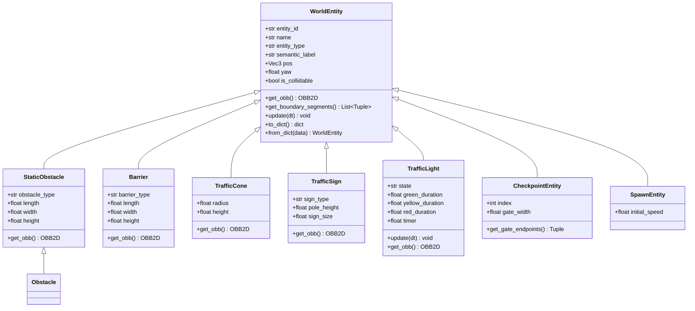

# Semantic World Entity Model Architecture

This document describes the design, class hierarchy, and simulation integration of the **Semantic World Entity Model** implemented in Phase 2 (`sim_core/world/entity.py`).

---

## 1. Architectural Principles

In contrast to early monolithic obstacle implementations, Phase 2 treats all interactive and decorative objects as first-class **World Entities**:

1. **Semantic Identity**: Every entity carries a unique identifier (`entity_id`), type classification (`entity_type`), and semantic category (`semantic_label`) to support future multi-task RL, semantic segmentation, and perception benchmarks.
2. **Decoupled Geometry & Physics**: Bounding geometry is represented by 2D Oriented Bounding Boxes (`OBB2D`) and boundary line segments. Non-collidable entities (e.g. traffic signs, trigger checkpoints) do not inject physical collision constraints but remain visible to vision and raycasting sensors.
3. **Dynamic Capability**: Entities implement an optional `update(dt)` lifecycle method, permitting active scene elements such as cycling traffic lights.
4. **Clean Serialization**: Entities serialize to and deserialize from JSON dictionaries with versioned Schema 2.0.0 contracts.

---

## 2. Class Hierarchy



---

## 3. Supported Entity Specifications

| Entity Type | Collidable | Default Dimensions (L × W × H) | Semantic Label | Key Configurable Properties |
| :--- | :---: | :---: | :--- | :--- |
| **StaticObstacle** | Yes | $2.0 \times 1.0 \times 1.0\text{ m}$ | `hazard` | `obstacle_type` (box, barrel, crate, rock), dimensions |
| **Barrier** | Yes | $3.0 \times 0.6 \times 0.9\text{ m}$ | `infrastructure` | `barrier_type` (concrete, guardrail, tire_wall), length |
| **TrafficCone** | Yes | $r=0.3\text{ m}, h=0.75\text{ m}$ | `hazard` | `radius`, `height` |
| **TrafficSign** | Optional | $0.6 \times 0.6 \times 2.2\text{ m}$ | `traffic_control` | `sign_type` (speed_limit_50, stop, yield, turn), pole height |
| **TrafficLight** | Optional | $0.4 \times 0.6 \times 3.2\text{ m}$ | `traffic_control` | `state` (green, yellow, red), `green_duration`, `yellow_duration`, `red_duration` |
| **Checkpoint** | No (Trigger) | Gate Width $12.0\text{ m}$ | `waypoint` | `index`, `gate_width` |
| **Spawn** | No | Vehicle footprint | `spawn` | `initial_speed` |

---

## 4. Simulation & Sensor Integration

### 1. Broadphase Registration
All collidable entities register their bounding radiuses in `SpatialHashGrid2D`. The broadphase retrieves only entities within the immediate bounding radius of the vehicle before narrowphase SAT polygon testing.

### 2. LiDAR Raycasting
Entities provide boundary line segments via `get_boundary_segments()`. The environment raycaster includes these segments alongside track boundary walls, allowing the AI agent to perceive obstacles, barriers, and cones using rangefinder rays.

### 3. Offscreen Camera Rendering
Entities generate 3D rendering primitives during 3D framebuffer generation. Traffic lights render dynamic emissive colored lenses reflecting their current internal state.

---

## 5. Schema 2.0.0 Serialization

Entities serialize into the project container under the top-level `"entities"` array:

```json
{
  "schema_version": "2.0.0",
  "name": "Urban Proving Ground",
  "entities": [
    {
      "entity_id": "a1b2c3d4",
      "name": "Stop Sign",
      "entity_type": "traffic_sign",
      "semantic_label": "traffic_control",
      "pos": [12.5, 34.0, 0.0],
      "yaw": 1.57079,
      "is_collidable": false,
      "sign_type": "stop",
      "pole_height": 2.2,
      "sign_size": 0.6
    }
  ]
}
```

Legacy Schema 1.0.0 files containing `"obstacles"` are automatically ingested and promoted to `StaticObstacle` entities upon loading.
