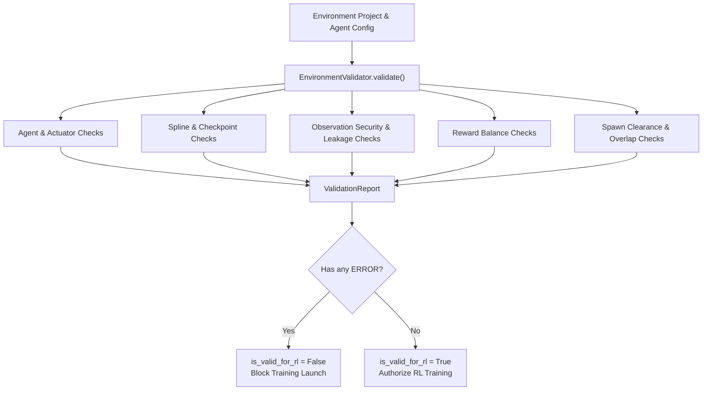

# Environment Validation Engine & Training Gatekeeper Specification

**Google DeepMind Advanced Agentic Coding — Phase 3 Specification**  
**Component:** Validation Gatekeeper, Geometric Analysis, & Pre-flight Diagnostics  
**Source Implementation:** [`sim_env/validator.py`](file:///D:/coding/projects/Simulation/sim_env/validator.py)  

---

## 1. Architectural Role: The Pre-Flight Gatekeeper

In reinforcement learning pipelines, subtle environment bugs (such as an inverted action bound, overlapping control points causing spline infinity, or obstacles placed directly on top of the vehicle spawn pose) can cause training jobs to fail hours into execution or learn invalid policies.

The **Environment Validator** functions as an automated pre-flight gatekeeper. It performs static analysis and geometric verification across all simulation subsystems.



---

## 2. Issue Severity Classification

Every discovered issue is categorized into one of three severities:

1. **`ERROR` (Critical Failure)**:
   - Violates RL mathematical validity, security, or physical consistency.
   - Sets `report.is_valid_for_rl = False`.
   - **Blocks training bundle export and runner execution.**
2. **`WARNING` (Suboptimal Configuration)**:
   - Does not prevent execution but may degrade training sample efficiency (e.g. no progress reward, or very tight deadzones).
3. **`INFO` (Sanity Confirmation)**:
   - Validates correct configuration counts (e.g. confirming 20 checkpoints active).

---

## 3. Subsystem Validation Rules

### 1. Agent & Identity
- **Rule**: `agent_id` must be a non-empty string.
- **Rule**: `entity_type` must be specified (e.g. `"vehicle"`).
- **Rule**: Action space, observation space, reward function, and termination rules must be attached.

### 2. Track & Road Geometry
- **Rule**: Road definition must contain at least 3 control points.
- **Rule (Degeneracy Check)**: No two control points may be within $0.5\text{m}$ of each other. Overlapping points cause tangent singularities in Catmull-Rom spline formulation.
- **Rule**: Road must contain at least 2 checkpoints for progress tracking.

### 3. Action Space
- **Rule (Continuous)**: For every channel, $\text{min\_value} < \text{max\_value}$.
- **Rule (Discrete)**: Must provide at least 2 selectable discrete actions.

### 4. Observation Space & Security
- **Rule**: Observation space must contain at least one enabled channel.
- **Rule**: Vector dimensions must be $> 0$.
- **Rule (Security)**: `validate_no_leakage()` must pass. If any channel has category `DEBUG_TELEMETRY` or `ORACLE_GROUND_TRUTH`, an `ERROR` is issued.

### 5. Reward Function
- **Rule**: At least one reward component must be enabled.
- **Rule**: Total reward weights must not be uniformly zero.
- **Rule (Balance Warning)**: If only penalties exist without forward progress incentives, a `WARNING` is issued.

### 6. Termination Rules
- **Rule**: At least one terminal failure rule (e.g. collision or off-road) must be active.
- **Rule**: At least one truncation horizon rule (max steps or timeout) must be active to prevent infinite trapped rollouts.

### 7. Spawn & Obstacle Clearance
- **Rule**: Spawn point cannot be placed inside an obstacle. If any obstacle entity is located $< 3.0\text{m}$ from the agent spawn point, an `ERROR` is issued.

---

## 4. Machine-Readable Validation Report Example

```json
{
  "is_valid_for_rl": true,
  "error_count": 0,
  "warning_count": 0,
  "info_count": 3,
  "issues": [
    {
      "severity": "INFO",
      "subsystem": "Track",
      "message": "Track contains 20 checkpoint gates for progress tracking.",
      "remediation": ""
    },
    {
      "severity": "INFO",
      "subsystem": "Observation",
      "message": "Observation space contains 8 active channels (total vector dim: 23). Zero leakage verified.",
      "remediation": ""
    },
    {
      "severity": "INFO",
      "subsystem": "Reward",
      "message": "Reward function contains 11 components (8 active, net positive progress weight: 1.0).",
      "remediation": ""
    }
  ]
}
```
