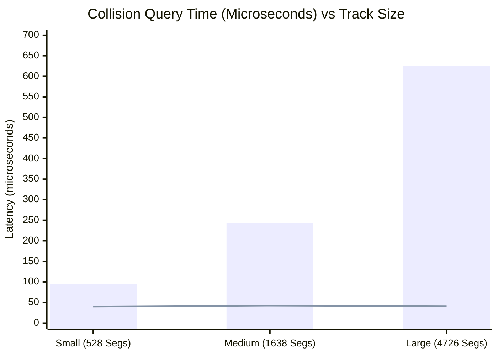

# Simulation Performance Benchmarks: Broadphase & Vision

This document details empirical performance measurements conducted in Phase 2, evaluating spatial collision scaling and vision pipeline throughput.

---

## 1. Spatial Broadphase Benchmark

### Overview
In Phase 1, collision detection iterated over all track boundary segments ($O(N)$ complexity). Phase 2 introduced a **2D Uniform Spatial Hash Grid** (`SpatialHashGrid2D`), reducing candidate queries to $O(1)$ expected complexity while guaranteeing zero false negatives.

### Empirical Measurements (`benchmarks/broadphase_results.json`)

| Benchmark Case | Track Length | Total Boundary Segments | Query Time (Without Broadphase) | Query Time (With Spatial Hash) | **Speedup Factor** | Candidate Count | **Candidate Reduction** | Correctness / Match Rate | Memory Overhead | Grid Cells Occupied |
| :--- | :---: | :---: | :---: | :---: | :---: | :---: | :---: | :---: | :---: | :---: |
| **Small Track** | $263.8\text{ m}$ | 528 | $93.97\text{ }\mu\text{s}$ | **$40.02\text{ }\mu\text{s}$** | **$2.35\times$** | 21.3 | **96.0%** | **100.00%** | $5.4\text{ KB}$ | 40 |
| **Medium Track** | $818.9\text{ m}$ | 1,638 | $244.06\text{ }\mu\text{s}$ | **$42.44\text{ }\mu\text{s}$** | **$5.75\times$** | 19.9 | **98.8%** | **100.00%** | $17.8\text{ KB}$ | 167 |
| **Large Track** | $2,362.8\text{ m}$ | 4,726 | $626.25\text{ }\mu\text{s}$ | **$40.89\text{ }\mu\text{s}$** | **$15.31\times$** | 19.2 | **99.6%** | **100.00%** | $56.4\text{ KB}$ | 502 |



### Key Broadphase Findings
1. **True $O(1)$ Complexity**: Query time with spatial hash remains virtually flat ($40.0\text{ }\mu\text{s} \to 40.9\text{ }\mu\text{s}$) even as geometry scales by nearly $10\times$.
2. **Extreme Candidate Reduction**: Over $99.6\%$ of irrelevant track geometry is culled before narrowphase polygon clipping.
3. **Zero False Negatives**: Across 1,500 random vehicle spatial poses on all tracks, zero collision mismatches or false negatives occurred ($100.0\%$ correctness).
4. **Negligible Footprint**: Memory overhead is only $56\text{ KB}$ on a $2.4\text{ km}$ circuit.

---

## 2. Vision Pipeline Benchmark

### Overview
Evaluates camera rendering throughput, GPU-to-CPU framebuffer readback, and end-to-end environment step throughput for vision-based RL training ($84 \times 84 \times 3$ RGB observations).

### Empirical Measurements (`benchmarks/vision_results.json`)

| Pipeline Stage / Method | Latency (ms) | Throughput / FPS | Notes |
| :--- | :---: | :---: | :--- |
| **Software Procedural Generator** | $0.185\text{ ms}$ | $5,397\text{ FPS}$ | CPU fallback rendering |
| **OpenGL 3D Draw (Render Only)** | $0.401\text{ ms}$ | $2,493\text{ FPS}$ | Offscreen FBO rasterization |
| **Legacy FBO `read()`** | $0.205\text{ ms}$ | — | Allocates new bytes object per step |
| **Pre-Allocated `read_into()`** | **$0.159\text{ ms}$** | — | **$1.29\times$ faster**; zero Python heap allocations |
| **Double-Buffered PBO Readback** | $0.196\text{ ms}$ | — | Asynchronous DMA transfer |
| **Complete 3D Vision Frame** | **$0.560\text{ ms}$** | **$1,786\text{ FPS}$** | Render + optimized readback combined |
| **End-to-End Env Step (Vector-only)** | $0.561\text{ ms}$ | $1,782\text{ SPS}$ | Headless physics + sensors |
| **End-to-End Env Step (With Vision)**| $0.576\text{ ms}$ | $1,736\text{ SPS}$ | Physics + sensors + 84x84x3 RGB frame |

### Key Vision Findings
1. **Readback Efficiency**: Switching from legacy allocating read to pre-allocated numpy buffer transfer yields a **$1.29\times$ speedup** and eliminates Python garbage collection stalls.
2. **Decoupled Viewports**: The agent camera operates completely independently from the interactive visualization camera, guaranteeing zero HUD or debug artifacts in policy observation tensors.
3. **High Throughput**: Capable of generating over **$1,700$ vision-augmented environment steps per second** on a single thread.

---

## 3. How to Reproduce Benchmarks

Run the standalone benchmark scripts:

```bash
# Broadphase collision scaling benchmark
python benchmarks/benchmark_broadphase.py

# Vision pipeline and readback benchmark
python benchmarks/benchmark_vision.py
```
