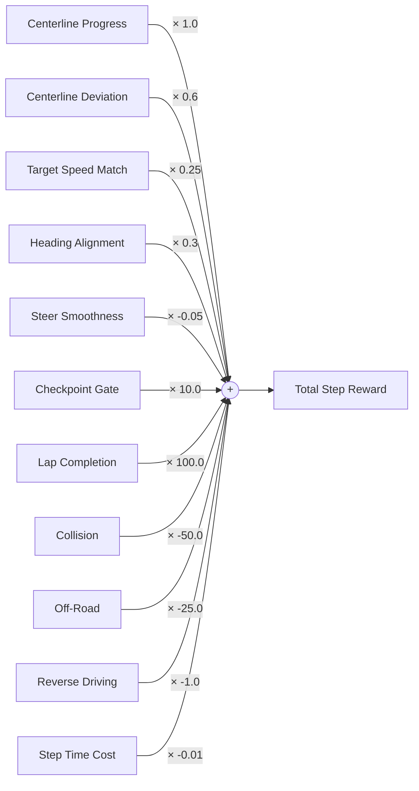

# Modular Reward Designer & Safety Engine Specification

**Google DeepMind Advanced Agentic Coding — Phase 3 Specification**  
**Component:** Reward Function Authoring, Graph Composition, & Runtime Engine  
**Source Implementation:** [`sim_env/reward_designer.py`](file:///D:/coding/projects/Simulation/sim_env/reward_designer.py)  

---

## 1. Modular Reward Architecture

The **Reward Designer** transforms opaque, hard-coded reward arithmetic into a transparent, user-configurable graph of modular components. The user can compose, weight, and parameterize reward components visually without writing Python code.



---

## 2. Standard Reusable Reward Components

| Component ID | Category | Raw Value Calculation | Parameters & Defaults | Default Weight |
| :--- | :--- | :--- | :--- | :--- |
| `progress` | Dense Incentive | Arc-length forward delta $\Delta s$ along centerline | `max_step_delta_m`: $5.0$ | $+1.0$ |
| `centering` | Dense Incentive | Distance from track centerline $d_{\text{center}}$ | `max_distance_m`: $6.0$, `falloff`: `linear` | $+0.5$ |
| `speed` | Dense Incentive | Gaussian or linear proximity to $v_{\text{target}}$ | `target_speed_ms`: $20.0$, `tolerance`: $5.0$ | $+0.2$ |
| `heading` | Dense Incentive | Direction cosine $\cos(\Delta \theta_{\text{track}})$ | None | $+0.3$ |
| `smooth_steer` | Regularizer | Squared steering delta $(\Delta \delta)^2$ | None | $-0.05$ |
| `checkpoint` | Sparse Bonus | Forward gate crossing event | None | $+10.0$ |
| `completion` | Sparse Bonus | Full circuit lap or open track goal | None | $+100.0$ |
| `collision` | Penalty | Contact with barrier, cone, or obstacle | None | $-50.0$ |
| `off_road` | Penalty | Vehicle completely off asphalt ribbon | None | $-25.0$ |
| `reverse` | Penalty | Heading error exceeding backward threshold | `heading_threshold_deg`: $100.0^\circ$ | $-1.0$ |
| `time_penalty`| Regularizer | Per-step operational cost | None | $-0.01$ |

---

## 3. Falloff Curve Formulations

For distance-based components (e.g. centering deviation), the designer supports three mathematical falloff curves:

1. **Linear Falloff:**
   $$f_{\text{linear}}(d, d_{\max}) = \max\left(0.0, 1.0 - \frac{|d|}{d_{\max}}\right)$$

2. **Quadratic Falloff:**
   $$f_{\text{quadratic}}(d, d_{\max}) = \left(\max\left(0.0, 1.0 - \frac{|d|}{d_{\max}}\right)\right)^2$$
   *Focuses incentive heavily near the center, decaying rapidly toward boundaries.*

3. **Exponential Falloff:**
   $$f_{\text{exponential}}(d, d_{\max}) = \exp\left(-3.0 \cdot \min\left(1.0, \frac{|d|}{d_{\max}}\right)\right)$$
   *Smooth, non-zero gradient across entire road width.*

---

## 4. Live Decomposed Debugging

During both interactive UI simulation and headless RL rollouts, every step produces an exact decomposition of active components in `info["reward_breakdown"]`:

```json
{
  "progress": 0.42,
  "centering": 0.36,
  "speed": 0.18,
  "heading": 0.28,
  "smooth_steer": -0.002,
  "checkpoint": 10.0,
  "completion": 0.0,
  "collision": 0.0,
  "off_road": 0.0,
  "reverse": 0.0,
  "time_penalty": -0.01,
  "total": 11.228
}
```
In the UI HUD, each component is visualized with live color-coded contribution bars, allowing researchers to diagnose reward hacking or conflicting incentives immediately.

---

## 5. Reward Safety & Anti-Abuse Guards

Reward functions are strictly protected against game-playing and physical anomalies:

1. **Teleportation Guard**:
   If anomalous physics causes position displacement $\Delta s > \text{max\_step\_delta\_m}$ (e.g. 5m in one 60Hz tick, equivalent to $300\text{ m/s}$), the progress reward is capped to zero.
2. **Reverse Driving Guard**:
   If vehicle heading deviates by $> 90^\circ$ from the centerline tangent vector, forward progress delta is suppressed ($\Delta s \leftarrow 0$), preventing policies from reversing to repeatedly farm checkpoint boundaries.
3. **Monotonic Checkpoint Crossing**:
   Checkpoint gates are sequential. An agent cannot trigger checkpoint $k$ multiple times without first completing the remainder of the circuit.
4. **Strict Temporal Integrity (No Future Information)**:
   Rewards are computed exclusively using states up to time $t$. No future trajectory predictions or oracle looks are accessible.

---

## 6. High-Performance Runtime Compilation (`CompiledRewardEngine`)

- Filters enabled components once during environment setup.
- Evaluates components in contiguous memory using branchless arithmetic.
- Maintains running progress baseline $s_{\text{prev}}$ across episode steps.
- Pre-allocated breakdown dictionary avoids heap fragmentation.
