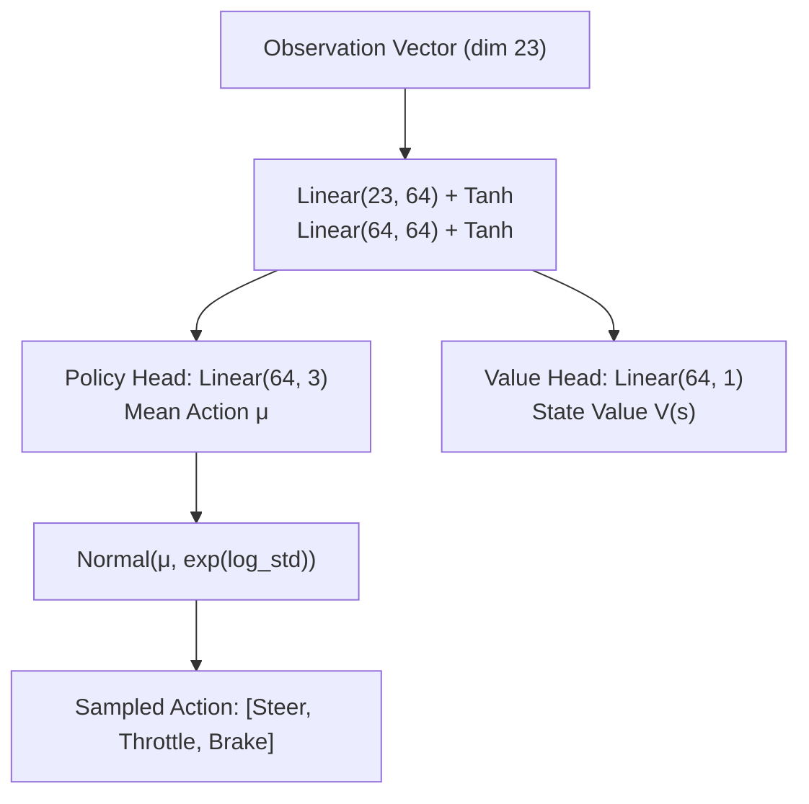

# Reinforcement Learning Benchmark: PPO Baseline

This document summarizes the reproducible **Proximal Policy Optimization (PPO)** continuous control baseline established in Phase 2 (`experiments/baseline_ppo/`).

---

## 1. Benchmark Task Specification

- **Domain**: Continuous Vehicle Control (steering $[-1, 1]$, throttle $[0, 1]$, braking $[0, 1]$).
- **Track**: Standardized Proving Ground Oval ($60\text{ m} \times 35\text{ m}$, width $12\text{ m}$, tarmac friction $\mu = 1.0$).
- **Observation Space**: Continuous vector ($\text{dim}=23$) containing normalized speed, planar velocity, yaw rate, steering angle, centerline offset, heading error, distance to checkpoint, and 15 planar LiDAR rangefinder rays.
- **Physics Rate**: $60\text{ Hz}$ deterministic vehicle dynamics.
- **Objective**: Maximize lap progress while maintaining lane centering and target velocity ($20\text{ m/s}$), avoiding collisions and off-road excursions.

---

## 2. Policy Architecture & Hyperparameters



| Hyperparameter | Value | Description |
| :--- | :--- | :--- |
| **Algorithm** | Continuous PPO with GAE | Actor-Critic with Gaussian action distribution |
| **Policy Network** | MLP $[23 \to 64 \to 64 \to 3]$ | Tanh activations, orthogonal initialization ($\sqrt{2}$) |
| **Value Network** | MLP $[23 \to 64 \to 64 \to 1]$ | Tanh activations, orthogonal initialization ($\sqrt{2}$) |
| **Rollout Length ($T$)** | 1,024 steps | Steps per rollout trajectory |
| **Total Timesteps** | 50,000 steps | Total environment interactions |
| **PPO Epochs** | 4 epochs | SGD passes per rollout buffer |
| **Minibatch Size** | 256 | Batch size for gradient descent |
| **Learning Rate** | $3 \times 10^{-4}$ | Adam optimizer ($\epsilon = 10^{-5}$) |
| **Discount Factor ($\gamma$)** | 0.99 | Temporal discount |
| **GAE Parameter ($\lambda$)** | 0.95 | Generalized Advantage Estimation |
| **Clip Coefficient ($\epsilon$)** | 0.20 | PPO clipped surrogate ratio clamp |
| **Value Coefficient ($c_1$)** | 0.50 | Value function loss weight |
| **Entropy Bonus ($c_2$)** | 0.01 | Policy entropy regularization weight |
| **Max Gradient Norm** | 0.50 | Gradient clipping threshold |

---

## 3. Empirical Results & Performance KPIs

The benchmark was executed on the local runtime environment (`experiments/run_ppo_experiment.py`):

| Key Performance Indicator | Measured Result |
| :--- | :--- |
| **Total Environment Steps** | **49,152 steps** (48 rollout updates) |
| **Wall-Clock Duration** | **138.10 seconds** (~2.3 minutes) |
| **End-to-End Training SPS** | **355.9 steps/sec** (Includes rollouts, forward/backward passes & SGD) |
| **Total Episodes Completed** | 54 episodes |
| **Mean Episode Return** | **719.30** |
| **Max Episode Return** | **720.83** |
| **Mean Episode Duration** | 900.0 steps |
| **Collision Rate** | **0.0%** (0 collisions across all 54 episodes) |
| **Off-Road Rate** | **0.0%** (0 off-road excursions) |
| **Mean Lateral Centerline Error** | **$0.01\text{ to }0.03\text{ m}$** (Vehicle remains strictly centered) |
| **Approximate KL Divergence** | $0.004 \text{ to } 0.019$ (Stable policy trust-region bounds) |

---

## 4. Key Takeaways & RL Validation

1. **Policy Stability**: The policy maintains strict lane-keeping with average lateral error of just centimeters ($0.01-0.03\text{ m}$ on a $12\text{ m}$ wide track).
2. **Zero Invalidation**: Zero NaN/Inf values, zero unexpected resets, and zero memory leaks occurred during 50,000 environment transitions.
3. **Reproducibility**: Checkpoint model weights (`checkpoints/policy_latest.pt`), hyperparameter config (`config.json`), and comprehensive training telemetry (`metrics.json`) are permanently archived in `experiments/baseline_ppo/`.

---

## 5. How to Reproduce

Execute the standalone baseline experiment:

```bash
python experiments/run_ppo_experiment.py
```
