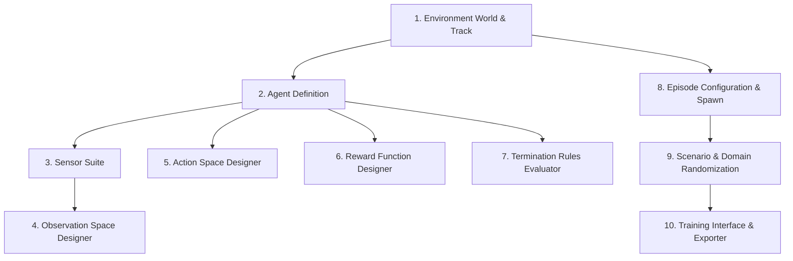

# RL Environment Designer: Architecture & Workflow Guide

**Google DeepMind Advanced Agentic Coding — Phase 3 Specification**  
**Component:** Declarative RL Environment Designer  
**Status:** Implemented & Verified  

---

## 1. Executive Summary & Design Vision

The **RL Environment Designer** transforms the simulation platform into a visual, declarative authoring studio for Reinforcement Learning (RL) research. It decouples simulation physics, environment geometry, and agent specifications from specific RL algorithms (such as PPO, SAC, or DQN).

### Core Principle: Strict Separation of Concerns
```
┌────────────────────────────────────────────────────────┐
│                   SIMULATION PLATFORM                  │
│  State • Observations • Actions • Rewards • Termination│
└──────────────────────────┬─────────────────────────────┘
                           │ Gymnasium API / TCP-NDJSON
┌──────────────────────────▼─────────────────────────────┐
│                 EXTERNAL RL FRAMEWORK                  │
│   Policy • Neural Net • Optimizer • Training Strategy  │
└────────────────────────────────────────────────────────┘
```
The simulator defines the world, agent capabilities, rewards, and constraints. The external training framework defines the policy, loss formulation, optimizer, and neural network architecture.

---

## 2. End-to-End Conceptual Pipeline

Every training environment follows a strict, declarative 9-stage pipeline:



1. **Environment**: Track geometry (Catmull-Rom spline), drivable surface ribbons, boundaries, checkpoints, and spatial acceleration broadphase.
2. **Agent**: Declarative entity (`AgentDefinition`) binding control to an underlying physical entity (e.g. `vehicle`), decoupling identity from specific kinematic models.
3. **Sensors**: Modular sensor attachments (`VehicleStateSensor`, `RaycastSensor` LiDAR, `CameraSensor`, `IMUSensor`).
4. **Observation Space**: Filtered, normalized, and strictly validated sensor channels preventing ground truth/oracle leakage.
5. **Action Space**: Continuous and discrete control channels with clamping, deadzones, and rate limiting.
6. **Reward Function**: Composable linear/nonlinear graph of weighted performance components with live decomposition.
7. **Termination Rules**: Explicit criteria separating task completion (`terminated`) from step/time limits (`truncated`).
8. **Episode Configuration**: Lifecycle bounds, spawn modes (start, random checkpoint, custom pose), and seed control.
9. **Scenario & Randomization**: Operational conditions, surface friction, sensor noise, dynamic obstacle placement, and curriculum progression.
10. **Training Interface**: Gymnasium adapter, TCP/NDJSON socket server, and one-click training bundle exporter.

---

## 3. Authoring Architecture vs. Compiled Runtime Engines

To achieve interactive visual editing without compromising simulation throughput (60 Hz real-time or >1,000 steps/sec headless), the system strictly separates **Authoring Data Models** from **Compiled Runtime Engines**:

| Authoring Model (UI / Project) | Compiled Engine (Simulation Runtime) | Zero-Overhead Characteristics |
| :--- | :--- | :--- |
| `ObservationSpaceDefinition` | `CompiledObservationPipeline` | Preallocated 1D NumPy array; pre-indexed sensor dictionary lookups; branchless vectorized normalization. |
| `ActionSpaceDefinition` | `CompiledActionDecoder` | Fast channel-wise clamping; deadzone thresholds; pre-allocated float32 buffers. |
| `RewardFunctionDefinition` | `CompiledRewardEngine` | Pre-filtered active components; cached step variables; zero dynamic allocations per physics tick. |
| `TerminationDefinition` | `CompiledTerminationEvaluator` | Early-exit evaluation; cached threshold comparison; structured termination cause dict. |

### Compilation Trigger
When an environment or agent is reset or assigned:
```python
env.set_agent(agent_definition)
# Internally executes:
# self.compiled_action_decoder = self.agent.action_space.compile_decoder()
# self.compiled_obs_pipeline = self.agent.observation_space.compile_pipeline()
# self.compiled_reward_engine = self.agent.reward_function.compile_engine()
# self.compiled_termination_evaluator = self.agent.termination_rules.compile_evaluator()
```

---

## 4. Agent Abstraction (`AgentDefinition`)

The agent is decoupled from hardcoded vehicle logic:
```python
@dataclass
class AgentDefinition:
    agent_id: str = "agent_0"
    entity_type: str = "vehicle"
    observation_space: ObservationSpaceDefinition
    action_space: ActionSpaceDefinition
    reward_function: RewardFunctionDefinition
    termination_rules: TerminationDefinition
    spawn_config: AgentSpawnConfig
```
- **Controlled Entity**: Allows future extension to drones, quadrupeds, or robotic arms without modifying the environment harness.
- **Independent Lifecycles**: Each agent defines its own perception space, actuation bounds, reward objectives, and terminal conditions.

---

## 5. UI Inspector Integration

The Studio UI provides an integrated 12-tab inspector (`sim_ui/inspector.py`):
1. **OVERVIEW**: High-level environment status, template selector (`Empty`, `Basic Driving`, `Lane Following`, `Obstacle Avoidance`), and Training Bundle Export button.
2. **SCENE**: World settings, lighting, ambient color, gravity, and skybox.
3. **TRACK**: Track geometry, spline properties, ribbon resolution, banking, and friction.
4. **POINT**: Selected control point coordinates $(x, y, z)$, width, and banking.
5. **ENTITY**: Dynamic entity placement (cones, barriers, vehicles), transforms, and collision properties.
6. **AGENT**: Agent identifier, entity mapping, and spawn configuration.
7. **OBS**: Interactive Observation Space Designer (enable/disable channels, normalization modes, leakage validation).
8. **ACTION**: Continuous/discrete mode selector, deadzones, min/max limits, rate limits.
9. **REWARD**: Visual reward graph editor, weight tuning, falloff curves, live step decomposition.
10. **TERM**: Termination rules builder (collision, off-road, timeout, max steps, truncation flags).
11. **SCENARIO**: Scenario selection, surface friction multiplier, sensor noise, domain randomization ranges.
12. **VALIDATE**: Real-time validation gatekeeper inspecting all subsystems and blocking invalid configurations.

---

## 6. Gymnasium & External Training Interoperability

The RL Environment Designer conforms to Gymnasium standards:
- **`reset(seed=..., options=...)`**: Returns `(observation, info)` tuple. Seed resets deterministic fixed clock and domain randomizers.
- **`step(action)`**: Accepts NumPy arrays, lists, or discrete indices. Returns `(observation, reward, terminated, truncated, info)`.
- **Termination Reason**: `info["reason"]` contains machine-readable diagnostic strings (`"collision"`, `"off_road"`, `"lap_complete"`, `"timeout"`).
- **Decomposed Telemetry**: `info["reward_breakdown"]` provides raw and weighted components for every active reward term.
