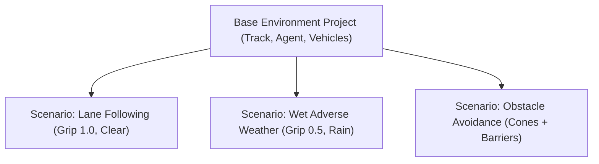
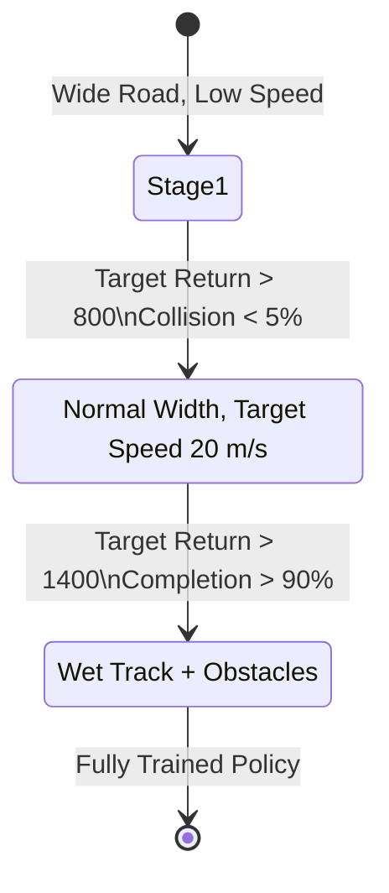

# Scenario & Curriculum System Specification

**Google DeepMind Advanced Agentic Coding — Phase 3 Specification**  
**Component:** Scenario Engine, Domain Randomization, & Progressive Curriculum  
**Source Implementations:**  
- [`sim_env/scenario_designer.py`](file:///D:/coding/projects/Simulation/sim_env/scenario_designer.py)  
- [`sim_env/randomization_designer.py`](file:///D:/coding/projects/Simulation/sim_env/randomization_designer.py)  
- [`sim_env/curriculum.py`](file:///D:/coding/projects/Simulation/sim_env/curriculum.py)  

---

## 1. Scenario Concept: Non-Destructive Environment Parameterization

A **Scenario** represents a distinct operational context or evaluation task layered on top of an environment. Rather than duplicating tracks, meshes, or agents, a scenario defines non-destructive parameter overrides:

---

## 2. Standard Scenario Library

The platform ships with pre-configured standard scenarios ready for immediate benchmarking:

| Scenario ID | Name | Surface Friction | Sensor Noise | Description |
| :--- | :--- | :--- | :--- | :--- |
| `basic_lane_following` | Basic Lane Following | $1.0\times$ (Dry) | $0.0\times$ (Zero) | Standard baseline centering on dry asphalt. |
| `high_speed_racing` | High Speed Racing | $1.0\times$ (Dry) | $0.0\times$ (Zero) | Target speed elevated to $30\text{ m/s}$ ($108\text{ km/h}$). |
| `wet_adverse_weather` | Wet Adverse Weather | $0.5\times$ (Slick) | $0.05\times$ (Rain) | Halved tire grip, rain particles, and sensor noise. |
| `obstacle_evasion` | Obstacle Avoidance | $0.9\times$ (Normal) | $0.02\times$ (Low) | Populates track with cones and barriers. |

---

## 3. Declarative Domain Randomization

The `DomainRandomizationDefinition` allows researchers to inject stochastic variations per episode reset to prevent policy overfitting:

### Supported Distributions
1. **Fixed**: Deterministic constant value.
2. **Uniform**: Sampled within $[min, max]$.
3. **Normal**: Sampled from $\mathcal{N}(\mu, \sigma)$ with optional $[min, max]$ clipping.

### Randomized Parameters
- **`mass_factor`**: Vehicle chassis mass variation ($\pm 10\%$).
- **`tire_friction_factor`**: Tire lateral/longitudinal grip coefficient variation ($\pm 15\%$).
- **`surface_friction_factor`**: Local road asphalt grip factor ($\pm 10\%$).
- **`spawn_lateral_jitter_m`**: Offset from track centerline at reset ($\pm 1.0\text{ m}$).
- **`spawn_heading_jitter_deg`**: Angular alignment perturbation at reset ($\pm 5^\circ$).

All sampling is driven by the deterministic fixed clock RNG seed, ensuring 100% reproducible training rollouts.

---

## 4. Multi-Stage Curriculum Progression (`CurriculumDefinition`)

Complex behaviors are learned through automated staged difficulty progression:

Each stage defines advancement criteria:
- **`advancement_metric`**: `"mean_return"`, `"collision_rate"`, `"lap_completion"`.
- **`target_threshold`**: Numerical threshold required to advance.
- **`min_episodes`**: Minimum episodes evaluated before stage graduation is permissible.

When the rolling window of metrics crosses the threshold, the environment advances to the next stage, dynamically updating friction, speed targets, or obstacle densities without interrupting the training session.
