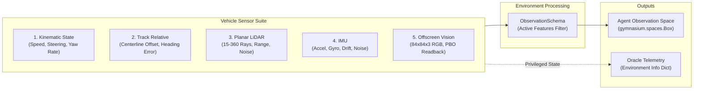

# Sensor Configuration and Perception Architecture

This document describes sensor configuration, the observation pipeline, and observation/oracle boundary isolation in the **AI Environment Simulation Studio (Phase 2)**.

---

## 1. Supported Sensor Modalities

The studio supports five primary sensing modalities designed for autonomous driving and reinforcement learning:



### 1. Kinematic State Sensor
- **Speed**: Scalar vehicle longitudinal speed ($m/s$).
- **Velocity Vector**: Vehicle frame $[v_x, v_y]$ velocities ($m/s$).
- **Yaw Rate**: Angular velocity around vertical axis ($rad/s$).
- **Steering Angle**: Current front road wheel angle ($rad$).

### 2. Track-Relative Sensor
- **Lateral Offset**: Signed distance from vehicle center of mass to spline centerline ($m$).
- **Heading Error**: Angle between vehicle forward heading and track tangent vector ($rad$).
- **Upcoming Checkpoint Distance**: Euclidean distance to next active waypoint ($m$).

### 3. Planar LiDAR Rangefinder
- **Ray Count**: Configurable beam density (default: 15 rays spanning $-90^\circ$ to $+90^\circ$ FOV).
- **Max Range**: Maximum range cutoff (default: $30.0\text{ m}$).
- **Noise Model**: Additive zero-mean Gaussian measurement noise ($\sigma = 0.02\text{ m}$).
- **Intersections**: Raycasts against both track boundaries and active world entities.

### 4. Inertial Measurement Unit (IMU)
- **Triaxial Accelerometer**: Measures specific force including centrifugal acceleration.
- **Rate Gyroscope**: Angular velocity measurement.
- **Configurable Bias & Drift**: Emulates MEMS IMU sensor noise.

### 5. Offscreen Vision Sensor (Camera)
- **Resolution**: $84 \times 84 \times 3$ standard RL tensor format (or configurable up to $1920 \times 1080$).
- **Mounting**: Rigid mount to vehicle chassis with pitch, roll, and elevation offsets.
- **GPU Readback Pipeline**: Pre-allocated pixel buffer with asynchronous PBO ping-pong transfer ($0.159\text{ ms}$ latency).

---

## 2. Observation Schema Configuration

The `ObservationSchema` dataclass controls which feature channels are normalized and concatenated into the vector observation fed to the AI policy:

```python
from sim_env.spaces import ObservationSchema

schema = ObservationSchema(
    include_speed=True,
    include_velocity=True,
    include_yaw_rate=True,
    include_steering_angle=True,
    include_distance_from_center=True,
    include_heading_error=True,
    include_distance_to_checkpoint=True,
    include_lidar_rays=True,
    lidar_ray_count=15,
    include_camera_rgb=False,
    flatten_vector=True
)
print(f"Observation Vector Dimension: {schema.compute_vector_dim()}")  # 23
```

---

## 3. Strict Isolation: Agent Observation vs. Oracle Information

A critical design requirement is preventing privileged simulator state from leaking into agent observations:

| Data Category | Agent Observation (`obs`) | Oracle Information (`info`) |
| :--- | :---: | :---: |
| Kinematic Speed / Yaw Rate | **Yes** (Subject to sensor noise) | Yes (Exact ground truth) |
| LiDAR Rangefinder Distances | **Yes** (Rays clipped to max range) | Yes |
| Camera RGB Frame | **Yes** (If vision enabled) | No |
| Global World Coordinates $(X, Y, Z)$ | **NO** (Prevents memorization) | Yes (For replay & trajectory logging) |
| True Friction Coefficient ($\mu$) | **NO** | Yes (Domain randomization tracking) |
| Vehicle Slip Angles ($\alpha_f, \alpha_r$) | **NO** | Yes (Physics diagnostics) |
| Normalized Tire Forces ($F_{yf}, F_{yr}$) | **NO** | Yes (Dynamics validation) |
| Reward Decomposition Breakdown | **NO** | Yes (For training dashboards) |

---

## 4. Authoring and Debug Inspector

The studio provides dedicated UI tools for sensor management:
1. **Sensors Inspector Tab**: Add, remove, toggle, and tune sensor noise parameters in real time.
2. **Observation HUD**: Press `F3` or select the `OBS` tab to view real-time vector channel graphs, normalized value ranges, and camera viewfinder previews during live simulation.
