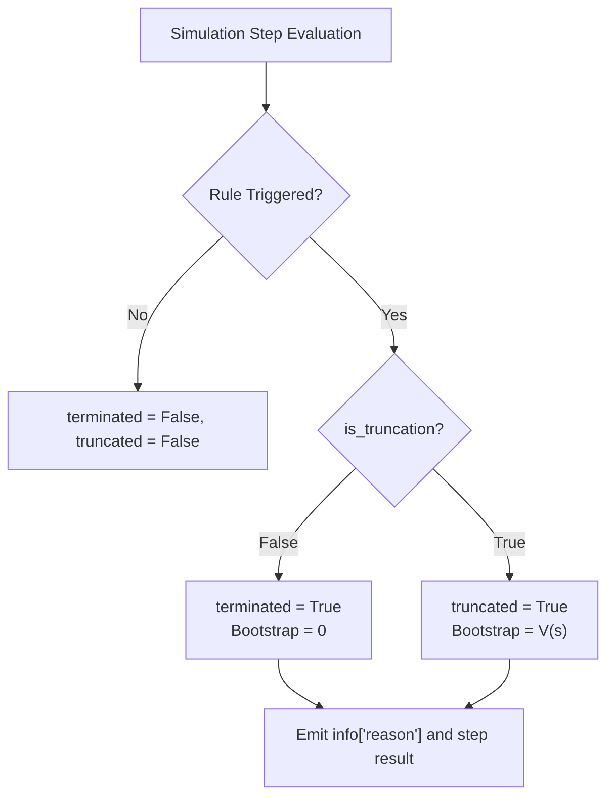

# Termination System & Lifecycle Specification

**Google DeepMind Advanced Agentic Coding — Phase 3 Specification**  
**Component:** Episode Termination Rules & Horizon Truncation  
**Source Implementation:** [`sim_env/termination_designer.py`](file:///D:/coding/projects/Simulation/sim_env/termination_designer.py)  

---

## 1. Gymnasium Semantics: Terminated vs. Truncated

A fundamental flaw in naive RL environments is conflating **task completion / physical failure** with **time horizon exhaustion**. 

In the AI Simulation Studio:
- **`terminated = True` (MDP Terminal State)**: The agent has reached a natural endpoint in the Markov Decision Process:
  - Catastrophic failure (e.g. crashing into a barrier, falling off the drivable surface).
  - Task completion (e.g. successfully finishing the required laps or reaching the goal).
  - In value iteration and bootstrap learning, $V(s_{\text{terminal}}) \equiv 0$.
- **`truncated = True` (Operational Horizon Limit)**: The episode was stopped artificially due to an external constraint:
  - Exceeded maximum episode steps.
  - Exceeded maximum simulation time.
  - Stall timeout (e.g. vehicle stationary for 15 seconds).
  - In Generalized Advantage Estimation (GAE), bootstrapping continues: $V(s_{t}) \ne 0$.



---

## 2. Declarative Rule Configuration

Termination criteria are defined declaratively via `TerminationRuleConfig`:

```python
@dataclass
class TerminationRuleConfig:
    rule_id: str                        # Unique rule identifier
    name: str                           # Display label
    rule_type: str                      # collision, off_road, finish, max_steps, etc.
    enabled: bool = True                # User toggle
    is_truncation: bool = False         # False = terminated, True = truncated
    threshold: float = 0.0              # Numeric parameter (steps, seconds, distance)
    reason: str = ""                    # Machine-readable output reason token
    description: str = ""
```

### Standard Rules Matrix

| Rule ID | Rule Type | Default Trigger Condition | Default Semantics | Reason String |
| :--- | :--- | :--- | :--- | :--- |
| `collision` | `collision` | Barrier / Obstacle impact detected | **`terminated`** | `"collision"` |
| `off_road` | `off_road` | Drivable road mask $< 0.1$ | **`terminated`** | `"off_road"` |
| `finish` | `finish` | Completed required laps | **`terminated`** | `"lap_complete"` |
| `max_steps` | `max_steps` | `current_step >= threshold` (e.g. 1000) | **`truncated`** | `"max_steps_exceeded"` |
| `timeout` | `timeout` | Simulation time $\ge$ threshold | **`truncated`** | `"max_time_exceeded"` |
| `stall` | `stall` | Time since last checkpoint $\ge 15.0\text{s}$ | **`truncated`** | `"checkpoint_timeout"` |
| `custom` | `custom_threshold` | User custom sensor threshold | Configurable | `"threshold_exceeded"` |

---

## 3. Structured Machine-Readable Termination Output

Whenever an episode terminates or truncates, the environment emits an explicit, machine-readable reason dictionary in `info`:

```json
{
  "reason": "collision",
  "step": 482,
  "sim_time": 8.0333,
  "is_truncation": false
}
```

This prevents ambiguous post-mortem analysis and enables RL algorithms to track exact failure mode statistics across training iterations (e.g. tracking collision vs. timeout frequencies over epochs).

---

## 4. High-Performance Runtime Evaluation (`CompiledTerminationEvaluator`)

- Pre-compiles enabled rules into fast priority-ordered checks:
  1. Instant physical collisions.
  2. Drivable boundary violations.
  3. Lap completion milestones.
  4. Step and duration timeouts.
- Evaluates in under 1 microsecond per physics tick with zero object allocation during continuous running.
