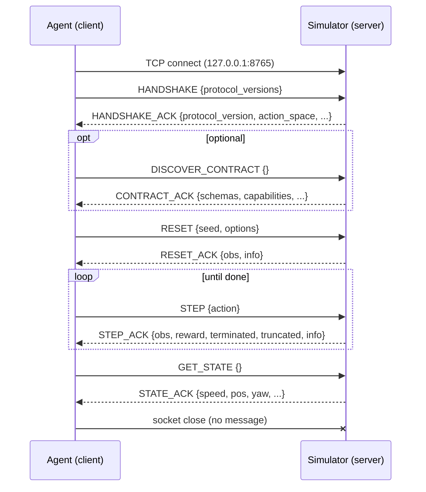

# TCP Protocol Reference

The wire protocol between Simulation Studio's environment server and external
agents. Simulator **4.0.0** speaks protocol **2.1** (and accepts 2.0). The
protocol is lockstep request/response over a single TCP connection — the
environment advances exactly once per `STEP` message and never ticks on its own.

## Framing & transport

| Property | Value |
|---|---|
| Encoding | **NDJSON** — one UTF-8 JSON object per line, `\n`-terminated |
| Envelope | `{"type": <message type>, "payload": {...}}` |
| Read size | `recv(16384)` on both sides; per-connection receive buffer |
| Socket opts | `SO_REUSEADDR` + `TCP_NODELAY` (no Nagle delay) |
| Serialization | `json.dumps(default=convert_numpy)` — numpy arrays → lists, numpy scalars → Python scalars |
| Disconnect | No disconnect message — the client just closes the socket |

- Decoding an empty line yields `("", {})` — it is ignored, not an error.
- There is no message size cap or rate limiting beyond socket buffers.
- There are **no recording-control messages**; recording is driven from the
  studio UI, not the socket.

## Version negotiation

The first message a client sends is `HANDSHAKE` listing the protocol versions
it supports:

```json
{"type": "HANDSHAKE", "payload": {"protocol_versions": ["2.0", "2.1"]}}
```

| Rule | Behavior |
|---|---|
| Constants | `PROTOCOL_VERSION = "2.1"`, `SUPPORTED_PROTOCOL_VERSIONS = ("2.0", "2.1")` |
| Empty / missing list | Assume the current version (`"2.1"`) |
| Mutual versions exist | Highest mutual version wins |
| No mutual version | `ERROR` — `protocol_version_mismatch: no mutually supported protocol version` |
| Legacy key | `client_protocol_versions` is accepted as an alias for `protocol_versions` |
| Feature gate | `SET_SCENARIO` requires negotiated version ≥ `"2.1"` |

The negotiated version is tracked per connection (`client_version`) and gates
`SET_SCENARIO` for the life of the session.

## Client → server messages

| Type | Payload keys | Notes |
|---|---|---|
| `HANDSHAKE` | `{"protocol_versions": [str]}` | Legacy `client_protocol_versions` accepted. Empty/missing → current version. |
| `DISCOVER_CONTRACT` | `{}` | Returns the full declarative environment contract. |
| `RESET` | `{"seed": int \| null, "options": dict \| null}` | Starts a new episode. |
| `STEP` | `{"action": list \| int}` | Server default action is `[0, 0, 0]` when omitted. Advances the env exactly one physics step. |
| `GET_STATE` | `{}` | Diagnostic state snapshot (does not advance the env). |
| `SET_SCENARIO` | `{"scenario": dict}` **XOR** `{"scenario_id": str}`, plus `seed`, `reset` | Protocol ≥ 2.1. `scenario_id` must come from the standard scenario library. |

## Server → client messages

Every request gets exactly one response — either the matching `*_ACK` or an
`ERROR`.

### `HANDSHAKE_ACK`

| Key | Contents |
|---|---|
| `protocol_version` | Negotiated version, e.g. `"2.1"` |
| `supported_versions` | `["2.0", "2.1"]` |
| `action_space` | `{"type", "continuous_low", "continuous_high", "discrete_actions"}` |
| `observation_schema` | Observation channel / `include_*` flags |
| `vector_dim` | Flat observation dimension |
| `track_name`, `track_length` | Active track name and length (m) |
| `physics_hz`, `dt` | Physics rate and timestep (60 Hz / 0.01667 s) |

### `CONTRACT_ACK` (`DISCOVER_CONTRACT` response)

`protocol_version`, `supported_versions`, `environment_id`,
`environment_version`, `physics_hz`, `dt`, `action_schema`,
`observation_schema`, `reward_schema`, `termination_schema`, `sensors`,
`observation_field_classes`, `diagnostic_fields`,
`scenario{name, weather, friction_mult}`, and
`capabilities{scenario_update, episode_state}`.

### Episode ACKs

| Type | Payload keys |
|---|---|
| `RESET_ACK` | `{obs, info}` |
| `STEP_ACK` | `{obs, reward, terminated, truncated, info}` |
| `STATE_ACK` | `{speed, pos[x,y,z], yaw, sim_time, total_reward, reward_breakdown}` — all classified DIAGNOSTIC |
| `SET_SCENARIO_ACK` | `{scenario: {scenario_id, name, weather, friction_mult}, episode_state: "applied" \| "reset"}` — plus `obs`/`info` when `reset=true` |

## Error catalog

Errors arrive as `{"type": "ERROR", "payload": {"error": "<string>"}}`.
Exact `error` strings:

| Error string | Cause |
|---|---|
| `protocol_version_mismatch: no mutually supported protocol version` | HANDSHAKE lists no version the server supports |
| `Unknown message type: X` | Unrecognized `type` field |
| `unsupported_in_protocol_version: SET_SCENARIO requires protocol >= 2.1` | `SET_SCENARIO` sent on a 2.0 session |
| `scenario_update_rejected: episode is active; ...` | `SET_SCENARIO` mid-episode without `reset: true` |
| `unknown_scenario: 'X' is not in the standard scenario library` | `scenario_id` not in the standard library |
| `invalid_scenario: ...` | Malformed scenario dict |
| `scenario_apply_failed: ...` | Scenario failed to apply to the environment |
| `server_full: all N env slots busy` | Multi-env server has no free env slot (connection is then closed) |
| `{error: str(e)}` | Generic catch-all — server-side exception text |

## Session lifecycle



## Semantics

- **Lockstep.** The environment advances **exactly once per `STEP`** — there is
  no server-side tick. A paused or disconnected agent freezes the simulation.
  `GET_STATE`/`DISCOVER_CONTRACT` never advance physics.
- **Single-env server** (`SimulationServer`, `sim_net/server.py`): `listen(1)` —
  maximum **one client**; extra connections wait in the backlog until the active
  client disconnects. The host process must call `poll_and_process()` (returns
  `True` iff a `STEP` was processed); the studio does this once per frame, the
  headless loop ~every 0.5 ms. Metrics: `total_steps_served`, `last_latency_ms`.
- **Multi-env server** (`SimServerMulti`, `sim_net/multi_server.py`): one
  process, **one port**, N envs. Each new connection pops an env from the free
  pool in **FIFO** order — there is **no `env_id` on the wire**. Empty pool →
  `server_full` error + close. A disconnect returns the env to the pool. Launch
  with `python main.py --headless --num-envs N --port P --track T`; envs are
  built from the track project with `seed = 42 + i`.

### `SET_SCENARIO` state machine

Each connection tracks `_episode_state ∈ {idle, mid_episode, terminated}`:

| State | `SET_SCENARIO` behavior |
|---|---|
| `idle` | Scenario applies; `episode_state: "applied"` (or `"reset"` if `reset: true`) |
| `mid_episode` | `reset: false`/absent → `scenario_update_rejected`; `reset: true` applies + resets atomically → `"reset"` with fresh `obs`/`info` |
| `terminated` | Same as idle — apply freely |

`scenario` (a full dict) and `scenario_id` (a standard-library name) are
mutually exclusive — send exactly one. `seed` optionally reseeds.

## Minimal raw-socket example

No SDK needed — the protocol is lines of JSON:

```python
import json
import socket

HOST, PORT = "127.0.0.1", 8765

sock = socket.create_connection((HOST, PORT), timeout=10.0)
sock.setsockopt(socket.IPPROTO_TCP, socket.TCP_NODELAY, 1)
rx = sock.makefile("r", encoding="utf-8")          # line-buffered reader

def send(msg_type, payload):
    line = json.dumps({"type": msg_type, "payload": payload}) + "\n"
    sock.sendall(line.encode("utf-8"))
    return json.loads(rx.readline())

# 1. Handshake — advertise the versions we speak
ack = send("HANDSHAKE", {"protocol_versions": ["2.0", "2.1"]})
print("protocol:", ack["payload"]["protocol_version"])   # "2.1"

# 2. Reset the episode
resp = send("RESET", {"seed": 42, "options": None})
obs, info = resp["payload"]["obs"], resp["payload"]["info"]

# 3. Lockstep drive loop — one STEP = one physics step
total = 0.0
for _ in range(600):
    resp = send("STEP", {"action": [0.0, 0.4, 0.0]})     # steer, throttle, brake
    p = resp["payload"]
    obs, total = p["obs"], total + p["reward"]
    if p["terminated"] or p["truncated"]:
        resp = send("RESET", {"seed": 42})
        obs = resp["payload"]["obs"]

# 4. Diagnostic snapshot, then hang up
print(send("GET_STATE", {})["payload"])
sock.close()
```

## Version compatibility

| Simulator | Protocol | Accepts | Notes |
|---|---|---|---|
| `4.0.0` | `2.1` (current) | `2.0`, `2.1` | `SET_SCENARIO` is 2.1-only; 2.0 sessions get `unsupported_in_protocol_version` |

## See also

- [External Agents](external-agents.md) — SDK, Gym adapter, included agents
- [RL Overview](../reinforcement-learning/rl-overview.md) — obs/action/reward contract
- [Training](../reinforcement-learning/training.md) — env modes (`tcp`, `tcp_multi`, `process`)
- [Experiments](../experiments/experiments.md) · [CLI Reference](../experiments/cli-reference.md)
- [Recording & Replay](../recording-replay/recording-and-replay.md)
- [Troubleshooting](../troubleshooting/troubleshooting.md)
