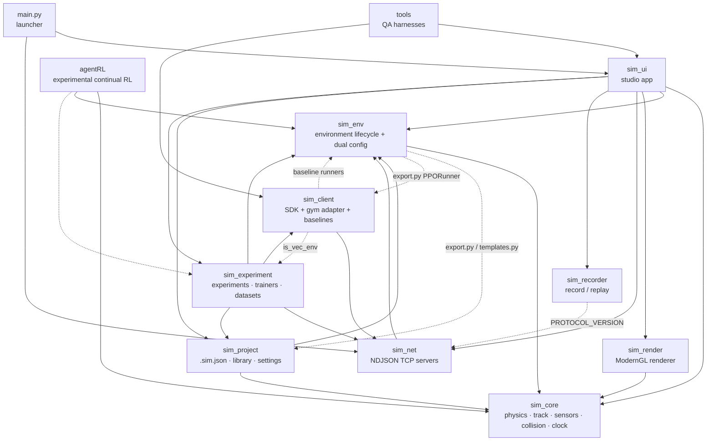
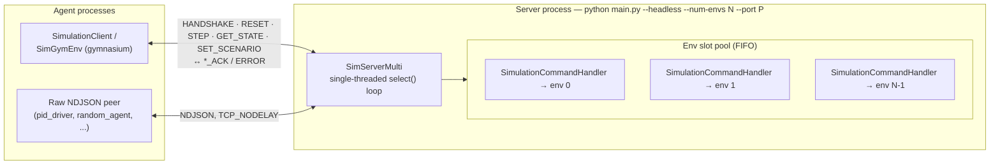
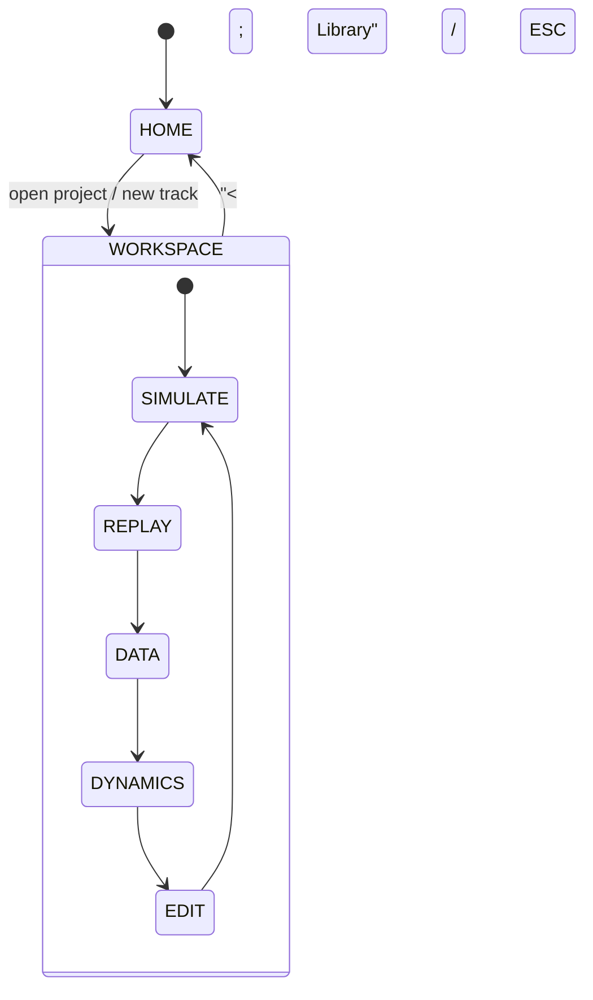

# Architecture

How the Simulation Studio codebase is organized: the package map, runtime data flow, external TCP interface, and process model.

Version facts: SIMULATOR_VERSION `4.0.0` (`sim_version.py`) · TCP protocol `2.1` (accepts `2.0`/`2.1`) · worker protocol `1.0` · manifest `1.0` · trainer contract `1.0` · dataset format `transitions_v1` · `.sim.json` schema `2.0.0` (`3.0.0` recognized on load) · agentRL `0.1.0` (partial).

## System overview

The central design rule: **Simulator = Environment, AI = Agent.** `sim_env.SimulationEnvironment` owns the vehicle, track, sensors, collision, reward, and termination. Agents are clients — in-process callables or external TCP peers — that consume `(obs, reward, terminated, truncated, info)` and return a 3-channel continuous action `[steering, throttle, brake]` or a discrete option index. Nothing in `sim_core` or `sim_env` knows about agents, training loops, or networking.

Two ways to drive an environment:

1. **In-process** — construct `SimulationEnvironment` directly (or via `sim_experiment.headless.build_env_from_dicts`, the canonical factory) and call `reset()` / `step()`. Used by the studio SIMULATE tab, the keyboard driver, `env_mode="inprocess"` trainers, and `ProcessVectorEnv` workers.
2. **External (TCP)** — `sim_net` wraps an env in a lockstep NDJSON server; `sim_client.SimulationClient` and the `SimGymEnv` gymnasium adapter talk to it. `main.py --headless` hosts a single env; `--num-envs N` hosts N envs on one port. Used by external agents and the `tcp` / `tcp_multi` experiment env modes.

The studio (`sim_ui`) is a pygame + ModernGL desktop app that embeds one environment, renders it with `sim_render`, records episodes with `sim_recorder`, manages projects via `sim_project`, and orchestrates training through `sim_experiment` — all in one process.

## Packages

| Package | Responsibility | Key files |
|---|---|---|
| `sim_core` | Physics & geometry foundation. Single-track (bicycle) vehicle dynamics with substeps, Catmull-Rom track spline + arc-length reparameterization, mesh generation, OBB-vs-segment SAT collision + spatial-hash broadphase, sensor suite, world entities, checkpoint/lap tracking, fixed-step clock. No RL concepts. | `vehicle/vehicle_model.py`, `vehicle/vehicle_config.py`, `vehicle/collision.py`; `track/road_definition.py`, `track/spline.py`, `track/mesh_generator.py`, `track/track_queries.py`; `sensors/base_sensor.py`, `vehicle_state_sensor.py`, `raycast_sensor.py`, `imu_sensor.py`, `camera_sensor.py`, `sensor_manager.py`; `collision/spatial_hash.py`; `world/entity.py`, `world/obstacle.py`, `world/checkpoint.py`; `clock.py`, `math_utils.py` |
| `sim_env` | Environment lifecycle (`reset`/`step`) with **two config paths**: legacy blocks (`ActionSpaceConfig`, `ObservationSchema`, `RewardConfig`/`RewardEngine`, `TerminationConfig`/`TerminationEngine`, `DomainRandomizationConfig`, `ScenarioConfig`) and the declarative `AgentDefinition`, which compiles into `CompiledActionDecoder` / `CompiledObservationPipeline` / `CompiledRewardEngine` / `CompiledTerminationEvaluator`. Compiled pipelines take precedence when `agent` is set. Also: validator, scenarios, domain randomization, curriculum definition, versioning/fingerprinting, templates. | `environment.py`, `agent.py`, `spaces.py`, `reward_engine.py`, `termination_engine.py`, `domain_randomizer.py`, `scenarios.py`; `observation_designer.py`, `action_designer.py`, `reward_designer.py`, `termination_designer.py`, `randomization_designer.py`, `scenario_designer.py`, `sensor_config.py`, `episode_config.py`, `curriculum.py`, `observation_contract.py`, `validator.py`, `versioning.py`, `templates.py`, `experiment.py`, `export.py` |
| `sim_render` | ModernGL renderer: track/entity meshes, camera rig (`CameraMode.CHASE` / `HOOD` / `TOP_DOWN` / `ORBIT`), offscreen FBO that produces real RGB frames for the `camera_rgb` sensor, shaders. | `renderer.py`, `camera.py`, `mesh.py`, `offscreen.py`, `shaders.py` |
| `sim_ui` | pygame + ModernGL studio application. Home screen (tracks/recent/templates/datasets/experiments/settings), workspace screen with EDIT/SIMULATE/REPLAY/DATA/DYNAMICS tabs, track editor + gizmos + undo, two-tier inspector, HUD + PiP + obs inspector, custom widget layer (pure pygame, no imgui), 5 palettes. Always hosts a `SimulationServer` for external agents. | `app.py`; `screens/home_screen.py`, `screens/workspace_screen.py`, `screens/datasets_panel.py`, `screens/dynamics_panel.py`, `screens/experiments_panel.py`, `screens/dialogs.py`; `editor.py`, `editor_ui.py`, `edit_history.py`, `inspector.py`, `hud.py`, `theme.py`, `widgets.py`, `ui_overlay.py`, `thumbnails.py`, `train_providers.py` |
| `sim_net` | NDJSON-over-TCP wire protocol `2.1` and its servers. `protocol.py` (envelope `{type, payload}`, numpy conversion, version constants); `server.py` (single-env `SimulationServer`, non-blocking select loop, max 1 client); `multi_server.py` (`SimServerMulti` — one port, N envs, FIFO slot pool); `env_handler.py` (per-connection `SimulationCommandHandler`, version negotiation, episode state machine). | `protocol.py`, `server.py`, `multi_server.py`, `env_handler.py` |
| `sim_client` | Client SDK and agent-side libraries. `SimulationClient` (handshake, contract discovery, reset/step/set_scenario/get_state); `SimGymEnv` gymnasium adapter; runnable agents `pid_driver` / `random_agent` / `ppo_train` (rollout demo); baseline libraries `ppo_baseline` / `sac_baseline` / `dqn_baseline` + `replay_buffer` (used by `sim_experiment` trainers). | `client.py`, `gym_env.py`, `agents/` |
| `sim_recorder` | Telemetry episode recording (ring buffer `EpisodeRecorder`, frames with pos/yaw/speed/action/reward/breakdown — **no observations**) and `EpisodeReplayPlayer` (play/pause/seek/step, speed control). | `recorder.py`, `replay.py` |
| `sim_project` | `.sim.json` serialization (schema `2.0.0`, `3.0.0` recognized; tolerant `.get` loading + migration; SHA-256 fingerprint), track library over `tracks/` + read-only `presets/` roots, studio settings, default preset factories. | `serializer.py`, `library.py`, `settings.py`, `presets/` |
| `sim_experiment` | Training & experiment platform: immutable fingerprinted manifests, run lifecycle (`run.json` + status state machine), `metrics.jsonl` metrics, artifact registry, orchestrator + trainer contract `1.0`, trainers (`ppo`, `sac`, `dqn`, `bc`, `dummy`), evaluation, `transitions_v1` dataset export/validate/split/inspect, batch scheduler + retry policy, remote worker service/registry (`worker` protocol `1.0`), curriculum runtime, `SyncVectorEnv`/`ProcessVectorEnv`, headless env/process pools, trajectories (`agent_data` vs `diagnostic_data` split), analytics, reproducibility checks, CLI. | `manifest.py`, `manager.py`, `run.py`, `metrics.py`, `artifacts.py`, `trainer_contract.py`, `capabilities.py`, `orchestrator.py`, `headless.py`, `vec_env.py`, `process_env.py`, `batch.py`, `scheduler.py`, `remote_worker.py`, `worker_registry.py`, `evaluation.py`, `dataset.py`, `dataset_inspect.py`, `trajectory.py`, `trajectory_sampler.py`, `curriculum_runtime.py`, `convergence.py`, `analytics.py`, `reproduce.py`, `bc/`, `trainers/`, `cli.py` |
| `agentRL` | Experimental continual multi-track RL library (`0.1.0`, numpy-only deps for env side). Audited-stable surface: `core/` (versions, seed tree, configs), `obs/` (channel spec, encoder), `act/` (action adapter), `rewards/` (presets `drive_v1`/`term_v1`), `envs/` (track registry, generators, `EnvFactory`, `ScenarioMutator`), `memory/` (replay + track-rehearsal buffers). `algos/`, `train/`, `eval/`, `checkpoints/`, `experiments/` exist but are under active development; there is no packaged CLI. See `agentRL/AGENT_RL_ARCHITECTURE.md`. | `core/`, `obs/`, `act/`, `rewards/`, `envs/`, `memory/` (+ in-progress `algos/`, `train/`, `eval/`) |
| `tools` | Dev/QA harnesses, not shipped in the bundle: `ui_shots.py` (screenshot suite → `assets/screenshots/qa/`), `smoke_interactions.py` (~37 interaction checks), `tcp_recording_e2e.py` (15 TCP-driven checks), `vehicle_dynamics/` (maneuver suite used by the DYNAMICS tab). | `ui_shots.py`, `smoke_interactions.py`, `tcp_recording_e2e.py`, `vehicle_dynamics/` |

## Package dependency graph

Solid edges are module-level imports; dotted edges are lazy/optional imports (e.g. `sim_env/export.py` importing `PPORunner`, baseline runners importing `is_vec_env`).



## Runtime data flow — one `env.step()`

`step()` in `sim_env/environment.py` runs a fixed pipeline every tick (dt = 1/60 s). The agent only ever sees the observation, scalar reward, terminated/truncated flags, and the `info` dict.

```mermaid
sequenceDiagram
    participant A as Agent
    participant E as SimulationEnvironment
    participant D as Action decoder<br/>(compiled or legacy)
    participant V as VehicleModel
    participant C as Collision check<br/>(OBB SAT + broadphase)
    participant T as Track queries +<br/>CheckpointTracker
    participant R as Reward engine/evaluator
    participant X as Termination evaluator
    participant S as SensorManager

    A->>E: step(action) — [steer, throttle, brake] or discrete index
    E->>D: decode (NaN→0, dead-zone, rate-limit, clip)
    E->>V: vehicle.step(steer, throttle, brake, surface_friction)<br/>4 substeps → 240 Hz physics
    E->>C: vehicle OBB vs boundary segments + entity OBBs<br/>→ is_colliding
    E->>T: query_vehicle_pose → s, lateral_offset, heading_error,<br/>is_on_road; checkpoint crossing → cp_passed, lap_completed
    E->>R: compute_step_reward → reward + breakdown
    E->>X: evaluate → terminated / truncated + reason dict<br/>(env may add max_duration / scenario_time_limit truncation)
    E->>S: update_all(sim_time, context, rng) — per-sensor rates
    E-->>A: (obs, reward, terminated, truncated, info)
```

Notes:

- If `step()` is called after the episode ended, the env returns `(obs, 0.0, True, True, info)` with `info["error"]` and `termination_reason="invalid_call_after_done"` — it does not advance physics.
- `info` keys: `step`, `sim_time`, `terminated`, `truncated`, `termination_reason`, `termination_info`, `reward_breakdown`, `total_reward`, `speed`, `lateral_offset`, `heading_error`, `road_width`, `is_on_road`, `is_colliding`, `action_valid`, `action_error`, `checkpoints_passed`, `current_checkpoint`, `laps_completed`, `lap_progress`, `last_action`.
- `terminated` = task end (collision, off-road, wrong direction, completion); `truncated` = horizon limit (max steps, checkpoint timeout, duration). Both set `is_done`.

## External TCP architecture

Lockstep request/response: the environment advances **only** when a `STEP` message arrives — there is no free-running server loop. One message = one JSON object per line (NDJSON, `\n`-terminated).



- **Single-env** (`main.py --headless`, or the studio's always-on server): `SimulationServer` in `server.py` — `listen(1)`, extra clients wait in the backlog. The host calls `poll_and_process()` each frame; it returns `True` iff a `STEP` was processed.
- **Multi-env** (`main.py --headless --num-envs N`): `SimServerMulti` in `multi_server.py` — one process, one port, N envs built from factories (`seed = 42 + i`). Each accepted client pops an env from the free pool into a `_ClientSlot`; when the pool is empty the server replies `server_full: all N env slots busy` and closes the socket. Disconnect returns the env to the pool. There is **no env_id on the wire** — slot assignment is FIFO.
- **Session**: `SimulationCommandHandler` (`env_handler.py`) negotiates the highest mutual protocol version, tracks `_episode_state` (`idle`/`mid_episode`/`terminated`), and enforces the `SET_SCENARIO` state machine (requires protocol ≥ 2.1; rejected mid-episode unless `reset=true`).

## Studio screens

The app has two screens — `home` (library) and `workspace` — and the workspace is split into five tabs (`ws_tab`):



| Screen/tab | What lives there |
|---|---|
| HOME | Left nav: TRACKS (library cards), RECENT, TEMPLATES, DATASETS, EXPERIMENTS, SETTINGS (theme palettes, data root, UI scale) |
| EDIT | Track editor: draw/edit control points, entity placement gizmos, spawn marker, inspector (GEO + RL tiers) |
| SIMULATE | Live 3D viewport, manual driving keys, HUD telemetry + reward decomposition, camera PiPs, obs inspector, Record/Stop, "AI CONNECTED / AI listening" status for the embedded TCP server |
| REPLAY | Episode picker over `<data_root>/recordings/*/episode.json` (+ legacy `last_episode.json`), transport controls, scrub bar, 0.5–4× speeds |
| DATA | Recordings + `transitions_v1` training datasets found under the data root and `experiments/`; dataset inspect report |
| DYNAMICS | `tools/vehicle_dynamics` maneuver suite (physics-only, dt=1/60) with plots, A/B compare, export to `benchmarks/` — uses the **default** `VehicleConfig`, not the project's |

## Design principles

These are enforced by the code, not aspirational:

1. **Simulator = Environment, AI = Agent.** `sim_core`/`sim_env` contain no agent, training, or networking code. Agents consume the Gym-style 5-tuple through in-process calls or TCP — the env cannot be reached except through `obs`, `reward`, flags, `info`, and the diagnostic `GET_STATE` contract.
2. **Dual config paths with agent precedence.** Every environment carries both the legacy blocks and an optional declarative `AgentDefinition`. When `agent` is present, its compiled pipelines (action decoder, observation pipeline, reward engine, termination evaluator) take precedence; the legacy engines are still constructed but bypassed (`last_breakdown`/`total` are mirrored so consumers keep working).
3. **Deterministic fixed-step time.** `FixedClock` pins dt = `1/60` s; physics runs `physics_substeps = 4` substeps (240 Hz effective). A single seeded `np.random.default_rng(seed)` lives on the clock and is shared by sensors and domain randomization, so a given seed reproduces an episode exactly.
4. **Lockstep stepping.** Both servers only advance the env on `STEP` — one message, one tick. There is no server-side autoplay.
5. **Agent data vs diagnostic data.** Observations are whitelisted `agent_observation` channels; `debug_telemetry` and `oracle_ground_truth` channels are rejected by `validate_no_leakage()` (validator reports a `SECURITY LEAKAGE` error and the compiled pipeline raises `ValueError`). Trajectory step records split `agent_data` from `diagnostic_data`; dataset export (`transitions_v1`) writes only whitelisted fields; `STATE_ACK` fields are classified `DIAGNOSTIC`.
6. **Immutable, fingerprinted manifests.** `experiment_id` derives from a SHA-256 over the environment fingerprint, scenario, seed, simulator/protocol versions, obs/action/reward/termination/episode/curriculum/randomization configs, and training/evaluation config. Re-creating a launched experiment is rejected; `check_reproducibility()` verifies fingerprints before a rerun.
7. **Everything serializes to `.sim.json`.** The full environment (road, vehicle, all config blocks, entities, agent, episode, scenario, curriculum, experiment config) round-trips through `EnvironmentProject.to_dict`/`from_dict` with tolerant `.get` loading, schema migration, and a fingerprint that excludes volatile keys (`timestamp`, `last_saved`, `fingerprint`, …).

## Data ownership map

| Path | Owner | Contents | Git status |
|---|---|---|---|
| `tracks/` | `sim_project.library` | User track library: `*.sim.json` + `.library.json` sidecars + `.thumbs/` | gitignored |
| `presets/` | `sim_project.presets` | Bundled read-only presets (`oval_circuit`, `serpentine_track`, `obstacle_challenge`, `custom_environment`); regenerated only if the whole dir is missing | committed |
| `data/` | `sim_project.settings` (`data_root`) | `recordings/` (episode.json + manifest.json), `datasets/` (`transitions_v1`), `studio_settings.json` | gitignored |
| `experiments/` | `sim_experiment.manager` | `exp_*/experiment.json` manifests, `environment.json`, `scenario.json`, `runs/` (run.json, metrics.jsonl, checkpoints, trajectories, artifacts, replays), `batches/`, `workers/registry.json`; also hosts `run_ppo_experiment.py` / `run_ui_env_ppo.py` helper scripts | committed (structure + scripts) |
| `logs/` | orchestrator / `HeadlessSimProcessPool` | trainer `stdout.log`/`stderr.log`, `sim_<port>.log` | `*.log` gitignored |
| `benchmarks/` | `tools.vehicle_dynamics` + benchmark scripts | Committed benchmark results (`phase4_results.json`, `vision_results.json`, `broadphase_results.json`), benchmark runners, DYNAMICS-tab exports | committed |
| `assets/screenshots/qa/` | `tools/ui_shots.py` | QA screenshot output (`<W>x<H>_<name>.png`) | gitignored |
| `agentRL/runs/` | `agentRL.train` | agentRL checkpoints + metrics | gitignored |
| `dist/`, `build_temp/` | `build/package_windows.py` | PyInstaller onedir output + intermediates | gitignored |
| `last_episode.json` | studio | Legacy episode recording; REPLAY tab fallback | gitignored |

## Process model

| Mode | Processes | Notes |
|---|---|---|
| Interactive studio | 1 process, 1 thread | `SimulationStudioApp` runs UI, physics, and an always-on `SimulationServer` in one loop; each frame calls `poll_and_process()` (non-blocking select, `timeout=0`) |
| Headless single-env | 1 process | `main.py --headless` → `SimulationStudioApp(headless=True)` + `SimulationServer`; loop polls the server and sleeps `0.005` s |
| Headless multi-env | 1 process | `main.py --headless --num-envs N` → `SimServerMulti`, one port, N envs, single-threaded select loop, `sleep(0.0005)` |
| `env_mode="inprocess"` | trainer process only | Trainer imports and steps `SimulationEnvironment` directly (via `build_env_from_dicts` / `HeadlessEnvPool`, `seed = base + i`) |
| `env_mode="process"` | 1 + N | `ProcessVectorEnv` spawns one `mp.Process` per env, pipelined pipe commands (`reset`, `step`, `set_scenario`, `ping`, `close`) |
| `env_mode="tcp"` | 1 + N | `HeadlessSimProcessPool` spawns N `main.py --headless` on consecutive ports; trainer connects via `SimGymEnv` per port |
| `env_mode="tcp_multi"` | 1 + 1 | `HeadlessSimProcessPool(shared_process=True)` spawns one `main.py --headless --num-envs N`; N envs share one port |
| Remote workers | N machines | `WorkerService` (TCP NDJSON, token auth via `hmac.compare_digest`, protocol `1.0`) hosts runs on behalf of the `BatchScheduler` |

## See also

- [Development guide](../development/development.md) — repo layout, setup, tests, extension points
- [Standalone build](../development/standalone-build.md) — PyInstaller packaging
- [Installation](../getting-started/installation.md)
- [Experiment CLI reference](../experiments/cli-reference.md)
- [Troubleshooting](../troubleshooting/troubleshooting.md)
- [Performance](../performance/performance.md)
