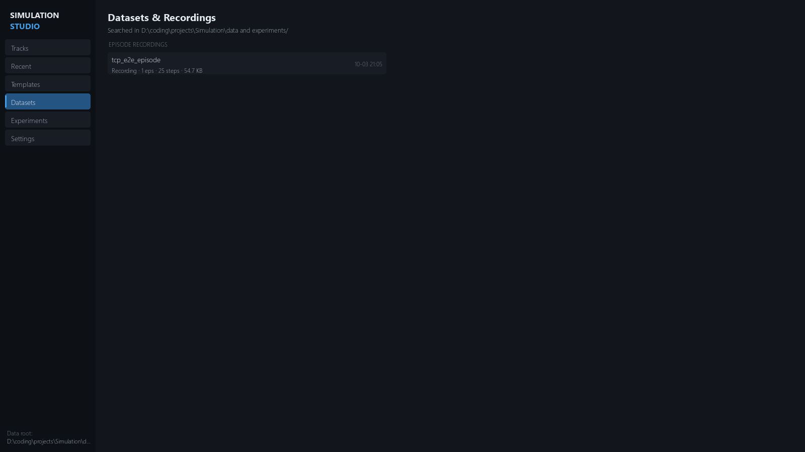

# Datasets & Data Artifacts

Simulation Studio produces **three distinct kinds of data artifacts** — they
look similar on disk but are produced by different systems for different
purposes:

| Artifact | Producer | Location | Purpose |
|---|---|---|---|
| **Episode recording** | `sim_recorder` (studio Record button) | `<data_root>/recordings/<name>/` | Human replay in the REPLAY tab — telemetry frames, no observations |
| **Trajectory** | experiment trainers (`sim_experiment`) | `experiments/<exp>/runs/<run>/trajectories/<ep>.jsonl` | Per-episode training record — agent data + diagnostics, side by side |
| **Exported dataset** | `dataset-export` (`transitions_v1`) | wherever `--dest` points (`<data_root>/datasets/` by convention) | Consumable offline dataset — **agent-visible fields only** |

The critical invariant across all three: **agent-facing data and
diagnostic/oracle data are strictly separated**, and diagnostics never cross
into an exported dataset.

## Episode recordings (studio)

Pressing **Record** on the SIMULATE tab starts an `EpisodeRecorder`
(`sim_recorder`, `max_steps=5000` — a ring buffer that drops the oldest frames
when full). Stopping writes:

```text
<data_root>/recordings/<name>/
    episode.json      — {metadata, frames[]}
    manifest.json     — {kind: "episode_recording", name, steps,
                         track_name, simulator_version, created}
```

### Frame keys (`frames[]`)

| Key | Contents |
|---|---|
| `step`, `t` | Step index and sim time |
| `pos` | `[x, y, z]` vehicle position |
| `yaw`, `speed` | Heading (rad) and speed |
| `action` | `[steer, throttle, brake]` applied |
| `reward`, `breakdown` | Step reward and per-component dict |
| `lat_offset`, `heading_err` | Lane-center error and heading error |
| `collision` | Collision flag |

> **Note:** recordings contain **telemetry only — no observations**. A replay
> reconstructs what the *vehicle* did, not what the *agent* saw.

### Metadata keys (`episode.json.metadata`)

`timestamp`, `track_name`, `seed`, `env_version`, `scenario_name`,
`simulator_version`, `protocol_version`, `env_fingerprint`, `env_config`,
`observation_schema`, `action_schema`, `reward_config`, `total_steps`,
`termination_reason`, `episode_result`.

- `EpisodeRecorder.save_to_file` writes gzip when the filename ends in `.gz`;
  `load_from_file` reads both.
- The REPLAY picker lists `<data_root>/recordings/*/episode.json` plus the
  legacy `last_episode.json` fallback.

## Training trajectories

Every experiment trainer can record per-episode trajectories to
`runs/<run_id>/trajectories/<episode_id>.jsonl` (buffered via
`TrajectoryWriter`, `buffer_size=128`; episodes are buffered in memory and
written atomically at episode end). Episode ids look like
`train_env{env_idx}_ep{ep_idx}`.

Each file is one **header record** followed by **step records**:

```json
{"type": "header", "episode_id": "train_env0_ep3",
 "env_fingerprint": "...", "scenario_id": "basic_lane_following",
 "seed": 42, "episode_seed": 42, "curriculum_stage_index": 0,
 "env_index": 0, "observation_schema": {...}, "action_schema": {...}}
{"type": "step", "episode_id": "train_env0_ep3", "step": 0,
 "agent_data":      {"obs": [...], "action": [...], "reward": 0.79,
                     "terminated": false, "truncated": false,
                     "termination_reason": ""},
 "diagnostic_data": {"speed": 0.0, "lateral_offset": 0.0,
                     "heading_error": 0.0, "is_colliding": false,
                     "is_on_road": true, "checkpoints_passed": 0}}
```

`agent_data` is what the policy saw and received; `diagnostic_data` is oracle
telemetry for debugging and evaluation — the two keys are never merged.

### Which episodes get recorded

Selection is controlled by `training.algorithm_config.trajectory_sampling`:

| Mode | Selects |
|---|---|
| `first_n` `{n}` | First `n` episodes per env — **the default** |
| `every_n` `{n}` | Every `n`-th episode (`ep_idx % n == 0`) |
| `probability` `{p}` | Each episode with probability `p` (deterministic hash of `seed:env:ep`) |
| `episodes` `{episode_ids}` | Explicit id list |
| `min_return` `{min_return}` | Episodes whose total return ≥ threshold |
| `termination_reasons` `{termination_reasons}` | Episodes ending with a listed reason |
| `all` | Every episode |

Back-compat: a bare integer `trajectory_episodes` is treated as
`{"mode": "first_n", "n": <int>}`.

`sample_trajectories(run_dir, count, seed, strategy)` picks recorded episodes
deterministically with strategy `uniform` | `best` | `mixed`. The CLI
`python -m sim_experiment.cli trajectories <exp> <run> [--json]` lists them.

## Exported datasets — `transitions_v1`

`export_dataset` converts a run's trajectories into a consumable dataset
(`DATASET_FORMAT = "transitions_v1"`):

```text
<dest>/
    episodes.jsonl   — one episode per line
    manifest.json    — dataset metadata + filter accounting
    splits.json      — only after dataset-split
```

### `episodes.jsonl` — one line per episode

```json
{"episode_id": "train_env0_ep3", "seed": 42,
 "env_fingerprint": "...", "scenario_id": "basic_lane_following",
 "total_return": 812.4, "length": 1024,
 "termination_reason": "course_completion",
 "steps": [{"obs": [...], "action": [...], "reward": 0.79,
            "terminated": false, "truncated": false,
            "termination_reason": ""}, ...]}
```

Step fields are a **strict whitelist**: `obs`, `action`, `reward`,
`terminated`, `truncated`, `termination_reason`. Diagnostics are structurally
excluded at export — a file that smuggles them back in fails validation with
`episode[i].steps[j]: unexpected diagnostic fields [...]`.

### `manifest.json`

| Key | Contents |
|---|---|
| `dataset_format` | `"transitions_v1"` |
| `source_run_dir` | Absolute path of the source run |
| `schema_hash` | `sha256({observation_schema, action_schema})[:16]` — episodes with a different hash are skipped |
| `env_fingerprint` | Filter value used (or null) |
| `episodes`, `steps` | Exported counts |
| `filters` | `{env_fingerprint, min_return, termination_reasons}` applied |
| `skipped` | `{fingerprint_or_schema_mismatch, fingerprint_mismatch, schema_mismatch, below_min_return, termination_reason}` counts |
| `isolation` | `"steps contain agent_data only; diagnostic_data excluded"` |

## Lifecycle commands

All under `python -m sim_experiment.cli`:

```powershell
# Export a run's trajectories → transitions_v1 dataset
python -m sim_experiment.cli dataset-export <exp> <run> --dest DIR `
    [--min-return R] [--env-fingerprint FP] [--termination-reasons a,b]

# Validate structure, whitelists, counts →
#   {valid, errors, warnings, episodes, steps, fingerprints,
#    schema_hash, step_field_violations}
python -m sim_experiment.cli dataset-validate DIR

# Inspect → episode_count, step_count, return/length stats,
#   termination_reasons, obs/action dims, fingerprints, scenario_ids, splits
python -m sim_experiment.cli dataset-stats DIR

# Deterministic hash splits (hash of "{seed}:{episode_id}") → splits.json
python -m sim_experiment.cli dataset-split DIR [--val-frac 0.1 --test-frac 0.1 --seed 42]

# Train a behavior-cloning policy on the dataset
python -m sim_experiment.cli train-bc <exp> --dataset DIR [--epochs 20 --val-frac 0.2 --seed 42]
```

- `dataset-validate` checks: manifest + episodes exist/parse,
  `dataset_format == "transitions_v1"`, unique `episode_id`s, non-empty steps,
  required `{obs, action, reward}` keys, allowed step fields only,
  episode `length` consistency (warning), last step terminated|truncated
  (warning), and count agreement with the manifest.
- `dataset-split` defaults to train 0.8 / val 0.1 / test 0.1 and writes
  `splits.json` `{seed, ratios, episodes, splits{name: [ids]}}` — the same
  seed always reproduces the same assignment.
- `train-bc` requires the dataset's `env_fingerprint` to match the
  experiment's environment — a mismatch is a compatibility failure, not a
  warning.

## Use cases

- **Behavioral cloning / imitation** — `train-bc` consumes `transitions_v1`
  directly (`BCPolicy`: Tanh MLP, MSE for continuous / cross-entropy for
  discrete actions).
- **Offline analysis** — `dataset-stats` / `inspect_dataset` for return and
  termination distributions across scenarios and fingerprints.
- **Debugging** — trajectories keep `diagnostic_data` beside `agent_data`, so
  you can see *why* an episode failed without re-running it.
- **Benchmarking** — deterministic splits give stable train/val/test sets for
  comparing policies.

> **Honest note:** there is **no built-in DAgger loop and no offline-RL
> loader** (no DQN-from-dataset / CQL-style trainer). `transitions_v1` is a
> plain-JSON interchange format — write your own loader for anything beyond
> the `bc` trainer.

## The studio DATA tab

The **DATA** workspace tab scans `<data_root>`, `experiments/`, and
`<repo>/data/experiments` for `manifest.json` / `episode.json` (including
`.gz`) and lists them in **EPISODE RECORDINGS** and **TRAINING DATASETS**
sections. Selecting an entry shows the `inspect_dataset` report plus actions:
**View Replay**, **Open Folder**, **Open Source**, **Delete**.




> **Eval replays:** periodic evaluations during training also write replay
> files at `runs/<run>/replays/eval_<step>_ep0.json` using the same frame
> schema as studio recordings — they show up in the REPLAY picker too.

## See also

- [Experiments](../experiments/experiments.md) — runs, manifests, artifacts
- [CLI Reference](../experiments/cli-reference.md) — full subcommand syntax
- [Recording & Replay](../recording-replay/recording-and-replay.md) — studio recording workflow
- [RL Overview](../reinforcement-learning/rl-overview.md) · [Training](../reinforcement-learning/training.md) — `trajectory_sampling` config, BC trainer
- [External Agents](../agents/external-agents.md) · [TCP Protocol](../agents/tcp-protocol.md)
- [Troubleshooting](../troubleshooting/troubleshooting.md)
