# Experiments & Training Runs

The `sim_experiment` package is the training and experiment platform of the
Autonomous Systems Simulator. It owns experiment manifests, the run lifecycle,
metrics, artifacts, orchestration, trainers, evaluation, datasets, batches, and
remote workers. `sim_core`/`sim_env` stay independent of it — the platform
consumes environment *snapshots*, not live studio state.

Four concepts cover the whole model:

| Concept | What it is |
|---|---|
| **Experiment** | An immutable, fingerprinted manifest: full environment snapshot + scenario + observation/action schemas + training/evaluation configs. |
| **Run** | One training execution under an experiment, identified by `run_id`, with its own directory, metrics stream, checkpoints, and artifacts. |
| **Batch** | A seed × scenario cross-product of run specs executed by a worker pool through a scheduler. |
| **Worker** | An execution backend for runs — the local adapter (in-process orchestrator) or a remote TCP worker service. |

---

## The experiment manifest

An experiment is a single JSON document (`manifest_version` `"1.0"`) that
snapshots the environment *by value*. The experiment does not reference your
`.sim.json` file — it embeds the complete project dict, so editing the track
later can never retroactively change what a run meant.

### Identity

```text
experiment_fingerprint = SHA-256(json.dumps(identity_payload, sort_keys=True))
experiment_id          = "exp_" + experiment_fingerprint[:16]
```

The **identity payload** hashed into the fingerprint is:

- `environment_fingerprint` (structural hash of the embedded project snapshot)
- `scenario_configuration`
- `random_seed`
- `simulator_version`, `protocol_version`
- `observation_schema`, `action_schema`
- `reward_configuration`, `termination_configuration`, `episode_configuration`
- `curriculum_configuration`, `randomization_configuration`
- `training` (full TrainingConfig), `evaluation` (full EvaluationConfig)

`name` and `created_at` are **metadata, not identity** — renaming an experiment
does not change its fingerprint. Any change to an identity field produces a
different `experiment_id`, i.e. a different experiment.

### Directory layout

```text
experiments/                          # root: <repo>/experiments (override with --root)
└── exp_<hash16>/
    ├── experiment.json               # the manifest (immutable after launch)
    ├── environment.json              # full environment snapshot
    ├── scenario.json                 # scenario snapshot
    ├── batches/                      # batch records (see below)
    └── runs/
        └── run_<YYYYMMDD>_<HHMMSS>_<8hex>/
```

`ExperimentManager.create()` validates the manifest (recomputes the environment
fingerprint against the embedded snapshot, recomputes the experiment fingerprint
against the identity payload) and refuses to persist invalid manifests. Once the
first run launches (`launched: true`), `create()`/`save()` reject any further
write — **manifests are immutable post-launch**. To vary an experiment, clone it
or create a new one; both get new fingerprints if anything identity-relevant
changed. `list` skips legacy `experiment.json` files that lack
`manifest_version`.

### Training & evaluation configs

`TrainingConfig` fields (all part of identity):

| Field | Type | Default | Meaning |
|---|---|---|---|
| `algorithm` | str | `ppo` | `ppo` \| `sac` \| `dqn` \| `custom:<name>` |
| `total_timesteps` | int | 50000 | env steps to train |
| `rollout_length` | int | 1024 | steps per rollout / buffer segment |
| `batch_size` | int | 256 | minibatch size |
| `epochs` | int | 4 | optimization epochs per update |
| `learning_rate` | float | 3e-4 | |
| `discount_factor` | float | 0.99 | gamma |
| `gae_lambda` | float | 0.95 | |
| `eval_frequency` | int | 5000 | timesteps between evals; `0` = off |
| `checkpoint_frequency` | int | 10000 | timesteps between checkpoints; `0` = off |
| `logging_frequency` | int | 1 | rollout updates between metric writes |
| `num_envs` | int | 1 | parallel environments |
| `max_wall_seconds` | float | 0 | wall-clock limit; `0` = unlimited |
| `algorithm_config` | dict | `{}` | trainer-specific hparams (incl. `trajectory_sampling`) |

`EvaluationConfig`: `eval_seeds` (default `[0]`), `num_episodes` (default `5`),
`deterministic_policy` (default `true`), `scenario_id` (`null` = training
scenario).

---

## Run lifecycle

A run is one execution of an experiment. `run_id` format:

```text
run_%Y%m%d_%H%M%S_<8 hex>      e.g. run_20261003_141522_a1b2c3d4
```

Statuses and allowed transitions (`run.json` is written atomically, tmp +
`os.replace`):

```text
CREATED → QUEUED → STARTING → RUNNING → COMPLETED
                                │     → FAILED / CANCELLED / INTERRUPTED
                                └── PAUSED ⇄ RUNNING
TERMINAL = COMPLETED | FAILED | CANCELLED | INTERRUPTED
```

Resuming never mutates a run: `resume` creates a **new** run linked to its
parent via `resume_from = {parent_run_id, checkpoint}`.

### Run record (`run.json`)

`run_id`, `experiment_id`, `status`, `seed`, `created_at`, `started_at`,
`ended_at`, `pid`, `current_timestep`, `episode_count`, `latest_metrics`,
`checkpoints[]`, `evaluation_results[]`, `replays[]` (run-relative artifact
paths), `resume_from`, `error{type,message}`, `exit_code`, `trainer`,
`env_mode`, `num_envs`.

### Run directory layout

```text
runs/<run_id>/
├── run.json                # lifecycle record (single writer: the orchestrator)
├── contract.json           # trainer contract v1.0 (see below)
├── metrics.jsonl           # structured metrics stream
├── run_result.json         # written by the trainer at exit
├── curriculum_state.json   # present only for curriculum runs
├── logs/                   # stdout.log, stderr.log, sim_<port>.log (tcp modes)
├── checkpoints/            # model artifacts (policy_final.pt, eval ckpts)
├── evaluation/             # eval_<step>.json / eval_<id>.json result files
├── replays/                # eval_<step>_ep0.json replay recordings
├── trajectories/           # per-episode .jsonl transition records
└── artifacts/
    └── registry.jsonl      # append-only artifact registry
```

### `metrics.jsonl`

One JSON record per line:

```json
{"scope": "step|episode|evaluation|curriculum|bc|run", "seq": 42, "ts": 1759526400.0, "timestep": 8192, "metrics": {"reward": 12.3, "...": "..."}}
```

- `MetricsWriter` buffers 64 records, converts `NaN`/`Inf` to `null`, and keeps
  `seq` monotonic across trainer restarts.
- `MetricsReader` offers `iter_rows`, `read_all`, `by_scope`, `latest`,
  `latest_metrics`, `tail`, and `aggregate` (→ `<key>/mean|min|max|last`).

### Artifact registry

`artifacts/registry.jsonl` is append-only:

```json
{"kind": "checkpoint|evaluation|replay|trajectory|other", "path": "checkpoints/policy_10000.pt", "created_at": ..., "step": 10000, "metadata": {...}}
```

Registration requires the file to exist and rejects paths that escape the run
directory. The orchestrator syncs `checkpoint`/`evaluation`/`replay` entries
into `run.json` on every poll.

### `contract.json` — trainer contract v1.0

The orchestrator writes this before spawning the trainer; it is the *only*
interface the trainer needs. Keys:

`contract_version` (`"1.0"`), `experiment_id`, `experiment_fingerprint`,
`run_id`, `environment_name`, `environment_version`, `environment_fingerprint`,
`scenario_id`, `scenario` (full dict), `seed`, `simulator_version`,
`protocol_version`, `observation_schema`, `action_schema`, `curriculum`,
`curriculum_fingerprint`, `training`, `evaluation`, `env_mode`,
`tcp {host, ports}` (required for tcp modes), `paths {experiment_dir, run_dir,
environment_json, scenario_json, metrics_file, checkpoints_dir, evaluation_dir,
trajectories_dir, replays_dir, logs_dir, run_result}`, `resume`, `capabilities`.

A compliant trainer must write `run_result.json` before exiting, e.g.
`{"status": "completed"}`. A nonzero exit without a result file is finalized as
`FAILED` with error type `trainer_crash`.

---

## `env_mode` — where the environments live

| Mode | Environment execution |
|---|---|
| `inprocess` | Envs built inside the trainer process (`build_env_from_dicts` / `HeadlessEnvPool`, seeds `base+i`). No TCP, no extra processes. |
| `process` | One `spawn` `mp.Process` per env (`ProcessVectorEnv`), pipe commands `reset/step/set_scenario/ping/close`, pipelined stepping. A dead worker raises `EnvWorkerCrash` (retryable). Startup timeout 120 s. |
| `tcp` | The orchestrator spawns a `HeadlessSimProcessPool`: **N** `python main.py --headless --port P` processes, one port per env. Trainer connects via the TCP protocol like any external agent. Sim logs → `logs/sim_<port>.log`. |
| `tcp_multi` | One shared headless process hosting all N envs on one port (`main.py --headless --port P --num-envs N`, per-client env binding). |

TCP mode port allocation comes from `HeadlessSimProcessPool` and lands in
`contract.tcp.ports`; contract validation fails tcp modes without ports.

### Launch flow

```mermaid
flowchart LR
    A[create<br/>validate manifest<br/>write experiment.json] --> B[launch<br/>check_compatibility<br/>validate curriculum]
    B --> C[create run dir<br/>QUEUED → STARTING]
    C --> D{env_mode tcp?}
    D -- yes --> E[spawn HeadlessSimProcessPool]
    D -- no --> F
    E --> F[write contract.json]
    F --> G[subprocess:<br/>python -m sim_experiment.trainers.&lt;name&gt; --run-dir RD]
    G --> H[trainer writes<br/>metrics.jsonl · registry.jsonl · trajectories · checkpoints]
    H --> I[poll:<br/>sync metrics/refs<br/>enforce max_wall_seconds]
    I --> J[finalize from run_result.json<br/>COMPLETED / FAILED / INTERRUPTED]
```



Status `RUNNING` is set when the subprocess is spawned; trainer stdout/stderr go
to `logs/stdout.log` and `logs/stderr.log`. `poll()` syncs the metrics tail to
`current_timestep`/`episode_count`, registers artifact refs, interrupts on
`max_wall_seconds` (error type `timeout`), and finalizes on process exit.
`cancel` does graceful `terminate()` with a 5 s grace period then `kill()`.

---

## Trainers

All trainers run as `python -m sim_experiment.trainers.<name> --run-dir <dir>`
over the shared `trainers/_harness.py` (contract loading, env building,
resume-checkpoint resolution, periodic eval, trajectory recording,
`write_result`). Registered modules: `ppo`, `sac`, `dqn`, `bc`, `dummy`.

| Trainer | Algorithms | Action types | Obs types | multi_env | Checkpoint format | Eval support |
|---|---|---|---|---|---|---|
| `ppo` | ppo | continuous | vector | yes | torch | yes |
| `sac` | sac | continuous | vector | yes | torch | yes |
| `dqn` | dqn | discrete | vector | yes | torch | yes |
| `bc` | bc | continuous + discrete | vector | yes | torch | yes |
| `dummy` | dummy | continuous + discrete | vector + image | yes | raw | **no** |

`check_compatibility()` runs **before any process spawn** and rejects:
algorithm not in the trainer's list, action-space mismatch (e.g. DQN on a
continuous env), image observations on vector-only trainers, and `num_envs > 1`
on non-multi-env trainers. No trainer is recurrent. `dummy` is a test harness
(`tick_seconds`, `fail_at_step`, `emit_checkpoint_at`) — not a learner.

Notable `algorithm_config` keys:

| Trainer | Keys |
|---|---|
| ppo | `clip_coef=0.2`, `ent_coef=0.01`, `vf_coef=0.5`, `max_grad_norm=0.5`, `trajectory_episodes=0` |
| sac | `buffer_size=100000`, `warmup_steps=1000`, `tau=0.005`, `alpha=0.2`, `auto_entropy_tuning`, `target_entropy`, `updates_per_step`, `target_update_interval`, `update_interval=500` |
| dqn | `buffer_size=50000`, `warmup_steps=1000`, `train_freq=4`, `target_update_interval=500`, `eps_start=1.0`, `eps_end=0.05`, `eps_decay_steps=10000`, `update_interval=500` |
| bc | `bc_epochs=20`, `batch_size`, `bc_lr`, `hidden_sizes=(64,64)`, `val_ratio=0.2`; consumes `contract.bc.dataset_dir` (transitions_v1, fingerprint must match) |

PPO episode metrics: `reward`, `length`, `termination_reason`,
`mean_lateral_error`, `mean_speed`, `checkpoints_passed`; run metrics: `sps`,
`policy_loss`, `value_loss`, `entropy`, `approx_kl`, `explained_variance`,
`episodes_completed`. Final artifact: `policy_final.pt`.

---

## Evaluation

`evaluate_policy` runs frozen-policy episodes and produces an
`EvaluationResult` (`eval_id = eval_%Y%m%d_%H%M%S_<8hex>`):

- **Seeds cycle** — episode *i* uses `eval_seeds[i % n]`, so a seed list shorter
  than `num_episodes` wraps deterministically.
- **Per-episode keys**: `seed`, `reward`, `length`, `termination_reason`,
  `completed`, `collided`, `off_road`, `timed_out`, `mean_lateral_error`,
  `mean_heading_error`, `mean_speed`.
- **Aggregate**: `episode_count`, `mean/std/min/max_reward`, `completion_rate`,
  `collision_rate`, `off_road_rate`, `timeout_rate`, `mean_episode_length`,
  `mean_lateral_error`, `mean_heading_error`, `mean_speed`.
- `deterministic_policy` (default `true`) selects argmax/mean actions.

`make_policy_from_checkpoint` reconstructs per-algorithm policies: PPO
`ActorCritic`, SAC `SACActor` (tanh squashed to action bounds), DQN `QNetwork`
(argmax), BC `BCPolicy`.

Periodic eval during training writes `evaluation/eval_<step>.json` plus replay
recordings `replays/eval_<step>_ep0.json` — same frame schema as studio
recordings, so they open in the REPLAY tab. The CLI `evaluate` command writes
`evaluation/<eval_id>.json` and registers it as an `evaluation` artifact.
`export_transitions` can also dump eval episodes as a transitions_v1 dataset
(episode ids `eval_ep{i}`, source `"evaluation_export"`).

---

## Batch runs

`expand_run_specs(manifest, seeds, scenario_ids)` produces the cross product —
one spec per seed × scenario combination, each spec possibly carrying
`{"seed", "scenario_id", "algorithm_config"}`.

`BatchScheduler` executes the queue over a fixed worker pool
(`max_workers=2` default). Each worker runs at most one job at a time, still
through `LocalTrainingOrchestrator` — so every job is a full run with its own
subprocess, run dir, and metrics.

```text
<exp>/batches/<batch_id>/batch.json         # live state, updated on transitions
<exp>/batches/<batch_id>/batch_result.json  # final immutable result
batch_id = batch_%Y%m%d_%H%M%S_<8hex>
JobStatus: QUEUED → RUNNING → COMPLETED | FAILED | CANCELLED
WorkerState: IDLE | STARTING | RUNNING | FAILED | STOPPING | OFFLINE
```

### Retry policy

`RetryPolicy(max_retries)` classifies run errors:

- **Retryable** (infrastructure): `trainer_crash`, `trainer_exception`,
  `launch_failure`, `timeout`, `worker_crash`.
- **Non-retryable** (configuration/determinism): `invalid_contract`,
  `invalid_curriculum`, `invalid_experiment`, `unsupported_algorithm`,
  `curriculum_mismatch`, `curriculum_state_missing`,
  `protocol_version_mismatch`, `launch_rejected`, `incompatible_environment`.
- Unknown error types are **not** retried (conservative).

### Heartbeat / lease

Workers whose adapter exposes `heartbeat()` (i.e. remote workers) are probed
every `heartbeat_interval_s` (10 s). If no heartbeat lands inside
`lease_ttl_s` (30 s), the worker is marked `OFFLINE` and its in-flight job is
requeued **without consuming its retry budget** — a lost worker is
infrastructure failure, not a job failure. One failed job never terminates the
batch; `batch-run` exits non-zero only if any job finished FAILED or CANCELLED.

Note: the CLI `batch` command only *creates* queued run records; `batch-run` is
the one that actually executes a batch through the scheduler.

---

## Remote workers

`WorkerService` exposes a `LocalTrainingOrchestrator` over newline-delimited
JSON TCP — a LAN-oriented channel, not internet-grade security.

```text
RemoteWorkerAdapter (client) ──TCP/NDJSON──> WorkerService
                                                  └── LocalTrainingOrchestrator
                                                         └── trainer subprocess
```

- **Protocol**: `WORKER_PROTOCOL_VERSION = "1.0"`. Every message carries
  `{v, type, token}`.
- **Auth**: shared token compared with `hmac.compare_digest`; rejected before
  dispatch (`auth_failed`). Version mismatch → `protocol_version_mismatch`.
- **Messages**: `HELLO→HELLO_ACK`, `REGISTER→REGISTER_ACK{worker_id}`,
  `HEARTBEAT→HEARTBEAT_ACK`, `STATUS→STATUS_ACK`,
  `LAUNCH→LAUNCH_ACK{run_id}`, `POLL→POLL_ACK{summary}`, `CANCEL→CANCEL_ACK`;
  anything else → `ERROR`.
- **Containment**: `LAUNCH`/`POLL`/`CANCEL` enforce that `experiment_dir` lives
  under the worker's experiments root (`invalid_experiment_dir` otherwise).
- `worker_id = worker_<12 hex>`.

The scheduler keeps a persistent `WorkerRegistry` at
`<experiments_root>/workers/registry.json`
(`{workers: {id: {worker_id, capabilities, meta, status ONLINE|OFFLINE, ...}}}`),
so worker identity survives scheduler restarts. Use `worker-serve` to start a
worker, `worker-register`/`worker-status`/`worker-list` to interact, and
`batch-run --worker host:port --token T` to dispatch to it.

---

## Curriculum

If the manifest carries `curriculum_configuration`, the run maintains
`runs/<run_id>/curriculum_state.json` (`CURRICULUM_STATE_VERSION "1.0"`) and a
`CurriculumController` drives stage progression:

- Stage seeds are deterministic: `stage_seed = base + env_index + stage*10000`.
- Stage scenarios apply `environment_overrides` —
  `target_speed→target_speed_override`, `time_limit→time_limit_override`,
  `surface_friction_mult`, `sensor_noise_mult`, `ambient_light`, `weather`,
  `time_of_day`.
- **Advancement** requires the configured metric present,
  `episodes_in_stage >= min_episodes`, the threshold passed, and a next stage to
  enter. History is recorded per stage.
- **Metric aliases** map `mean_return→mean_reward`,
  `lap_completion_rate→completion_rate`, etc. Lower-is-better metrics:
  `collision_rate`, `off_road_rate`, `timeout_rate`, `mean_lateral_error`,
  `mean_heading_error`.
- Curriculum works in every `env_mode` (inprocess rebuilds stage envs, process
  workers re-`set_scenario`, TCP sims on protocol ≥ 2.1 accept `SET_SCENARIO`).

Curriculum validation failures are **non-retryable** errors
(`invalid_curriculum`, `curriculum_mismatch`, `curriculum_state_missing`).

---

## Reproducibility & export

`python -m sim_experiment.cli reproduce <experiment_id>` runs
`check_reproducibility` over the experiment dir:

| Check | Severity |
|---|---|
| `experiment.json` exists and parses | fatal |
| `manifest_version == "1.0"` | — |
| environment fingerprint matches embedded snapshot | fatal |
| scenario snapshot match | — |
| observation/action schemas | — |
| termination rules, episode config | — |
| `simulator_version` in known set | — |
| `protocol_version` in supported set | — |
| training config integrity | — |

Result: `{reproducible, exact_reproduction_guaranteed: false, checks[],
fatal_failures[], warnings[]}` — note the honest `false`: bit-exact
reproduction is **not** guaranteed, only configuration integrity.

`export` copies the *entire* self-describing experiment directory to `--dest`
(copytree; dest removed first if it exists), and `archive` only flips the
`archived` metadata flag — files are preserved.

---

## TRAIN tab in the studio

The inspector TRAIN tab (RL tab group) drives the same services as the CLI —
`ExperimentManager`, `LocalTrainingOrchestrator`, `RunManager` rooted at
`<repo>/experiments` — with runs polled at ~1 Hz while the workspace is open.


Available actions:

- **Create** — builds an experiment from the currently open project
  (PPO, 20 000 steps, checkpoint every 5 000, eval seeds `[0,1]` × 3 episodes,
  seed 42).
- **Launch**, **Batch** (2-seed sweep), **Cancel**, **Resume** (new run from the
  latest checkpoint), **Evaluate**, **Repro** (reproducibility report),
  **Export**, **Dataset export**, **Compare**.
- **Run monitor** — status, timesteps, episodes, curriculum state, latest
  metrics, and a live reward chart.
- **Batch progress**, **workers view** (pool + remote worker states),
  **dataset preview**, and a **comparison chart** across runs
  (`compare_runs(metric, scope="episode", smooth_window=10)`).


The same experiment list is also reachable from HOME → EXPERIMENTS.

---

## `learn-bench` — measured learning

```bash
python -m sim_experiment.cli learn-bench --config benchmarks/phase6/benchmark_config.json --work-dir runs/bench1
```

Runs `benchmarks.phase6.benchmark_runner` — a phased benchmark that evaluates a
frozen *untrained* baseline, then trains for configured timesteps per phase and
re-evaluates on the **same eval seeds** — followed by `convergence_report`.
Results land at `<work-dir>/benchmark_results.json`.

Config shape (from `benchmarks/phase6/benchmark_config.json`):

```json
{
  "name": "phase6_ppo_learning_benchmark",
  "template": "lane_following",
  "trainer": "ppo",
  "env_mode": "inprocess",
  "random_seed": 42,
  "eval_seeds": [101, 202, 303],
  "num_eval_episodes": 3,
  "phases": [{"timesteps": 2000, "rollout_length": 512},
             {"timesteps": 4000, "rollout_length": 512}],
  "training_overrides": {"num_envs": 2, "eval_frequency": 0, "checkpoint_frequency": 0},
  "thresholds": {"min_reward_delta": 5.0, "stability_tolerance": 10.0},
  "phase_timeout_s": 1200
}
```

Verdicts: `improved` (delta ≥ `min_reward_delta`), `no_improvement`,
`unstable` (a phase regressed vs the previous phase beyond
`stability_tolerance`), `regressed` (final < baseline − tolerance),
`insufficient_data` (< 2 phases). The report includes per-phase cross-seed
mean/std, regression list, and the thresholds used. **Exit code 1 on
`regressed`** — usable as a CI gate.

## `benchmark` — env throughput

```bash
python -m sim_experiment.cli benchmark --envs 1,2,4 --steps 2000 --template lane_following
```

Builds the template project, creates a `HeadlessEnvPool` per env count, and
steps a fixed throttle command — reporting `env_steps_per_sec` and
`per_env_sps` per pool size. It measures physics throughput, not trainer
speed.

---

## See also

- [Experiment CLI reference](cli-reference.md)
- [Datasets](../datasets/datasets.md) — trajectory → transitions_v1 export pipeline
- [Recording & Replay](../recording-replay/recording-and-replay.md) — eval replays open here
- [RL overview](../reinforcement-learning/rl-overview.md) and
  [Training](../reinforcement-learning/training.md)
- [External agents](../agents/external-agents.md) and
  [TCP protocol](../agents/tcp-protocol.md) — the `tcp`/`tcp_multi` env modes
- [Settings reference](../configuration/settings-reference.md) — `data_root`
- [Troubleshooting](../troubleshooting/troubleshooting.md)
