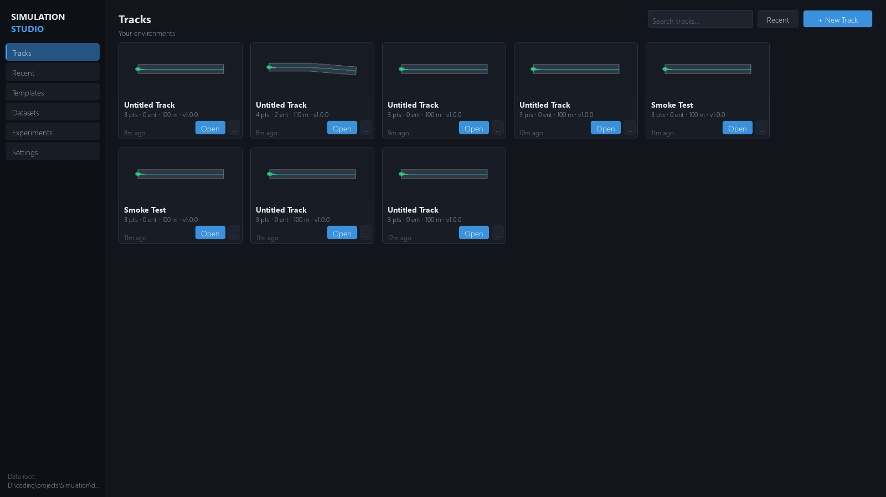

# Quick Start

The shortest path from clone to a running simulation. Assumes
[installation](installation.md) is complete.

## 1. Launch the Studio

```bash
python main.py
```

A window opens on the **Studio home** — the track library with your tracks,
templates, datasets, experiments, and settings.



## 2. All launch modes

```bash
python main.py                                  # Studio home screen
python main.py --track oval                     # studio + oval preset loaded
python main.py --track serpentine               # studio + serpentine preset
python main.py --track obstacle                 # studio + obstacle course
python main.py --track path\to\my.sim.json      # studio + your project file

python main.py --headless                       # headless env, TCP :8765
python main.py --headless --port 9000           # headless env on :9000
python main.py --headless --num-envs 8          # 8 envs, one port (training)
python main.py --headless --num-envs 8 --track serpentine

python main.py --width 1600 --height 900        # window size
```

| Flag | Default | Effect |
|---|---|---|
| `--headless` | off | No window — physics + TCP server only |
| `--port` | `8765` | TCP port for external agents |
| `--num-envs` | `1` | Headless only: host N envs on `--port` |
| `--track` | studio home | `oval`, `serpentine`, `obstacle`, or a `.sim.json` path |
| `--width` / `--height` | `1280` / `720` | Window size |

## 3. Your first 60 seconds

1. Home → **+ New Track** → name it, pick the `basic_driving` template →
   the workspace opens on the **EDIT** tab.
2. Click **SIMULATE** — the 3D viewport shows the car at spawn.
3. Drive: `W`/`↑` throttle, `S`/`↓`/`Space` brake, `A`/`D` or `←`/`→` steer.
4. `C` cycles camera (chase → hood → top-down → orbit), `R` resets,
   `Tab` toggles the observation inspector.

## 4. Connect an external agent (30 seconds)

The studio **always** hosts the TCP server — or run a dedicated headless
env:

```bash
python main.py --headless --port 8765
```

```python
from sim_client import SimGymEnv

env = SimGymEnv(host="127.0.0.1", port=8765)   # connects on construction
obs, info = env.reset(seed=42)                # obs: float32[23]

for _ in range(500):
    obs, r, term, trunc, info = env.step(env.action_space.sample())
    if term or trunc:
        obs, info = env.reset()
env.close()
```

`action_space` is `Box([-1,0,0],[1,1,1])` = `[steer, throttle, brake]` by
default. Or watch the included PID driver take over:

```bash
python -m sim_client.agents.pid_driver 127.0.0.1 8765
```

## Next steps

- [First simulation walkthrough](first-simulation.md) — record and replay an episode
- [External agents](../agents/external-agents.md) — SDK, gymnasium, other languages
- [Training](../reinforcement-learning/training.md) — PPO/SAC/DQN/BC
