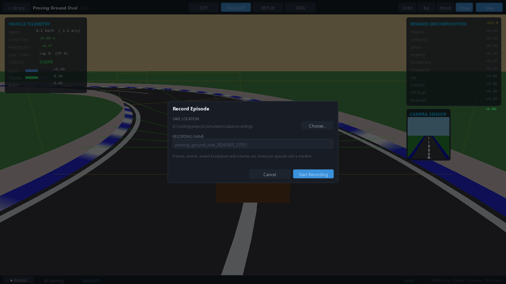
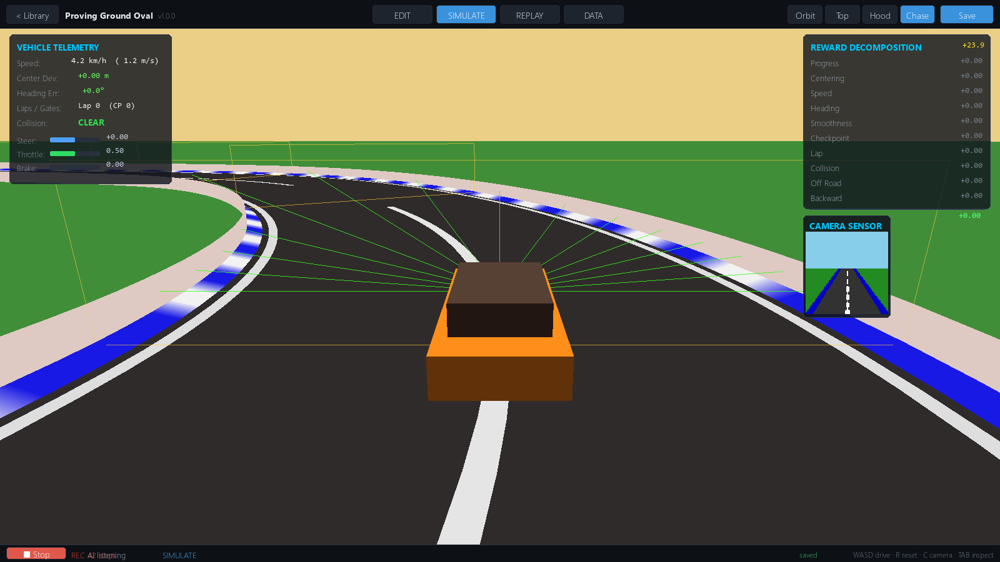
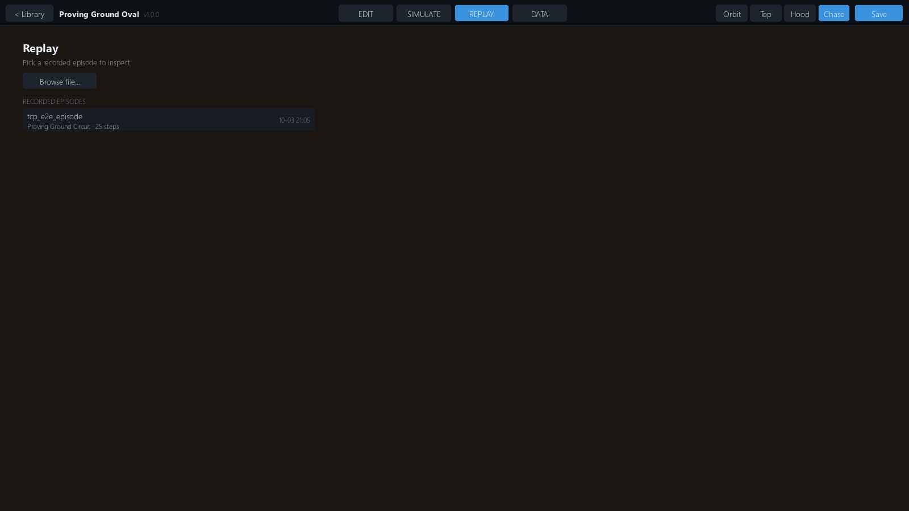
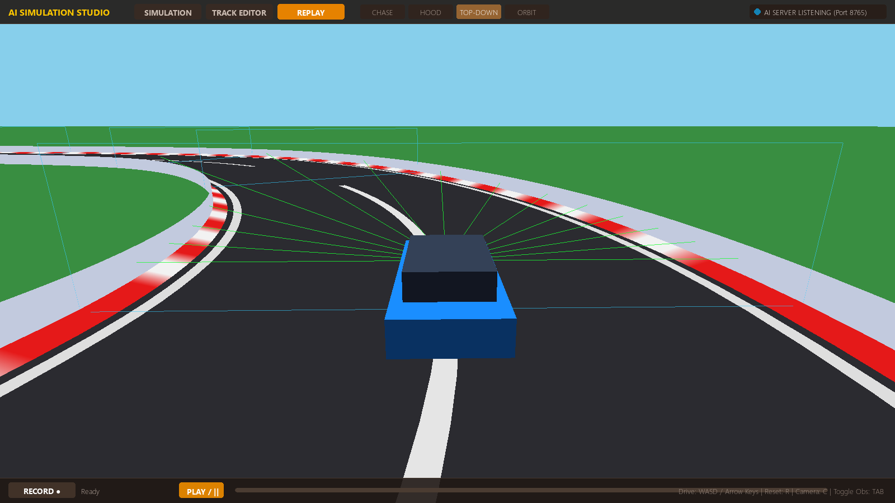

# Recording & Replay

Record any episode — manually driven or driven by an external AI — to a
portable JSON file, then scrub through it frame-by-frame in the Studio.

## Recording an episode

Recording lives on the **SIMULATE** tab's status bar:

1. Click **`● Record`** → the *Record Episode* dialog opens.
2. Set the **save location** (**Choose…** opens a folder picker; default
   is `<data_root>/recordings/`) and a **recording name** (a suggested
   `<track>_<timestamp>` name is used if you leave the field blank).
3. Click **Start Recording**. The status bar switches to a **`■ Stop`**
   button with a live `REC <n> steps` frame counter.
4. Click **`■ Stop`** → the *Recording Saved* summary dialog shows
   steps, duration (s), total return, termination reason, and the output
   path, with **View Replay**, **Record Again**, **Show in Folder**,
   and **Done** buttons.





Recording works in **both** driving modes: manual keyboard driving *and*
episodes driven by an external TCP agent — the recorder hooks the
environment's step counter (`_record_step_if_needed`), so **every STEP
frame is captured regardless of who supplied the action**.

> Note: `EpisodeRecorder` keeps at most `max_steps=5000` frames — past
> that it drops the **oldest** frames (ring buffer). Longer episodes
> lose their beginning.

## What gets captured

Each recorded step is one **telemetry** frame — observations are *not*
stored:

| Frame key | Contents |
|-----------|----------|
| `step` | Step index in the episode |
| `t` | Simulation time, s (4 decimals) |
| `pos` | Vehicle position `[x, y, z]` (3 decimals) |
| `yaw` | Heading, rad |
| `speed` | Speed, m/s |
| `action` | Applied `[steer, throttle, brake]` |
| `reward` | Step reward |
| `breakdown` | Per-component reward contributions `{id: contrib, …, "total"}` |
| `lat_offset` | Signed distance from centerline, m |
| `heading_err` | Heading vs. track tangent, rad |
| `collision` | `is_colliding` flag |

## Files on disk

Stopping writes a per-episode directory `<dest>/<name>/`:

```text
recordings/
└── oval_run_20261003_1420/
    ├── episode.json      # {"metadata": {...}, "frames": [...]}
    └── manifest.json     # lightweight listing entry
```

`episode.json` → `{"metadata": {...}, "frames": [...]}` where metadata
captures `timestamp`, `track_name`, `seed`, `env_version`,
`scenario_name`/`scenario_config`, `simulator_version`,
`protocol_version`, `env_fingerprint`, the full `env_config`,
`observation_schema`, `action_schema`, `reward_config`, plus
`total_steps`, `termination_reason`, and `episode_result` filled at
stop time.

`manifest.json` → `{kind: "episode_recording", name, steps, track_name,
simulator_version, created}` — a small file browsers can read without
parsing the full episode.

The recorder API (`sim_recorder.recorder.EpisodeRecorder`) also supports
gzip: `save_to_file("x.gz")` / `load_from_file("x.gz")` write and read
compressed JSON transparently.

**Legacy**: a `last_episode.json` at the data root (the pre-studio
recording format) is still recognized and offered as a fallback entry in
the replay picker.

## Replaying

Open the **REPLAY** tab. With no episode loaded you get the **picker**:
it lists every `<recordings>/*/episode.json` (newest first) plus the
legacy `last_episode.json` fallback, showing each entry's name with a
`track_name · N steps` subtitle read from its `manifest.json` and the
file's modification time. **Browse file…** opens any `*.json`/`*.gz`
recording from anywhere on disk — including evaluation replays produced
by training runs.




Once loaded, the **player** takes over the viewport:

- **Info chip** (top-left):
  `<name> · <track> · <current>/<total> s · <frame>/<total> · <speed>×`
- **Transport**: `|<` first · `<` step back · `>` play/pause ·
  `>>` step forward · `>|` last
- **Scrub bar**: click anywhere to seek
- **Speed**: `0.5×`, `1×`, `2×`, `4×` playback rates
- **Close**: unload and return to the picker



**Keys**: `Space` play/pause, `←`/`→` single-step. Camera modes work
during replay — press `C` to cycle Chase → Hood → Top-down → Orbit, or
use the header camera buttons.

## Evaluation replays from training

`sim_experiment` runs write one replay per periodic evaluation to
`runs/<run_id>/replays/eval_<step>_ep0.json` — the same
`{"metadata", "frames"}` schema and the same frame keys as studio
recordings, with run provenance in metadata:

```json
{
  "metadata": {
    "env_fingerprint": "…",
    "scenario_name": "basic_lane_following",
    "seed": 0,
    "experiment_id": "exp_…",
    "run_id": "run_…",
    "total_steps": 812,
    "termination_reason": "collision"
  },
  "frames": [ … ]
}
```

These are registered in the run's artifact registry (`kind: "replay"`,
`metadata: {"episode": 0, "evaluation": true}`) and play back in the
same REPLAY player via **Browse file…** — or straight from the DATA tab's
detail view via **View Replay**.

## Recordings vs. datasets

An episode recording is **telemetry for inspection** — positions,
actions, rewards — with no observations, so it cannot be trained on
directly. Training data (obs/action/reward transitions) is a different
artifact produced by `dataset-export` / trajectory recording — see
[Datasets](../datasets/datasets.md) for the `transitions_v1` format.

## See also

- [Simulating](../user-guide/simulation.md) — SIMULATE tab, driving keys, HUD
- [RL Overview](../reinforcement-learning/rl-overview.md) — the env contract behind recorded frames
- [Training](../reinforcement-learning/training.md) — eval replays and run artifacts
- [External Agents](../agents/external-agents.md) · [TCP Protocol](../agents/tcp-protocol.md) — record an AI-driven episode
- [Experiments](../experiments/experiments.md) · [CLI Reference](../experiments/cli-reference.md)
- [Datasets](../datasets/datasets.md) — `transitions_v1` training data
- [Quickstart](../getting-started/quickstart.md) · [First Simulation](../getting-started/first-simulation.md)
