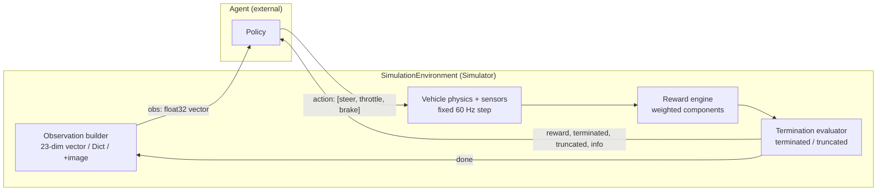

# Reinforcement Learning Overview

The simulator's RL contract in one page: **Simulator = Environment, Agent = external**.
The environment (`SimulationEnvironment`, `sim_env/environment.py`) implements a
Gymnasium-style `reset()/step()` API; your agent — a Python process, an included
baseline, or the built-in experiment trainers — supplies actions and consumes
observations, rewards, and done flags.



## Episode lifecycle

The environment follows the standard Gymnasium 5-tuple contract:

```text
obs, info = env.reset(seed=42)
while True:
    obs, reward, terminated, truncated, info = env.step(action)
    if terminated or truncated:      # either flag sets env.is_done
        obs, info = env.reset(seed=next_seed)
```

- `reset(seed=None, options=None)` → `(obs, info)`. If `seed` is `None`,
  `episode_config.random_seed` is used. Reset reseeds the fixed-step clock
  (`clock.rng`), samples domain randomization, applies the scenario
  (spawn override, obstacles, target-speed override), and returns the
  first observation.
- `step(action)` → `(obs, reward, terminated, truncated, info)`.
- **`terminated`** = task-level end (collision, off-road, wrong direction,
  completion). **`truncated`** = horizon limit (max steps, stuck/checkpoint
  timeout, duration limit). **Either one sets `is_done = True`.**
- **Step after done**: calling `step()` after an episode ended does **not**
  raise. It returns `(obs, 0.0, True, True, info)` with
  `info["termination_reason"] == "invalid_call_after_done"` and
  `info["error"] == "step() was called after episode ended. Must call reset() before stepping."`
  You must call `reset()` before stepping again.
- The environment advances **once per `step()` call** — a fixed `dt = 1/60 s`
  physics step at `physics_hz = 60`. There is no free-running simulation clock;
  lockstep applies over TCP too (see [TCP Protocol](../agents/tcp-protocol.md)).

## Observation space

### Default flat vector — 23 dims, float32

`ObservationSpaceDefinition.create_default_space()` produces a flat
`float32` vector of 23 dimensions. All channels are normalized; values are
further sanitized at runtime (NaN → 0, ±Inf → ±1).

| Index | Channel | Source `sensor:key` | Normalization | Declared range |
|-------|---------|---------------------|---------------|----------------|
| 0 | `speed` | `vehicle_state:speed` | ÷ 45 m/s (scale) | [0, 1] |
| 1–2 | `velocity_body` | `vehicle_state:vel_body` | vx ÷ 45, vy ÷ 10 | [−1, 1]² |
| 3 | `yaw_rate` | `vehicle_state:yaw_rate` | ÷ 3 rad/s | [−1, 1] |
| 4 | `steering_angle` | `vehicle_state:steering_angle` | ÷ 0.6 rad (max steer) | [−1, 1] |
| 5 | `distance_from_center` | `vehicle_state:distance_from_center` | ÷ road half-width (+ = left of centerline) | [−1, 1] |
| 6 | `heading_error` | `vehicle_state:heading_error` | ÷ π | [−1, 1] |
| 7 | `distance_to_checkpoint` | `vehicle_state:distance_to_checkpoint` | ÷ 100 m (capped) | [0, 1] |
| 8–22 | `lidar_ranges` | `lidar_rays:ranges_norm` | none — already normalized | [0, 1]¹⁵ |

LiDAR encodes `0 = impact`, `1 = clear` (40 m max range). If the LiDAR sensor
is missing from the suite, the channel is filled with `ones(15)` (all-clear).

### Dict mode and image channels

Set `flatten_vector=False` to receive a dict keyed by channel name
(`speed`, `vel_body`, `yaw_rate`, `steering_angle`,
`distance_from_center`, `heading_error`, `distance_to_checkpoint`,
`lidar_ranges`). Enable `include_image_channel` (or declare
`image_channels` for multi-camera) to add camera frames — `84×84×3 uint8`.
With a flat vector plus images the observation becomes
`{"vector": float32[23], "image": uint8[84,84,3]}`; extra cameras appear as
`image_<sensor_name>` (the bare `"image"` key is reserved for a sensor named
exactly `rgb_camera`). A missing camera yields zero-filled `uint8` frames.
See [Sensors](../sensors/sensors.md) for sensor configuration.

### Leakage guard

Every observation channel carries a `category`:
`agent_observation`, `debug_telemetry`, or `oracle_ground_truth`.
`validate_no_leakage()` rejects any enabled channel whose category is
`debug_telemetry` or `oracle_ground_truth` — the compiled pipeline raises
`ValueError` at build time and the environment validator reports a
`SECURITY LEAKAGE` error. Diagnostic data (exact position, ground-truth
state) is reachable only via `GET_STATE` / `info`, never as agent input.

## Action space

### Continuous (default)

`Box(low=[-1, 0, 0], high=[1, 1, 1], dtype=float32)` —
**[steering, throttle, brake]**. There is no handbrake channel.

The declarative `ActionSpaceDefinition` applies per-channel processing
(sanitize NaN→0 → scale → dead zone → rate limit → clip):

| Channel | Range | Default | Dead zone | Rate limit |
|---------|-------|---------|-----------|------------|
| `steering` | [−1, 1] | 0.0 | 0.02 | 4.0 /s |
| `throttle` | [0, 1] | 0.0 | 0.01 | 5.0 /s |
| `brake` | [0, 1] | 0.0 | 0.01 | 6.0 /s |

Dead zone: a deviation smaller than the dead zone from the default snaps back
to the default. Rate limit: per-step change is capped at `rate_limit × dt`
(continuous only; state resets each episode). Note: the **legacy**
`ActionSpaceConfig` path only sanitizes and clips — dead zones and rate
limits are a declarative-pipeline feature.

### Discrete option

`Discrete(5)`, each index mapping to a fixed `[steer, throttle, brake]`:

| Index | Action | Values |
|-------|--------|--------|
| 0 | Coast | [0.0, 0.0, 0.0] |
| 1 | Accelerate | [0.0, 0.7, 0.0] |
| 2 | Brake | [0.0, 0.0, 0.8] |
| 3 | Steer Left + Throttle | [−0.6, 0.4, 0.0] |
| 4 | Steer Right + Throttle | [0.6, 0.4, 0.0] |

## Reward

The default declarative reward (`create_default_racing_reward()`) is a
**weighted sum of 11 components**: `reward = Σ (raw_i × weight_i)`.

| `component_id` | Type | Weight | Params |
|----------------|------|--------|--------|
| `progress` | progress | 1.0 | `max_step_delta_m: 5.0`¹ |
| `centering` | centerline | 0.5 | `max_distance_m: 6.0`, falloff `linear` |
| `speed` | speed | 0.2 | `target_speed_ms: 20.0`, `tolerance: 5.0`¹ |
| `heading` | heading | 0.3 | — |
| `smooth_steer` | smooth_steer | −0.05 | — |
| `checkpoint` | checkpoint | 10.0 | — |
| `completion` | completion | 100.0 | — |
| `collision` | collision | −50.0 | — |
| `off_road` | off_road | −25.0 | — |
| `reverse` | reverse | −1.0 | `heading_threshold_deg: 100.0` |
| `time_penalty` | time_penalty | −0.01 | — |

¹ Declared but not consumed — the 5.0 m teleport guard is hardcoded.

Raw component values per step:

- **progress** — centerline distance advanced `Δs` (wrap-corrected; discarded if
  |Δs| > 5 m, a teleport guard).
- **centering** — `1 − norm` (linear), `1 − norm²` (quadratic), or
  `exp(−3·norm)` (exponential), where `norm = |lateral_offset| / max_distance_m`.
- **speed** — `min(1, speed / target_speed_ms)`.
- **heading** — `cos(heading_error)`.
- **smooth_steer** — `−(Δsteer)²`.
- **checkpoint / completion / collision / off_road** — 0/1 event flags.
- **reverse** — 1 if `Δs < −0.05 m` or `|heading_error| > heading_threshold_deg`.
- **time_penalty** — constant 1.0 per step (so `−0.01`/step here).

Every step's per-component contribution is exposed as
`info["reward_breakdown"]` (`{component_id: contrib, ..., "total": reward}`),
plus `last_detailed_breakdown` (`{id: {raw, weight, contrib}}`) on the engine.

The **legacy** `RewardConfig` uses the same structure with slightly different
defaults (progress 1.0, centering 0.5, speed 0.2 at 20 m/s, heading 0.3,
smoothness 0.05, checkpoint 10, lap bonus 100, collision −50, off-road −25,
backward −1) and breakdown keys `progress, centering, speed, heading,
smoothness, checkpoint, lap, collision, off_road, backward, total`.

> **Anti-idling note.** With the default weights a stationary, centered,
> aligned vehicle earns roughly +0.8/step from `centering` + `heading` alone.
> The `agentRL` library ships an anti-exploit preset **`drive_v1`** that
> fixes this: `progress 2.0, speed 0.5 (target 15 m/s), centering 0.05,
> heading 0.05, smooth_steer −0.02, checkpoint 5.0, completion 100,
> collision −50, off_road −25, reverse −1, time_penalty −0.12` — idling nets
> ≈ −0.02/step instead of +0.8. See [Training](training.md#agentrl-library-experimental).

## Termination

`terminated` and `truncated` are distinct: **terminated** = task outcome,
**truncated** = horizon/cutoff. Both set `is_done`. The default declarative
rule set (`create_default_racing_termination()`) has 6 rules:

| `rule_id` | Condition | Enabled | Kind | Params |
|-----------|-----------|---------|------|--------|
| `term_collision` | collision | yes | terminated | — |
| `term_off_road` | off_road | yes | terminated | — |
| `term_wrong_direction` | wrong_direction | yes | terminated | `max_angle_deg: 120` |
| `term_completion` | course_completion | **no** (off by default) | terminated | `target_laps: 1` |
| `trunc_max_steps` | max_steps | yes | truncated | `max_steps: 5000` |
| `trunc_stuck` | checkpoint_timeout | yes | truncated | `max_seconds: 30` |

Wrong direction triggers when the vehicle's heading deviates from the track
tangent by more than **120°**.

`info["termination_reason"]` strings differ between the two config paths:

| Meaning | Declarative (compiled) | Legacy |
|---------|------------------------|--------|
| Collision | `collision` | `collision` |
| Left the road | `off_road` | `off_road` |
| Wrong direction | `wrong_direction` | `wrong_direction` |
| Lap / course done | `completion` | `lap_completed`, `course_completed` |
| Step limit | `max_steps` | `max_steps_exceeded` |
| Stuck / no checkpoint | `stuck` | `checkpoint_timeout` |
| Still running | `running` | `running` |

Environment-level truncation adds two more reasons regardless of path:
`max_duration_exceeded` (episode `max_duration_seconds`, default 60 s) and
`scenario_time_limit_exceeded` (scenario `time_limit_override` wins when set).
Step-after-done reports `invalid_call_after_done`. Compiled evaluations also
populate `info["termination_info"]` with
`{rule_id, condition, reason, is_truncation, step, sim_time}`.

## `info` dict

`step()` and `reset()` return an `info` dict with these keys
(`_build_info_dict`):

| Key | Contents |
|-----|----------|
| `step` | Steps elapsed this episode |
| `sim_time` | Simulated seconds elapsed |
| `terminated` / `truncated` | Done flags |
| `termination_reason` | String reason (see table above) |
| `termination_info` | Dict `{rule_id, condition, reason, is_truncation, step, sim_time}` (declarative path) |
| `reward_breakdown` | `{component_id: contribution, ..., "total"}` |
| `total_reward` | Cumulative episode reward |
| `speed` | Vehicle speed, m/s |
| `lateral_offset` | Signed distance from centerline, m (+ = left) |
| `heading_error` | Heading vs. track tangent, rad |
| `road_width` | Road width at current position, m |
| `is_on_road` / `is_colliding` | Boolean flags |
| `action_valid` / `action_error` | Action validation result |
| `checkpoints_passed` / `current_checkpoint` | Checkpoint progress |
| `laps_completed` / `lap_progress` | Lap counters |
| `last_action` | Decoded `[steer, throttle, brake]` actually applied |

`info` is **diagnostic data** — usable for logging, shaping, or debugging.
Do not treat it as part of the agent's observation contract when chasing
benchmark comparability; the leakage guard exists precisely to keep these
two channels separate.

## Scenarios

A `ScenarioDefinition` controls episode conditions: `weather`
(`clear|rain|fog`), `time_of_day` (`day|dusk|night`), `ambient_light`,
`surface_friction_mult`, `target_speed_override`, `time_limit_override`,
`sensor_noise_mult`, `spawn_override` (`pos`, `yaw_deg`, `initial_speed`),
`obstacle_overrides` (spawned each reset), and a nested domain-randomization
block. Six built-ins ship in the standard library:

| `scenario_id` | Weather / Time | Friction mult | Target speed | Extras |
|---------------|----------------|---------------|--------------|--------|
| `basic_lane_following` | clear / day | 1.0 | 18 m/s | — |
| `high_speed_racing` | clear / day | 1.0 | 35 m/s | — |
| `wet_adverse_weather` | rain / dusk | 0.65 | 16 m/s | ambient light 0.6 |
| `obstacle_evasion` | — | — | — | cone @ [30, 10], barrier @ [−25, −15] yaw 0.4 |
| `sensor_noise_challenge` | fog / night | 0.9 | — | ambient 0.3, sensor noise ×2.5 |
| `full_domain_randomization` | — | — | — | randomization enabled, seed 1337 |

Scenarios can be switched at runtime via `SET_SCENARIO` (protocol ≥ 2.1) —
see [TCP Protocol](../agents/tcp-protocol.md#set_scenario-state-machine).

## Domain randomization

Two paths exist, applied per-`reset()` and seeded by `clock.rng`:

**Legacy** `DomainRandomizationConfig` (`enabled=False` by default):
mass ×U[0.85, 1.15], tire friction ×U[0.80, 1.20], surface friction
×U[0.75, 1.10], sensor noise ×U[0.5, 2.0], spawn lateral jitter ±1.0 m,
spawn heading jitter ±10°.

**Declarative** `DomainRandomizationDefinition` — a dict of
`RandomParamConfig` entries with `distribution ∈ {fixed, uniform, normal}`
(`param1` = fixed/min/mean, `param2` = max/std, plus `clip_min`/`clip_max`):

| Parameter | Default distribution | Clip |
|-----------|---------------------|------|
| `vehicle_mass_mult` | U[0.85, 1.15] | [0.5, 2.0] |
| `tire_friction_mult` | U[0.80, 1.20] | [0.4, 2.0] |
| `surface_friction_mult` | U[0.75, 1.10] | [0.3, 2.0] |
| `sensor_noise_mult` | U[0.5, 2.0] | [0, 5.0] |
| `spawn_lateral_jitter_m` | U[−1, 1] | [−3, 3] |
| `spawn_heading_jitter_deg` | N(0, 5) | [−30, 30] |

## Seeds and determinism

- `reset(seed)` seeds the environment's `FixedClock` RNG (`clock.rng`),
  which drives domain randomization, spawn jitter, and sensor noise draws.
  Same seed + same project file → same episode.
- Headless multi-env runs (`--num-envs N` or `HeadlessEnvPool`) use
  `seed = base_seed + env_index` (base default 42).
- Curriculum stages use `stage_seed = base + env_index + stage × 10000`.
- Physics runs at a fixed 60 Hz step — no wall-clock dependence.

## Curriculum

A curriculum (`CurriculumStage` list, serialized under `"curriculum"` in the
`.sim.json` project) advances the agent through progressively harder
scenarios. Each stage: `stage_id`, `scenario_id` (from the standard
library), `target_metric` (`mean_return` | `lap_completion_rate` |
`collision_rate`, default `mean_return`), `advancement_threshold` (default
100.0), `min_episodes` (default 50), and `environment_overrides`
(mapped keys: `target_speed`→`target_speed_override`, `time_limit`,
`surface_friction_mult`, `sensor_noise_mult`, `ambient_light`, `weather`,
`time_of_day`).

Default 5-stage curriculum:

| # | Stage | Scenario | Metric & threshold | Min episodes |
|---|-------|----------|--------------------|--------------|
| S1 | Lane Keeping | `basic_lane_following` | mean_return ≥ 50 (target speed 12) | 20 |
| S2 | High Speed | `high_speed_racing` | mean_return ≥ 120 (speed 22) | 30 |
| S3 | Obstacles | `obstacle_evasion` | lap_completion_rate ≥ 0.85 | 40 |
| S4 | Adverse | `wet_adverse_weather` | completion ≥ 0.80 | 40 |
| S5 | Full DR | `full_domain_randomization` | ≥ 0.90 | 50 |

Stage advancement is evaluated by `sim_experiment/curriculum_runtime.py` at
train time — **not** inside `SimulationEnvironment`. See
[Training](training.md#curriculum).

## Episode configuration

`EpisodeConfiguration` fields:

| Field | Default | Status |
|-------|---------|--------|
| `max_duration_seconds` | 60.0 | Used — truncation `max_duration_exceeded` |
| `max_steps` | 3600 | **Serialized but not consumed** — the step limit comes from termination rules (`trunc_max_steps`, 5000) |
| `spawn_mode` | `track_spawn` | `custom_pose` works; **`random_cp` is declared but never implemented** |
| `initial_speed` | 0.0 | Used (spawn) |
| `custom_spawn_pos` / `custom_spawn_yaw_deg` | (0,0,0.2) / 0 | Used when `spawn_mode=custom_pose` |
| `spawn_lateral_jitter_m` / `spawn_heading_jitter_deg` | 0 / 0 | Used |
| `random_seed` | 42 | Used (fallback when `reset(seed=None)`) |
| `reset_behavior` | `hard_reset` | **Config only — `soft` is not implemented** |
| `auto_reset_on_done` | False | **Serialized but not consumed** — agents must call `reset()` |

## Validation

`EnvironmentValidator` (`sim_env/validator.py`) gates a project for RL with
`is_valid_for_rl` (False if any ERROR-severity issue): agent present, ≥3
control points / ≥2 checkpoints, spawn on-road and ≥45° heading check, ≥3.5 m
clearance from collidables, ≥2 discrete options, sane channel bounds,
observation sources attached, no leakage, reward/termination sanity, and
more (warnings for missing progress reward or missing truncation rule).

Run it from the CLI:

```powershell
python -m sim_experiment.cli validate-env --project path\to\env.sim.json
```

## See also

- [Training](training.md) — trainers, env modes, curriculum runtime, BC
- [External Agents](../agents/external-agents.md) — SDK, Gym adapter, included agents
- [TCP Protocol](../agents/tcp-protocol.md) — wire contract
- [Experiments](../experiments/experiments.md) — experiment platform
- [Sensors](../sensors/sensors.md) · [Vehicle Model](../vehicle-dynamics/vehicle-model.md) · [Track Editor](../track-editor/track-editor.md)
