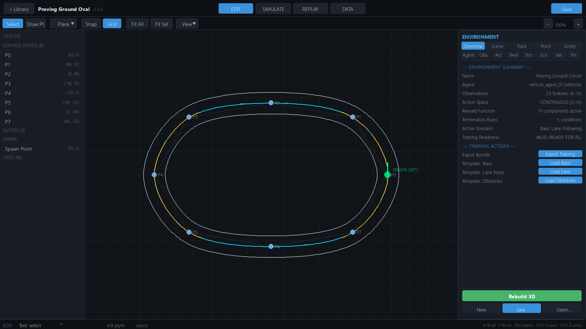
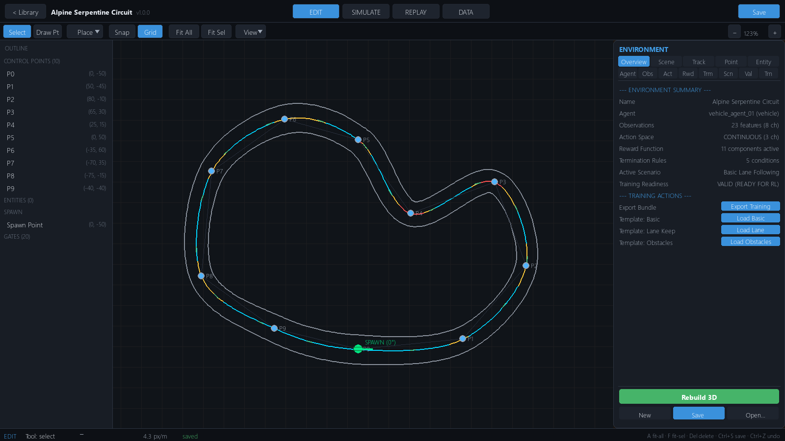
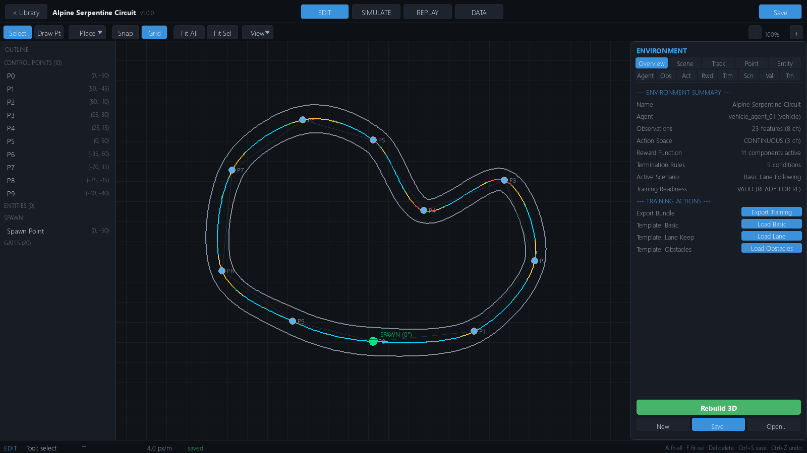
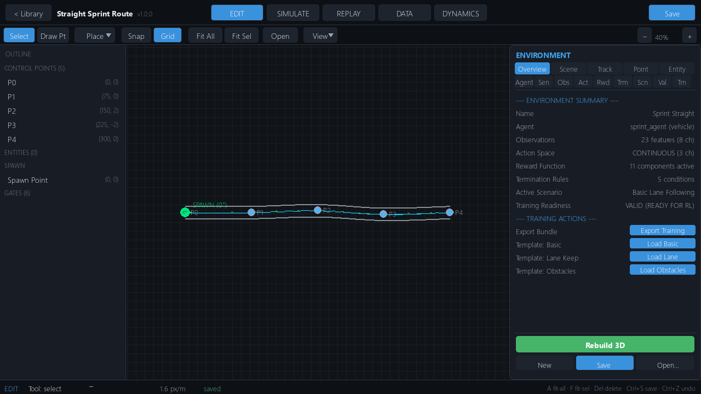
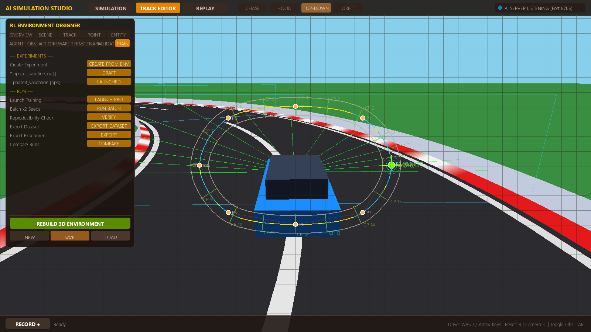
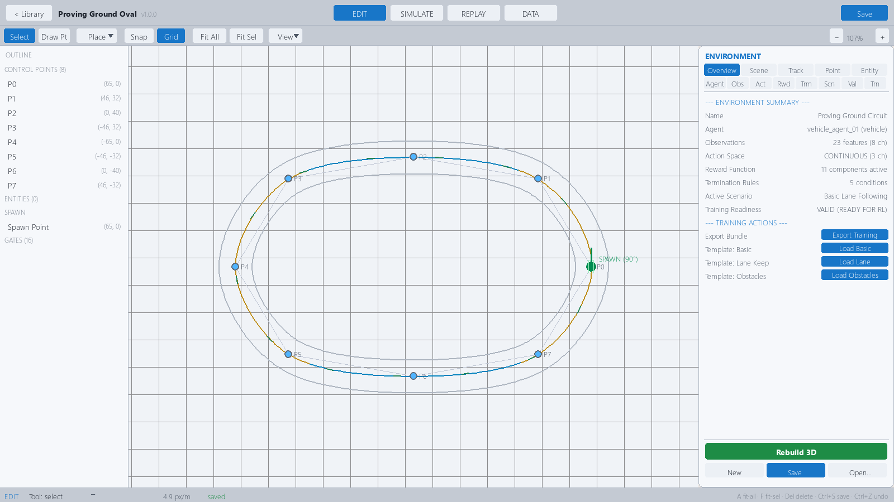

# Track Editor

The Track Editor is the 2D authoring environment inside Simulation Studio where you
build complete simulation projects — road geometry, world entities, and the full
agent/RL configuration — and save them as `.sim.json` project files in the track
library.

You reach it by opening any track from **HOME → TRACKS**, or by creating a new
track with **+ New Track**. The editor lives on the **EDIT** tab of the workspace.

## What's inside a `.sim.json`

One project file carries three conceptually different kinds of data. Understanding
the split makes the editor much easier to reason about:

| Layer | What it is | Where you edit it |
|---|---|---|
| **Track Geometry** (`road_definition`) | Control points → Catmull-Rom spline → road mesh, boundaries, spawn point, checkpoint gates | Canvas + OUTLINE rail + inspector GEO tabs (TRACK, POINT) |
| **Environment Entities** (`entities[]`) | Obstacles, barriers, cones, signs, traffic lights, checkpoint/spawn markers placed in the world | Place▾ menu, inspector SCENE and ENTITY tabs |
| **Simulation Configuration** (`agent`, `observation_schema`, `action_config`, `reward_config`, `termination_config`, `scenario_def`, `episode_config`, …) | Vehicle dynamics, sensors, observation/action spaces, reward function, termination rules, scenario & domain randomization | Inspector RL tabs (AGENT, SENSORS, OBS, ACTION, REWARD, TERM, SCENARIO) |

Everything is serialized into a single `.sim.json` file. See
[Project Schema Reference](../configuration/project-schema.md) for the full field
list.

## Editor anatomy

The EDIT workspace is divided into five regions:

1. **Toolbar (36 px, top of canvas)** — tool selection and view controls:
   `Select`, `Draw Pt`, `Place ▾`, `Snap`, `Grid`, `Fit All`, `Fit Sel`,
   the `Open/Closed` route toggle, `View ▾`, and zoom `−`/`+`.
2. **2D canvas (center)** — plan view of the track in world meters. A light grid
   is drawn every **10 m**. The road appears as boundary polylines around a
   curvature-colored centerline with direction chevrons; control points, gates,
   entity gizmos, and the spawn marker are drawn on top.
3. **OUTLINE rail (left, ~230 px)** — a scene outline with four sections:
   `CONTROL POINTS` (per-point rows you can click to select),
   `ENTITIES` (all placed world entities), `SPAWN`, and `GATES` (checkpoints).
4. **Inspector dock (right, ~350 px)** — the property editor. It has two tiers of
   tabs: **GEO** (`OVERVIEW`, `SCENE`, `TRACK`, `POINT`, `ENTITY`) and **RL**
   (`AGENT`, `SENSORS`, `OBS`, `ACTION`, `REWARD`, `TERM`, `SCENARIO`,
   `VALIDATE`, `TRAIN`). The bottom bar holds **Rebuild 3D** and
   **New / Save / Open**.
5. **Status bar (bottom)** — shows the active tool, cursor world coordinates,
   current zoom in px/m, `SNAP` state, and the dirty indicator when the project
   has unsaved changes.

## Navigation & view

| Action | How |
|---|---|
| Pan | Middle-mouse drag, or right-mouse drag on empty canvas |
| Zoom | Mouse wheel — ×1.15 per step, anchored at the cursor; clamped to 0.05–60 px/m (default **4.0 px/m**) |
| Fit all | `A` or **Fit All** — frames the whole track (zoom clamped to 0.05–35 px/m) |
| Fit selection | `F` or **Fit Sel** — frames the current selection |
| Grid toggle | `G` or **Grid** — shows/hides the 10 m grid (on by default) |
| Snap toggle | `S` or **Snap** — snaps edits to a **1.0 m** grid; with snap off, positions round to 0.1 m |
| View ▾ | Toggles for curvature coloring, direction chevrons, tangents, and width handles (all default on) |

New projects auto-frame on first open. The difference between a fitted and an
unfitted/zoomed view:

## Control points

Control points (CPs) define the road centerline. A valid track needs **at least
3 CPs** — the validator flags fewer as an ERROR, and the editor refuses to delete
below 3.

### Editing on the canvas

- **Move** — LMB-drag a point with the Select tool.
- **Append** — with the `Draw Pt` tool (`P`), click empty canvas to append a CP.
- **Insert** — with `Draw Pt`, click within **10 px** of an existing segment to
  insert an interpolated CP between its neighbors.
- **Close the loop** — with `Draw Pt` on an *open* track with ≥ 3 points, click
  the first CP. The editor shows a "Close Track" hover affordance near it.
- **Delete** — RMB on a point, or `Del`/`Backspace` with a point selected
  (ignored when only 3 points remain).

### Inspector POINT tab

Selecting a CP opens its properties:

| Field | Range | Serialized as | Notes |
|---|---|---|---|
| X, Y | ±1000 m | `x`, `y` | Plan position (world meters) |
| Elevation | −50 … 100 m | `z` | Real elevation — carried into the 3D mesh |
| Width | 4–40 m | `width` | Full road width at this station |
| Banking | ±30° | `banking` | Serialized and carried to the spline, **but does not affect vehicle dynamics** — the model never rolls |
| Friction | 0.1–2.5 typical | `friction` | Serialized but **not consumed by the vehicle step** — per-surface friction comes from `default_friction` × scenario multiplier |

The selected point also shows a width preview and a badge reading
`P<i> (<w>m) Z:+<z> <Bank:°>` on the canvas.

## Spline & route type

The centerline is a **Catmull-Rom cubic spline** interpolated through the control
points, then **arc-length reparameterized at a 1.0 m sample step** (minimum 10
samples). Per-point width and elevation are interpolated along it.

- **Closed** (default) — indices wrap; the route is a loop.
- **Open** — indices clamp at the ends; the route is point-to-point. The last
  checkpoint gate is drawn with a **FINISH** badge.

Toggle with the **Open/Closed** button in the toolbar or `is_closed` in the
inspector TRACK tab.

## Boundaries

Each road edge has a boundary *type* set in the inspector TRACK tab:

| `left_type` / `right_type` | Barrier mesh rendered? | Collision segments? |
|---|---|---|
| `guardrail` | Yes (vertical quads to `wall_height`) | Yes |
| `wall` | Yes (vertical quads to `wall_height`) | Yes |
| `curb` | No | **Yes** — still collidable at the road edge |
| `open` | No | **Yes** — still collidable at the road edge |
| `invisible` | No | **Yes** — still collidable at the road edge |

> **Honest note:** the boundary type only controls *rendering*. All five types
> produce collision segments at the road edge, so "open" does not mean the car
> can drive off into empty space — it means the barrier is invisible.

Other boundary fields (inspector TRACK):

| Field | Range / values | Effect |
|---|---|---|
| `wall_height` | 0.3–3.0 m | Height of guardrail/wall barrier quads |
| `has_curbs` | bool | When on, collision edges are pushed outward by `curb_width` and red/white curb strips render |
| `curb_width` | 0.2–2.0 m | Curb strip width outside the road edge |
| `curb_height` | serialized (default 0.15 m) | Raised curb lip height in the 3D mesh |
| `has_lane_markings` | bool | Serialized but **unused in mesh generation** |
| `default_friction` | 0.1–2.5 | Base surface friction multiplier for the whole road |

## Checkpoints (gates)

Checkpoints are direction-checked gates spaced evenly along the spline
(`s = k / num_checkpoints · length`). Set the count in the inspector TRACK tab:

- `num_checkpoints`: **4–64**, step 2 (runtime enforces a minimum of 4).

Crossing is detected by segment intersection and **verified against travel
direction** (motion · tangent > 0), so gates cannot be collected by driving
backward. Gate 0 (spawn/start) is drawn thicker; on open routes the final gate
gets the FINISH badge. Gates appear under the **GATES** section of the OUTLINE
rail.

## Environment entities

Entities are placed objects serialized under `entities[]`. Place them two ways:

- **Place ▾ toolbar menu** — pick a type, then click the canvas. The entity is
  placed and auto-selected.
- **Inspector SCENE tab** — `+Box`, `+Barrier`, `+Cone`, `+Sign`, `+Light`
  buttons.

Move entities by LMB-dragging them; delete with RMB or `Del`. The ENTITY tab
edits `pos x/y`, `yaw` (±180°), `collidable` (whether the entity produces a
collision OBB), and offers a delete action.

### Entity types

| Type | `entity_type` | Collidable by default | Semantics |
|---|---|---|---|
| Obstacle | `obstacle` | Yes | `obstacle_type` ∈ `box`, `barrel`, `crate`, `rock`; 2.0 × 1.0 × 1.0 m |
| Barrier | `barrier` | Yes | `barrier_type` ∈ `concrete`, `guardrail`, `tire_wall`; 3.0 × 0.6 × 0.9 m |
| Cone | `cone` | Yes | Radius 0.3 m, height 0.75 m |
| Traffic sign | `traffic_sign` | No | `sign_type` ∈ `stop`, `yield`, `speed_30`, `speed_50`, `speed_80`, `turn_left`, `turn_right`, `hazard_ahead`; 0.8 × 2.2 m |
| Traffic light | `traffic_light` | No | Auto-cycles green (12 s) → yellow (3 s) → red (10 s) via `update(dt)`; 0.6 × 3.2 m |
| Checkpoint | `checkpoint` | No | Manual gate entity, `gate_width` 12 m |
| Spawn | `spawn` | No | Alternate spawn marker entity |

Collidable entities (and all collidable OBBs) take part in OBB-vs-segment SAT
collision against the vehicle and are hit by LiDAR rays. Non-collidable entities
(signs, lights by default) are visual/logical only unless you flip the
`collidable` toggle.

## Spawn

The spawn marker is drawn as a crosshair plus a **vehicle footprint preview
(4.5 × 1.8 m)** and a yaw arrow showing initial heading. Set it two ways:

- Choose the **Spawn** placement tool (Place ▾) and click — sets `x`/`y`.
- Drag the marker; click within 12 px to select it.

The inspector AGENT tab additionally exposes `initial_speed` (0–60, step 2) and
`lateral_jitter_m` (0–5, step 0.2) on the agent's `spawn_config`. The full
serialized block is `road_definition.spawn_point` — see
[Project Schema](../configuration/project-schema.md).

## View aids

Under **View ▾** (all default on):

- **Curvature-colored centerline** — color-graded by local curvature so tight
  corners stand out.
- **Direction chevrons** — show the legal travel direction.
- **Tangents** — per-CP tangent handles.
- **Width handles** — per-CP width manipulation/visualization handles.

## Undo / redo

The editor keeps **full-document snapshots** (`project.to_dict()`) in an
`EditHistory` with a **limit of 64** entries. Snapshots are deep-copied, deduped
against no-ops, and cover **both canvas edits and inspector property changes** —
any `mark_dirty` action pushes a snapshot. `Ctrl+Z` undoes; `Ctrl+Y` or
`Ctrl+Shift+Z` redoes (redo is truncated by a new edit).

## Saving

`Ctrl+S` (or the **Save** button in the header / inspector footer) writes the
project to the track library at `<repo>/tracks/`:

- Files are saved as `.sim.json` (JSON, indent 2) under a **unique slug**
  (`name.sim.json`, then `name_2.sim.json`, …).
- The header shows a **dirty dot** next to the track name when unsaved changes
  exist; the status bar shows it too.
- On save, `environment_version` auto-bumps its patch number if the content
  fingerprint changed (e.g. `1.0.0` → `1.0.1`).
- A `fingerprint` (SHA-256 over the sorted JSON, excluding metadata keys) is
  written into the file.

After geometry changes, use **Rebuild 3D** in the inspector footer to regenerate
the 3D mesh used by the SIMULATE tab.

## Keyboard shortcuts (EDIT tab)

| Key | Action |
|---|---|
| `Ctrl+S` | Save project to library |
| `Ctrl+O` | Open project |
| `Ctrl+Z` / `Ctrl+Y` or `Ctrl+Shift+Z` | Undo / redo |
| `V` | Select tool |
| `P` | Draw Pt tool |
| `S` | Toggle snap |
| `G` | Toggle grid |
| `A` | Fit all |
| `F` | Fit selection |
| `Del` / `Backspace` | Delete selected point/entity |
| `Esc` | Cancel placement → deselect → leave editor |

## Light theme

All editor surfaces respect the selected palette (SETTINGS → theme cards).

## See also

- [Project Schema Reference](../configuration/project-schema.md) — every field in `.sim.json`
- [Environment Inspector](../user-guide/environment-inspector.md) — inspector tab reference
- [Vehicle Model](../vehicle-dynamics/vehicle-model.md) — what the vehicle_config fields do
- [Sensors](../sensors/sensors.md) — configuring the sensor suite
- [Keyboard Shortcuts](../user-guide/keyboard-shortcuts.md) — global bindings
- [First Simulation](../getting-started/first-simulation.md) — run what you build
