# Environment Inspector

The **Environment Inspector** is the docked right-hand panel in the EDIT
tab — the single place where the entire RL contract of a project is
viewed and edited. Every change writes into the `.sim.json` document,
participates in undo/redo, and re-runs the validator.

Two tab rows:

- **GEO** — `Overview · Scene · Track · Point · Entity`
- **RL** — `Agent · Sen(sors) · Obs · Act · Rwd · Trm · Scn · Val · Trn`

Bottom bar: **Rebuild 3D** (regenerate track mesh) and New / Save / Open.

## Training readiness

The OVERVIEW tab shows a readiness badge. After every property change the
`EnvironmentValidator` re-runs; tabs with errors get a red badge dot, and
the VALIDATE tab lists every issue as a clickable row that jumps to the
tab that owns the fix. `is_valid_for_rl` requires **zero ERRORs**.

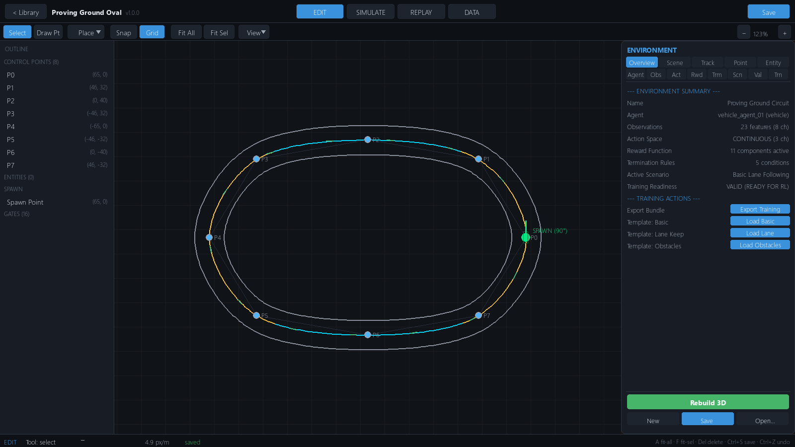

---

## GEO tabs

### OVERVIEW

Environment summary — name, agent id, observation dims/channels, action
space, reward component count, termination rule count, scenario —
plus the readiness badge, **Export Training** (writes a training bundle:
`environment.json`, `scenario.json`, `experiment.json`,
`run_gym_training.py` under `experiments/exported_training/`), and quick
template loaders (`basic_driving`, `lane_following`, `obstacle_avoidance`).

### SCENE

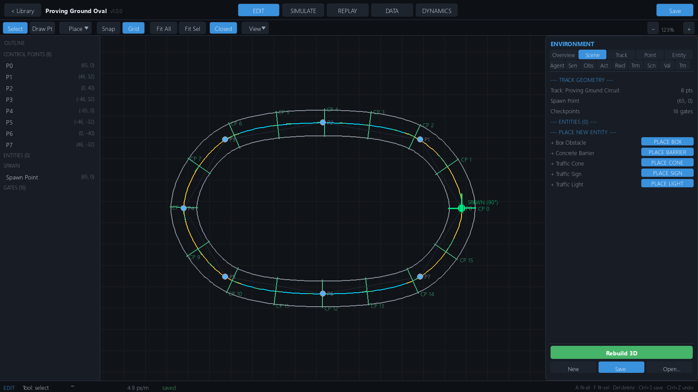

Track summary plus the **entity list** — select an entity to edit in the
ENTITY tab — and place-new actions (`+Box +Barrier +Cone +Sign +Light`)
that arm the editor's placement tool. See
[entities](../track-editor/track-editor.md#environment-entities).

### TRACK

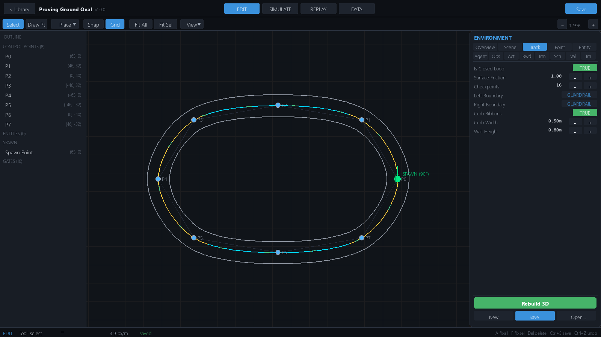

Road-level settings:

| Field | Range / values | Effect |
|---|---|---|
| `is_closed` | toggle | Closed loop vs open route |
| `default_friction` | 0.1 – 2.5 | Base surface µ multiplier |
| `num_checkpoints` | 4 – 64 (step 2) | Progress gates on the spline |
| `left_type` / `right_type` | guardrail · wall · curb · open | Boundary style (only guardrail/wall render barrier mesh — all types still collide at road edge) |
| `has_curbs` | toggle | Raised curb strip outside road edge |
| `curb_width` | 0.2 – 2.0 m | Curb strip width |
| `wall_height` | 0.3 – 3.0 m | Barrier visual height |

### POINT

Selected control point: `X/Y` (±1000), `width` (4–40 m), `elevation`
(−50 – 100), `banking` (±30°), and **Delete Point** (needs > 3 points).

> `banking` and per-point `friction` are serialized and carried through
> the spline, but the current vehicle model does not consume them —
> surface friction comes from `default_friction` × scenario multiplier.

### ENTITY

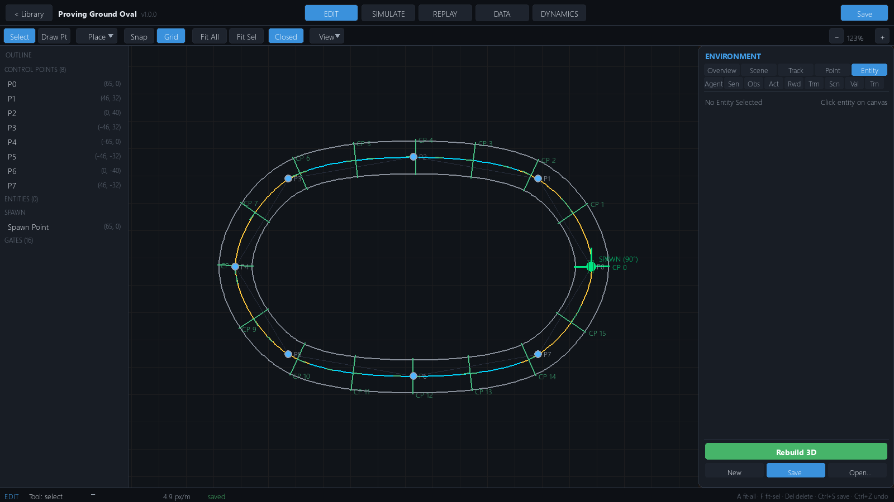

Selected entity: `pos x/y`, `yaw` (±180°), `collidable` toggle, **Delete**.

---

## RL tabs

### AGENT

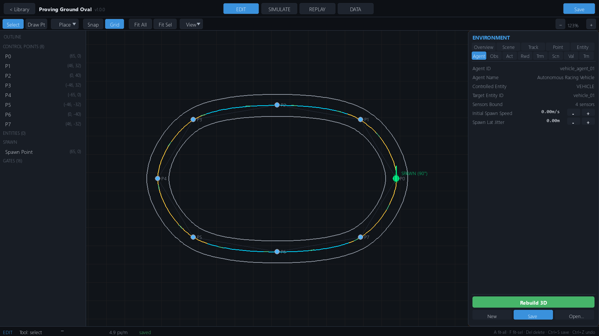

Agent identity (`agent_id`, `name`, `entity_type`, `entity_id`), bound
sensors, and spawn tuning: `initial_speed` (0–60 m/s, step 2) and
`lateral_jitter_m` (0–5, step 0.2).

### SENSORS

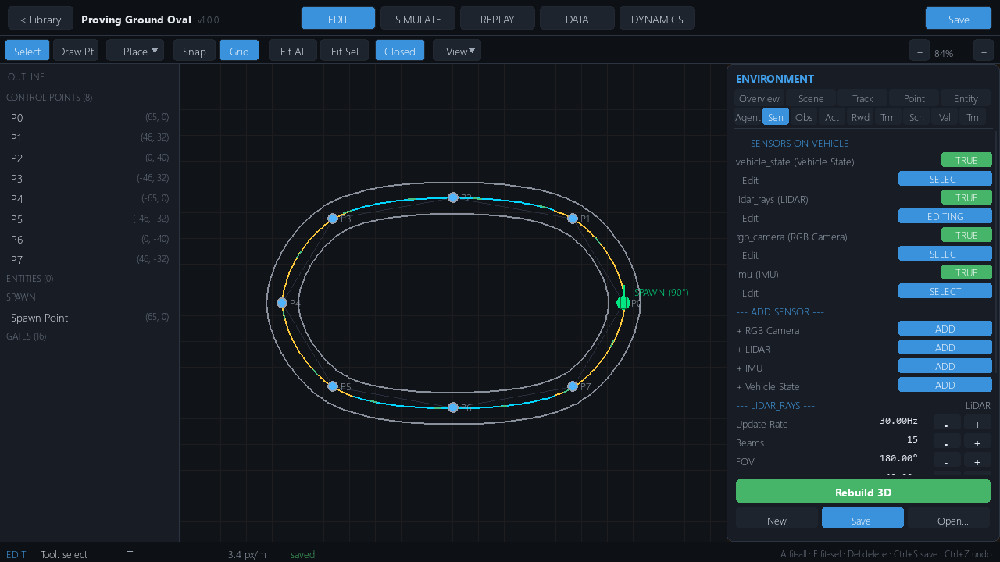

Per-sensor `enabled` toggle + EDIT, **add** buttons for each type
(RGB Camera / LiDAR / IMU / Vehicle State), duplicate and remove.
Full parameter reference: [Sensors](../sensors/sensors.md).

- Camera: update rate, FOV 30–120°, resolution 32–512 px, mount
  (x/y/z, yaw, pitch), noise σ, latency, **In Observations** toggle
  (syncs `image_channels`).
- LiDAR: beams 3–64, FOV ≤ 360°, range 5–200 m, mount yaw, noise, latency.
- IMU: accel/gyro noise σ, bias-drift rate.

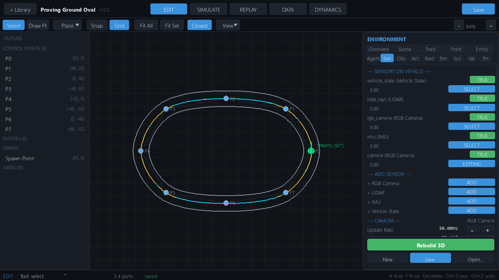

### OBS

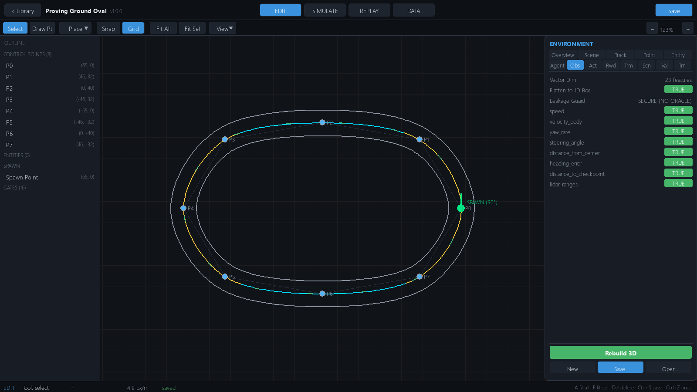

Vector dimension readout, `flatten_vector` toggle, **Leakage Guard**
(channels categorized `debug_telemetry`/`oracle_ground_truth` cannot be
agent observations), and a per-channel `enabled` toggle. Channels and
their normalization: [RL Overview](../reinforcement-learning/rl-overview.md).

### ACT

`Space Mode` — CONTINUOUS or DISCRETE — plus per-channel limits:
`Min`, `Max`, `Dead Zone` (≤ 0.2, clamped 0.3), `Rate Limit` (units/s).
Default channels: steering [−1, 1], throttle [0, 1], brake [0, 1].

### RWD — reward composer

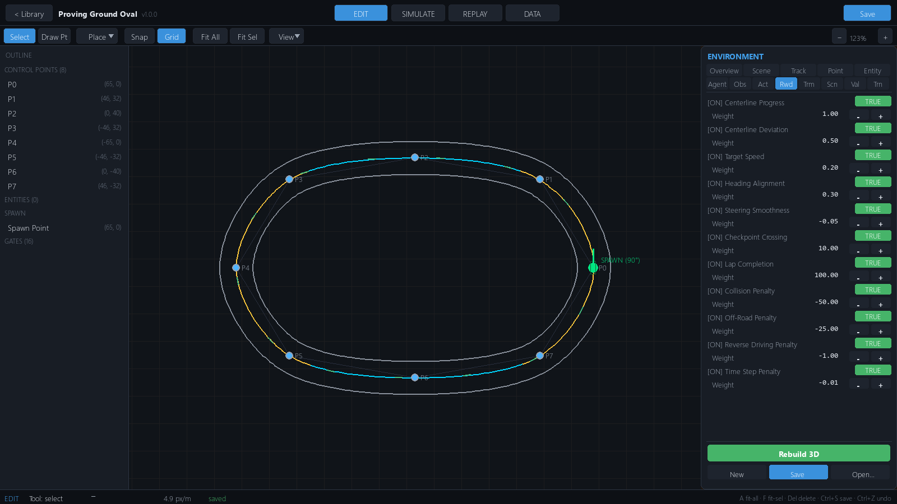

Each reward component: `enabled` toggle and weight (−200 … 500).
Default 11 components — see the
[reward table](../reinforcement-learning/rl-overview.md#reward).

### TRM — termination rules

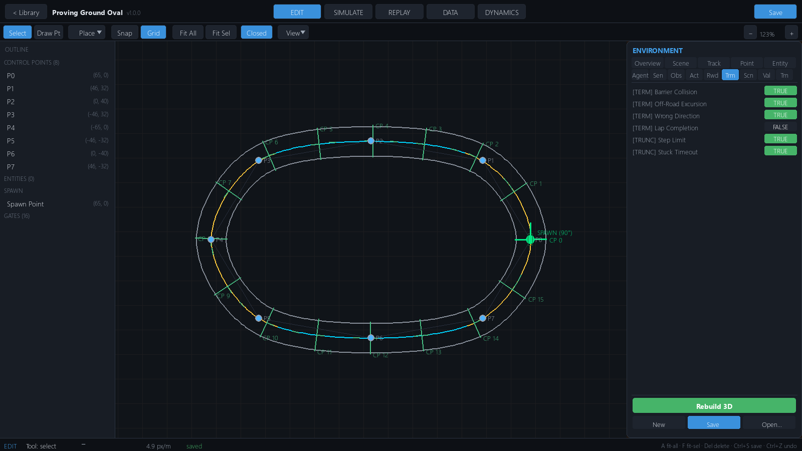

Each rule: `enabled` toggle plus a **TERM** (terminated) or **TRUNC**
(truncated) tag. Default six rules — see
[termination](../reinforcement-learning/rl-overview.md#termination).

### SCN — scenario

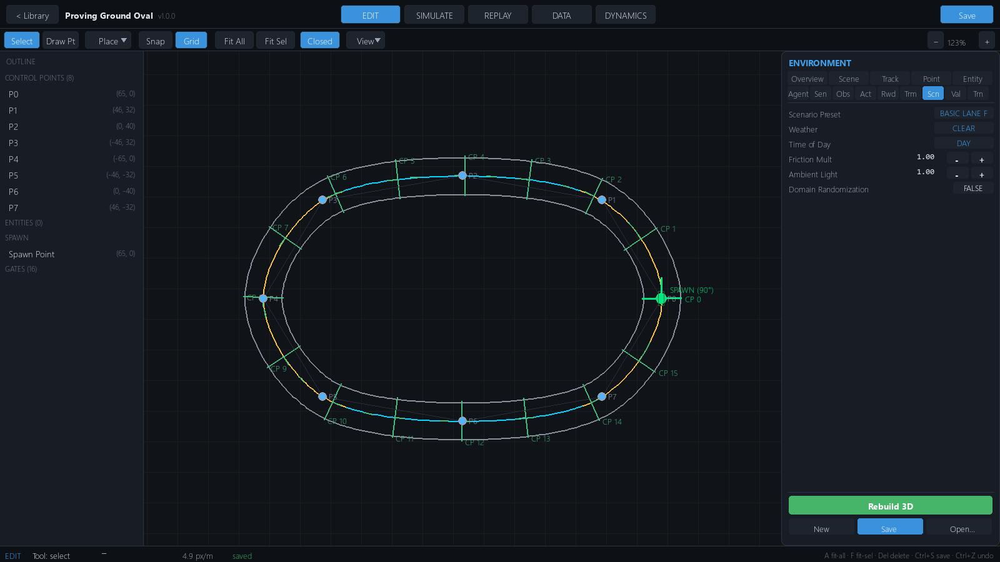

- **Scenario preset** — one of the 6 built-ins (`basic_lane_following`,
  `high_speed_racing`, `wet_adverse_weather`, `obstacle_evasion`,
  `sensor_noise_challenge`, `full_domain_randomization`).
- `weather` clear / rain / fog · `time_of_day` day / dusk / night
- `surface_friction_mult` 0.2 – 2.0 · `ambient_light` 0.1 – 1.0
- Domain-randomization enable.

Scenarios override spawn, target speed, time limits, sensor noise, and
obstacles — see [scenarios](../reinforcement-learning/rl-overview.md#scenarios).

### VAL — validation

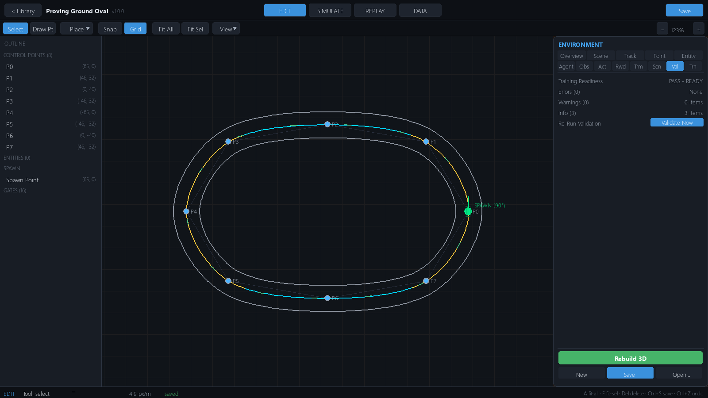

Readiness `PASS`/`FAIL`, error/warning/info counts, **Re-Run**, and the
issue list — every row clickable, jumping to the tab that owns the fix.
The same checks run via CLI:
`python -m sim_experiment.cli validate-env --project <file.sim.json>`.

### TRN — training

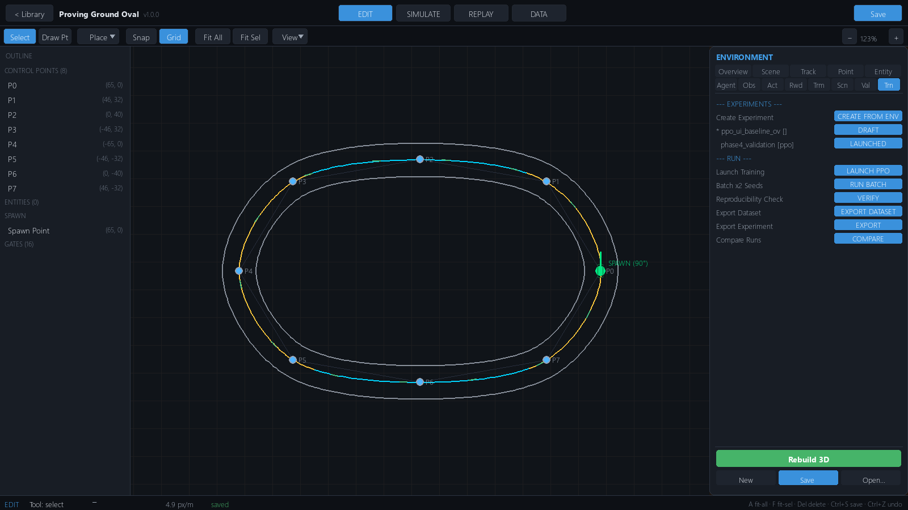

The experiment platform inline: experiment list, **create**
(PPO, 20 000 steps, ckpt 5 000, eval seeds [0, 1] × 3 episodes, seed 42),
launch, batch (2 seeds), cancel, resume, evaluate, reproducibility check,
export, dataset export, run comparison. The run monitor shows status,
timesteps, episodes, curriculum stage, metrics, and a reward chart;
batch progress, remote workers, dataset preview, and a comparison
multi-chart live here too. Full detail:
[Experiments](../experiments/experiments.md).

## Notes and limitations

- Vehicle-dynamics fields (`vc_*`) and full spawn fields (`sp_*`) have
  inspector plumbing but no emitting tab — edit `vehicle_config` /
  `spawn_config` in the `.sim.json` or via the API.
- Every inspector edit is one undoable document edit (`Ctrl+Z`) and is
  picked up by the running env — agent-space changes trigger a runtime
  recompile of the obs/action/reward/termination pipelines.

## See also

- [Track Editor](../track-editor/track-editor.md) · [Project schema](../configuration/project-schema.md)
- [RL Overview](../reinforcement-learning/rl-overview.md) · [Sensors](../sensors/sensors.md)
