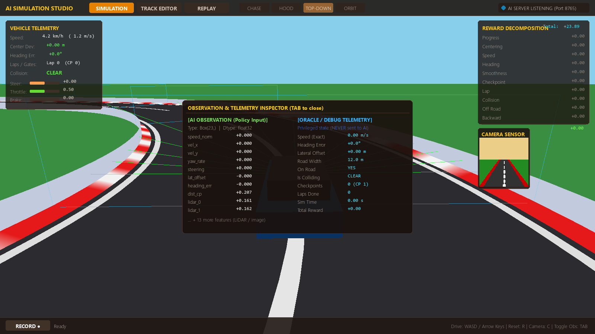

# Simulation — SIMULATE Tab & Workspace Tabs

The workspace has five tabs: **EDIT · SIMULATE · REPLAY · DATA · DYNAMICS**.
This page covers running, watching, and analyzing the simulation.
Authoring lives in [Track Editor](../track-editor/track-editor.md) and
[Environment Inspector](environment-inspector.md).

## SIMULATE


The SIMULATE tab runs the environment live in the 3D viewport.

### Driving controls

| Input | Action |
|---|---|
| `W` / `↑` | Throttle (+0.1 per press, decays 0.15/step) |
| `S` / `↓` / `Space` | Brake (+0.2, decays 0.2/step) |
| `A` / `D` or `←` / `→` | Steering (target ±0.8, smoothed 0.25) |
| `R` | Reset episode |
| `C` | Cycle camera: **CHASE → HOOD → TOP_DOWN → ORBIT** |
| `Tab` | Toggle observation inspector overlay |
| `Esc` | Dialog → tool → selection → home → quit |

> In interactive mode, episode timeouts are disabled
> (`max_episode_steps = 0`, `max_seconds_without_checkpoint = 0`) — you
> drive until `R` or a collision/off-road termination you configure.

### HUD telemetry (left panel)

Speed (km/h + m/s), center deviation, heading error, laps/checkpoint gates,
collision flag, and live steering/throttle/brake meters.

### Reward decomposition (right panel)

Every enabled reward component scored per step — the same values that land
in `info["reward_breakdown"]` for agents. Default component ids:
`progress, centering, speed, heading, smooth_steer, checkpoint,
completion, collision, off_road, reverse, time_penalty`.

### Camera PiP

A picture-in-picture shows the agent's `camera_rgb` sensor view (the same
pixels the policy would receive when image channels are enabled).

### Observation inspector (`Tab`)



Two columns: **AI observation** (the exact vector the agent receives, per
channel) vs **ORACLE telemetry** (ground-truth speed, lateral offset,
heading error, road width, on-road, colliding, checkpoints, laps, sim
time, total return). Use it to sanity-check what your policy is actually
allowed to see.

### External-agent indicator

The studio **always** hosts a `SimulationServer` on `127.0.0.1:--port`
(default 8765). The status bar shows `AI listening` / `AI CONNECTED`.
Connect a client and it drives the car in this very viewport — the
simulation you see *is* the env the agent steps:

```bash
python -m sim_client.agents.pid_driver 127.0.0.1 8765
```

### Recording

`● Record` opens the record dialog (name + destination, defaults to
`<data_root>/recordings/`); `■ Stop` finishes and summarizes the episode.
Recording also works while an external TCP agent drives — every STEP
frame is captured. See [Recording & Replay](../recording-replay/recording-and-replay.md).

## REPLAY

Episode playback: picker → transport controls (`|< < > >> >|`), scrub bar,
0.5/1/2/4× speed, `Space`/`←`/`→`. Replays include training-evaluation
recordings written by runs. Details:
[Recording & Replay](../recording-replay/recording-and-replay.md).

## DATA

Browser for recordings and datasets found under the data root and
`experiments/`: episode list, `inspect_dataset` report (validity, format,
episodes, steps, return stats, dims), View Replay / Open Folder / Delete.
Details: [Datasets](../datasets/datasets.md).

## DYNAMICS


A physics-only validation bench for the vehicle model — runs the
`tools/vehicle_dynamics` maneuver suite at fixed `dt = 1/60 s`:

- Maneuvers: `straight_line`, `constant_steer_±`, `steer_step`,
  `steer_ramp`, `sine_steer_0.15_0.5hz`, `steer_reversal`,
  `steer_escalation`, `braking_1.0`, `brake_steer`, `lane_change`,
  `lateral_disturbance`.
- Speed selector 10 / 20 / 30 m/s; **Run full suite**.
- Results: 14 metric rows (final speed, peak |vy|, steady/peak sideslip,
  yaw rates, ax/ay, slip angles, tire Fy, curvature, lateral drift),
  trajectory plot, sideslip/yaw/ay time-series.
- **Set A / Set B** comparison with a delta table; **Export** writes
  CSV + PNG + manifest + results.json to `benchmarks/vehicle_dynamics/ui_<ts>/`.

> The DYNAMICS tab currently runs with the **default** `VehicleConfig`,
> not the project's — it's a model-validation bench, not a per-track tuner.
> See [Vehicle Dynamics](../vehicle-dynamics/vehicle-model.md).

## See also

- [Keyboard & mouse reference](keyboard-shortcuts.md)
- [Sensors](../sensors/sensors.md) · [Vehicle model](../vehicle-dynamics/vehicle-model.md)
- [External agents](../agents/external-agents.md) · [RL contract](../reinforcement-learning/rl-overview.md)
