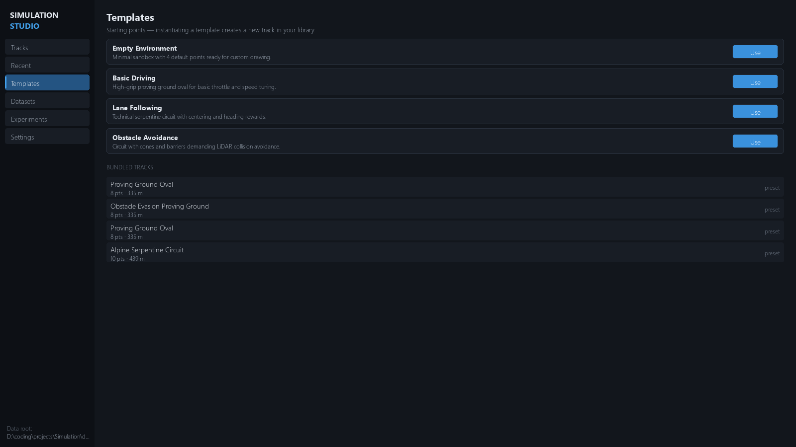
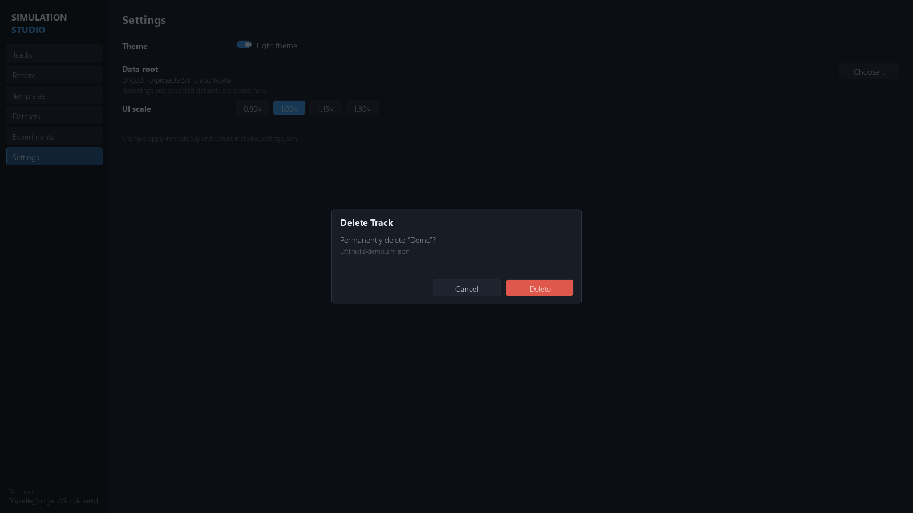
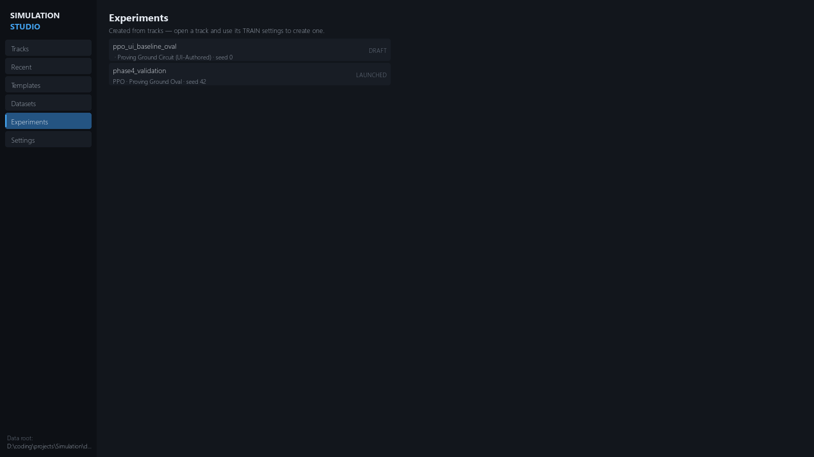
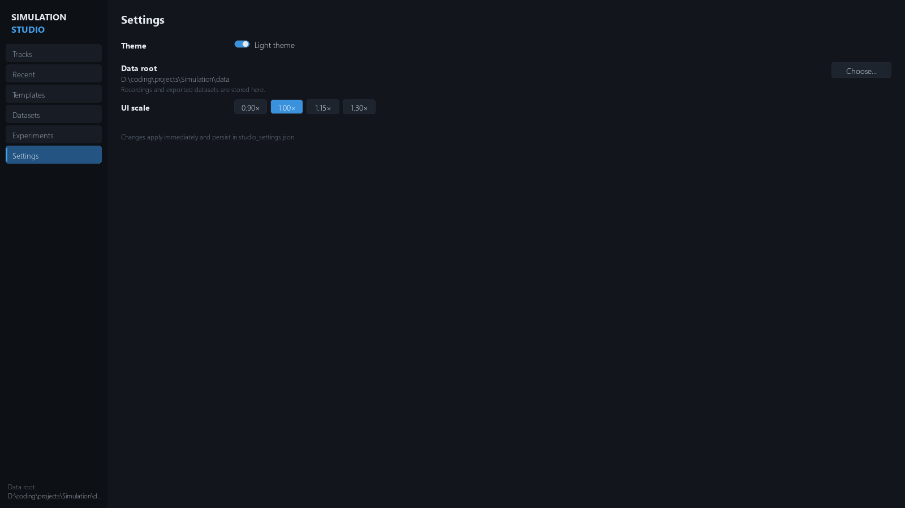
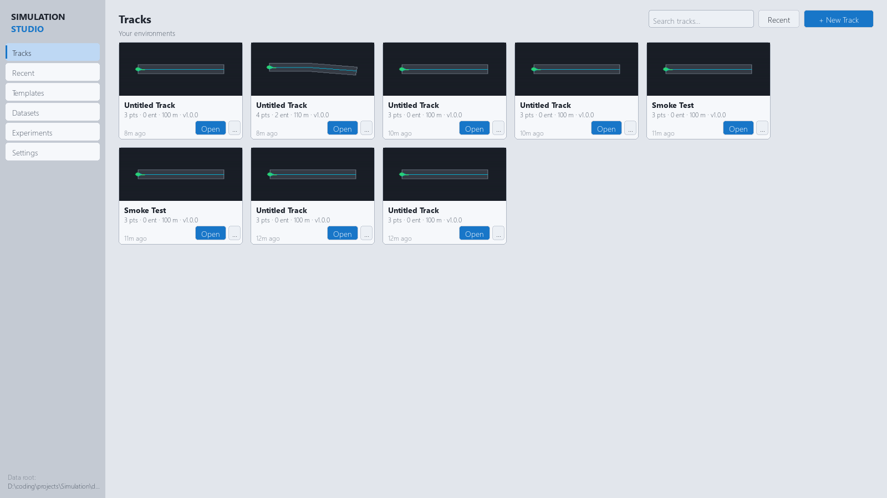

# Studio Home & Track Library

The home screen is the hub: track library, templates, datasets, experiments,
and settings. Reach it any time with **< Library** (workspace header) or
`Esc` from a workspace.

## Layout

A 190 px left nav with badge counts: **TRACKS · RECENT · TEMPLATES ·
DATASETS · EXPERIMENTS · SETTINGS**, and the current data root in the
footer.

### TRACKS

Every `.sim.json` in your library — card grid with generated thumbnails
(road outline, direction chevron, spawn marker):

- Card info: name, open/closed badge, `pts · entities · length m`,
  environment version, description, ★ favorite, age.
- `+ New Track` (top-left), search box, and a sort button that cycles
  **modified → name → length**. Favorites pin to the front.
- Card `...` menu: **Open · Favorite/Unfavorite · Rename… · Duplicate ·
  Reveal in Folder · Delete…**

Track files live in `tracks/` (writable library) and `presets/` (bundled,
read-only). Rename changes the project's display name — the `.sim.json`
filename stays stable. Duplicate creates `Name (copy)`.

### RECENT

Last-opened tracks (most-recent-first, up to 10 entries, tracked in
`data/studio_settings.json`).

### TEMPLATES

Click **Use** on a template to create a new track in your library:

| Template | Geometry | Highlights |
|---|---|---|
| `empty` | 100 m open straight | Sandbox — no entities |
| `basic_driving` | Closed oval | Default fallback template |
| `straight_sprint` | 300 m open sprint | 6 checkpoints, FINISH gate |
| `hairpin` | Closed circuit | Hairpin apex, 16 checkpoints |
| `slalom` | 200 m open | 16 m road, 5 cone gates |
| `lane_following` | Serpentine | 20 checkpoints, centering-tuned reward |
| `obstacle_avoidance` | Oval + entities | 3 cones + barrier, −100 collision weight |

Bundled `presets/*.sim.json` (oval circuit, serpentine, obstacle challenge)
open read-only from the same list.

### New Track dialog

Name input + template picker (`empty` is the default). `Enter` confirms.

### Delete confirmation

Deleting removes the `.sim.json`, its library metadata, and its cached
thumbnail.

### DATASETS

Browse episode recordings and training datasets found under the data root
and `experiments/` — see [Datasets](../datasets/datasets.md).

### EXPERIMENTS

Experiment manifests under `experiments/` — see
[Experiments](../experiments/experiments.md).

### SETTINGS

- **Theme** — five palettes: *Midnight*, *Ocean*, *Ember* (dark) and
  *Paper*, *Solar* (light). Persisted instantly.
- **Data root** — where `recordings/` and `datasets/` live. `Choose…`
  opens a folder picker; the path is write-probed before it's accepted.
  Default: `<repo>/data`.
- **UI scale** — `0.9 / 1.0 / 1.15 / 1.3` buttons, clamped to [0.75, 2.0].

Settings file: `data/studio_settings.json` — see
[Settings Reference](../configuration/settings-reference.md).

## Themes

Every screen re-renders in the selected palette — editor, simulation,
dialogs included.

## See also

- [Simulation tab](simulation.md) · [Keyboard & mouse](keyboard-shortcuts.md)
- [Track Editor](../track-editor/track-editor.md) · [Project schema](../configuration/project-schema.md)
