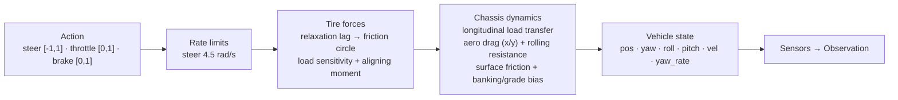
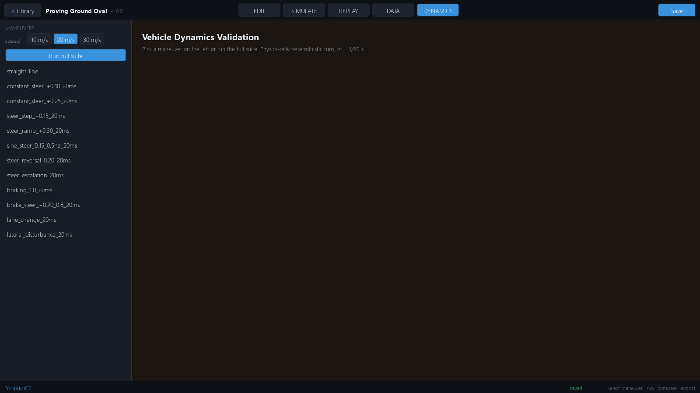

# Vehicle Dynamics

The simulator's vehicle is a **single-track (bicycle) dynamic model**
implemented in `sim_core/vehicle/` — lateral forces aggregated per axle
with a saturating tire model including relaxation length, load
sensitivity and pneumatic trail; longitudinal load transfer, per-axis
aero drag, and a kinematic↔dynamic blend at low speed. All units are SI.

> Terminology note: the code comments mention "4-wheel tire slip" but the
> implementation aggregates forces per axle (single-track model). Lateral
> load transfer is intentionally omitted.

## Data flow



### Tire model — friction envelope + saturation

Each axle computes a free-rolling lateral demand, then the demanded
(Fx, Fy) force vector is scaled proportionally to fit the friction
circle:

```
alpha_eff ← first-order lag: alpha_eff += min(1, v·h/σ) · (alpha − alpha_eff)
cap       = µ·Fz / (1 + k_load·(Fz/Fz_static − 1))
Cα_eff    = Cα · (Fz/Fz_static)^0.8
Fy_demand = −cap · tanh(Cα_eff · alpha_eff / max(1, cap))
s         = min(1, cap / |(Fx, Fy_demand)|)
(Fx, Fy) ← s · (Fx, Fy_demand)
Mz_align += −t·Fy      with  t = 0.05·max(0, 1 − |alpha_eff|/0.3)
```

Tire relaxation length (σ = 0.55 m) makes lateral force build over a
finite distance instead of instantly; load sensitivity makes grip grow
sublinearly with load; pneumatic trail adds the real self-aligning yaw
moment that lets a released slide re-straighten. Hard acceleration or
braking *reduces* available cornering force — combined-slip behavior
without a full Pacejka implementation — via the proportional vector
clamp. `Cα` vs axle-load ratio keeps a mild understeer gradient
(~2 °/g measured, V04).

### Longitudinal model

- Engine force is power-limited: `F = min(max_drive_force,
  engine_power / |v|)` — tractive bound at crawl, `P/v` at speed — with a
  smooth 2 m/s limiter band at `top_speed` (45 m/s ≈ 162 km/h).
- Brake force opposes velocity; below |vx| < 0.05 m/s the car is stopped;
  anti-creep zeroes velocity when `brake > 0.1` and |vx| < 0.1.
- Aero drag opposes the **velocity vector** with per-axis coefficients:
  frontal `Cd·A` on vx, broadside `Cs·As` on vy — a deep slide sheds
  lateral speed to aero side force.
- Rolling resistance `F = Crr·m·g` (deadband ±0.05 m/s) opposes vx.
- Longitudinal load transfer `ΔFz = m·ax·h_cog / wheelbase`, clamped to
  ±90 % of static axle load.
- Weight distribution `drive_force_front_fraction`: 0 = RWD (default),
  1 = FWD, 0.5 = AWD; `brake_bias_front` splits brake force.

### Low-speed blending

Below `low_speed_threshold` (1.5 m/s **total speed** `hypot(vx,vy)`) the
model blends toward a kinematic bicycle (`yaw_rate = vx·tanδ / wheelbase`)
via bounded relaxation with time constant `low_speed_relax_tau`
(0.05 s). Keying on total speed is load-bearing: the previous `|vx|`-only
keying switched off all lateral tire force during sideways slides that
scrubbed forward speed (the lateral-freeze defect). Inside the blend a
Coulomb-bounded decay `min(0.8·µg·cosθ, |vy|/h)` still removes residual
lateral velocity, where `cosθ` is the road-plane tilt derived from the
gravity bias. A **static-friction hold** parks the car at rest whenever
the gravity pull is within `µg·cosθ` (closed form `µg/√(1+µ²)`) and no
drive demand is present — on a slope steeper than the friction angle the
hold releases and the car genuinely slides downhill.

### Surface physics

Each step the environment queries `track_queries.query_surface(pos)` for
the **local** surface under the car: region (`road`/`curb`/`off`),
interpolated control-point `friction`, `banking`, and `grade`.
`µ = tire_friction × default_friction × scenario × local_mult`, and
banking/grade gravity enters as a world-frame acceleration bias —
it moves the car but is correctly excluded from `accel_body` (an
accelerometer cannot feel gravity). The road-plane tilt also scales
the static normal loads: `Fz → Fz·cos θ` with `sin θ = |bias|/g`,
so grip drops consistently on steep banks/grades.

### Body attitude

Quasi-static suspension attitude: `roll = 4°/g·ay`, `pitch = 1.2°/g·ax`
(nose-up / right-side-down positive). Exposed on `state.roll/pitch` for
the IMU gravity projection and camera rigs — not a roll DOF.

### Integration & determinism

Fixed `dt = 1/60 s`; each step runs `physics_substeps` (default 4)
explicit-Euler substeps → **240 Hz physics**. Control inputs are held
constant across substeps. All randomness flows through a seeded
`np.random.default_rng` — a given seed reproduces an episode exactly.

### Collision

The vehicle is an `OBB2D` (`length × width` at `yaw`) tested with SAT
against track boundary segments (→ `collider_type="boundary_barrier"`)
and collidable entity OBBs (→ `"obstacle"`). A spatial-hash broadphase
(12 m cells) culls candidate segments. Detected contacts get a **rigid-body
impulse response**: positional depenetration plus a normal impulse
`Jn = −(1+e)·vn / (1/m + (r×n)²/Iz)` and Coulomb-capped tangential
friction including the yaw moment arm — strictly dissipative
(`contact_restitution = 0.15`, `contact_friction = 0.6`). The contact
normal is oriented toward the **road interior** (from the surface
query's lateral offset), so a vehicle whose centre crosses the wall line
is resolved back onto the road rather than ejected outward. There is no
vehicle-vehicle collision.

## Parameters (`vehicle_config` in `.sim.json`)

| Field | Type | Default | Unit | Effect |
|---|---|---|---|---|
| `mass` | float | 1200.0 | kg | Vehicle mass (DR-multipliable) |
| `length` | float | 4.2 | m | OBB half-length = L/2 |
| `width` | float | 1.8 | m | OBB half-width = W/2 |
| `height` | float | 1.4 | m | Visual only |
| `wheelbase` | float | 2.6 | m | Axle distance — steering geometry, load transfer |
| `track_width` | float | 1.5 | m | Wheel transforms only |
| `cog_height` | float | 0.45 | m | CG height — longitudinal load transfer |
| `weight_dist_front` | float | 0.52 | [0–1] | Mass fraction on front axle |
| `wheel_radius` | float | 0.34 | m | Wheel visuals |
| `yaw_inertia` | float | 0.0 | kg·m² | `0` = auto `Iz = mass·a·b` |
| `max_steering_angle` | float | 0.58 | rad (~33°) | Road-wheel steering limit |
| `steering_rate` | float | 4.5 | rad/s | Road-wheel rate limit |
| `max_drive_force` | float | 5000.0 | N | Low-speed tractive bound (~traction limit of RWD axle) |
| `engine_power` | float | 90000.0 | W | Engine power — `F = P/v` at speed |
| `power_min_speed` | float | 2.0 | m/s | Floor for the P/v term |
| `max_brake_force` | float | 9000.0 | N | Total brake force |
| `top_speed` | float | 45.0 | m/s | Speed-limiter band edge |
| `reverse_max_speed` | float | 10.0 | m/s | **Declared, unused** |
| `drive_force_front_fraction` | float | 0.0 | [0–1] | RWD 0 · AWD 0.5 · FWD 1 |
| `brake_bias_front` | float | 0.65 | fraction | Brake split |
| `drag_coeff` | float | 0.32 | Cd | Aero drag (longitudinal) |
| `frontal_area` | float | 2.1 | m² | Aero drag (longitudinal) |
| `side_drag_coeff` | float | 1.0 | Cs | Aero side force in slides |
| `side_area` | float | 4.9 | m² | Projected side area |
| `air_density` | float | 1.225 | kg/m³ | Aero |
| `rolling_resistance` | float | 0.015 | — | `F = Crr·m·g` |
| `tire_friction` | float | 1.0 | µ mult | `µ = tire_friction × surface_friction` |
| `cornering_stiffness_front` | float | 80000.0 | N/rad | Front axle Cα |
| `cornering_stiffness_rear` | float | 85000.0 | N/rad | Rear axle Cα |
| `tire_relaxation_m` | float | 0.55 | m | Tire force lag ≈ σ/v |
| `tire_load_sensitivity` | float | 0.10 | — | µ-efficiency loss under overload |
| `tire_stiffness_load_exp` | float | 0.8 | — | Cα ∝ Fz^0.8 |
| `pneumatic_trail_m` | float | 0.05 | m | Aligning-moment lever arm |
| `roll_deg_per_g` | float | 4.0 | °/g | Quasi-static roll attitude |
| `pitch_deg_per_g` | float | 1.2 | °/g | Quasi-static pitch attitude |
| `contact_restitution` | float | 0.15 | — | Wall-impact restitution e |
| `contact_friction` | float | 0.6 | — | Wall tangential friction |
| `physics_substeps` | int | 4 | — | 60 Hz env → 240 Hz physics |
| `low_speed_threshold` | float | 1.5 | m/s | Blend below this **total** speed |
| `low_speed_relax_tau` | float | 0.05 | s | Blend time constant |
| `low_speed_slide_decay` | float | 0.8 | ×µg | Residual-slide friction in blend |

`yaw_inertia = 0` auto-computes `Iz = mass·a·b` where `a`/`b` are CG
distances to the axles.

## What is not modeled

- `reverse_max_speed` — declared but unused (no reverse gear input).
- Lateral load transfer (single-track axle aggregation), wheel-speed /
  slip-ratio dynamics, handbrake input, suspension, tire temperature,
  tire post-peak falloff, aero lift/downforce and yaw moment,
  vertical dynamics (`pos.z` follows surface elevation),
  vehicle-vehicle contact.

## Validation

Two layers of validation exist:

- **Maneuver bench** — the **DYNAMICS** workspace tab runs
  `tools/vehicle_dynamics` at fixed `dt = 1/60 s` over 17 maneuvers at
  10/20/30 m/s with A/B compare and export.
- **V01–V22 suite** — `tools/vehicle_dynamics/v_suite.py` runs the
  standards-aligned checks (J266 understeer gradient, ISO 7401 step
  metrics, ISO 3888-inspired lane change, friction/banking, contact
  response, timestep sweep, determinism) into
  `benchmarks/vehicle_dynamics/v_suite/results.json`.

`tests/test_vehicle_physics.py` and
`tests/test_vehicle_dynamics_validation.py` cover the model
programmatically, including regressions for the lateral-freeze defect,
countersteer recovery, relaxation lag, and contact response.



> The DYNAMICS tab currently uses the **default** `VehicleConfig`, not
> the project's — it's a model bench, not a per-track tuner.

This is a research-grade model, not a certified dynamics simulator —
tune it via `vehicle_config` and validate with the maneuver suite before
trusting quantitative results.

## Configuring

`vehicle_config` lives inside the `.sim.json` project file (see
[Project Schema](../configuration/project-schema.md)). The inspector
does not yet expose vehicle-parameter editing — change values in the
file, or construct `VehicleConfig` programmatically.

## See also

- [Sensors](../sensors/sensors.md) · [RL Overview](../reinforcement-learning/rl-overview.md)
- [Performance](../performance/performance.md) · [Troubleshooting](../troubleshooting/troubleshooting.md)
