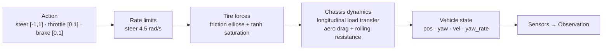

# Vehicle Dynamics

The simulator's vehicle is a **single-track (bicycle) dynamic model**
implemented in `sim_core/vehicle/` — lateral forces aggregated per axle
with a saturating tire model, longitudinal load transfer, aero drag, and a
kinematic↔dynamic blend at low speed. All units are SI.

> Terminology note: the code comments mention "4-wheel tire slip" but the
> implementation aggregates forces per axle (single-track model). Lateral
> load transfer is intentionally omitted.

## Data flow



### Tire model — friction ellipse + saturation

Each axle's lateral capacity is what's left after the longitudinal force
consumes grip:

```
u        = Fx_clamped / (µ · Fz)
lat_cap  = µ · Fz · sqrt(1 - u²)
Fy       = -lat_cap · tanh(Cα · α / max(1, cap))
```

So hard acceleration or braking *reduces* available cornering force —
combined-slip behavior without a full Pacejka implementation. Rear
cornering stiffness exceeds front by default → mild understeer.

### Longitudinal model

- Drive force tapers linearly to zero at `top_speed` (45 m/s ≈ 162 km/h).
- Brake force opposes velocity; below |vx| < 0.05 m/s the car is stopped;
  anti-creep zeroes velocity when `brake > 0.1` and |vx| < 0.1.
- Aero drag `F = ½·ρ·Cd·A·v·|v|`, rolling resistance `F = Crr·m·g`
  (deadband ±0.05 m/s).
- Longitudinal load transfer `ΔFz = m·ax·h_cog / wheelbase`, clamped to
  ±90 % of static axle load.
- Weight distribution `drive_force_front_fraction`: 0 = RWD (default),
  1 = FWD, 0.5 = AWD; `brake_bias_front` splits brake force.

### Low-speed blending

Below `low_speed_threshold` (1.5 m/s) the model blends toward a kinematic
bicycle (`yaw_rate = vx·tanδ / wheelbase`) via bounded relaxation with
time constant `low_speed_relax_tau` (0.05 s). This keeps parking-lot
behavior sane where slip angles are ill-defined.

### Integration & determinism

Fixed `dt = 1/60 s`; each step runs `physics_substeps` (default 4)
explicit-Euler substeps → **240 Hz physics**. Control inputs are held
constant across substeps. All randomness flows through a seeded
`np.random.default_rng` — a given seed reproduces an episode exactly.

### Collision

The vehicle is an `OBB2D` (`length × width` at `yaw`) tested with SAT
against track boundary segments (→ `collider_type="boundary_barrier"`)
and collidable entity OBBs (→ `"obstacle"`). A spatial-hash broadphase
(12 m cells) culls candidate segments — measured 2.3–5.8× speedup on
real tracks ([benchmarks](../../benchmarks/broadphase_results.json)).
There is no vehicle-vehicle collision.

## Parameters (`vehicle_config` in `.sim.json`)

| Field | Type | Default | Unit | Effect |
|---|---|---|---|---|
| `mass` | float | 1200.0 | kg | Vehicle mass (DR-multipliable) |
| `length` | float | 4.2 | m | OBB half-length = L/2 |
| `width` | float | 1.8 | m | OBB half-width = W/2 |
| `height` | float | 1.4 | m | Visual only |
| `wheelbase` | float | 2.6 | m | Axle distance — steering geometry, load transfer |
| `track_width` | float | 1.5 | m | Wheel transforms only |
| `cog_height` | float | 0.45 | m | CG height — longitudinal load transfer |
| `weight_dist_front` | float | 0.52 | [0–1] | Mass fraction on front axle |
| `wheel_radius` | float | 0.34 | m | Wheel visuals |
| `yaw_inertia` | float | 0.0 | kg·m² | `0` = auto `Iz = mass·a·b` |
| `max_steering_angle` | float | 0.58 | rad (~33°) | Road-wheel steering limit |
| `steering_rate` | float | 4.5 | rad/s | Road-wheel rate limit |
| `max_drive_force` | float | 6500.0 | N | Tire drive force at contact |
| `max_brake_force` | float | 9000.0 | N | Total brake force |
| `top_speed` | float | 45.0 | m/s | Linear power taper endpoint |
| `reverse_max_speed` | float | 10.0 | m/s | **Declared, unused** |
| `drive_force_front_fraction` | float | 0.0 | [0–1] | RWD 0 · AWD 0.5 · FWD 1 |
| `brake_bias_front` | float | 0.65 | fraction | Brake split |
| `drag_coeff` | float | 0.32 | Cd | Aero drag |
| `frontal_area` | float | 2.1 | m² | Aero drag |
| `air_density` | float | 1.225 | kg/m³ | Aero drag |
| `rolling_resistance` | float | 0.015 | — | `F = Crr·m·g` |
| `tire_friction` | float | 1.0 | µ mult | `µ = tire_friction × surface_friction` |
| `cornering_stiffness_front` | float | 80000.0 | N/rad | Front axle Cα |
| `cornering_stiffness_rear` | float | 85000.0 | N/rad | Rear axle Cα |
| `physics_substeps` | int | 4 | — | 60 Hz env → 240 Hz physics |
| `low_speed_threshold` | float | 1.5 | m/s | Kinematic blend below this |
| `low_speed_relax_tau` | float | 0.05 | s | Blend time constant |

`yaw_inertia = 0` auto-computes `Iz = mass·a·b` where `a`/`b` are CG
distances to the axles.

## What is not modeled

- `reverse_max_speed`, per-control-point `friction`/`banking` —
  serialized but not consumed by the model.
- Pitch and roll are state fields but are never integrated — always 0.
- Lateral load transfer, handbrake input, suspension, tire temperature,
  drivetrain/transmission model.

## Validation

The vehicle model has a maneuver-level validation bench — the
**DYNAMICS** workspace tab runs `tools/vehicle_dynamics` at fixed
`dt = 1/60 s` over maneuvers (`straight_line`, `constant_steer`,
`steer_step`, `steer_ramp`, `sine_steer`, `steer_reversal`,
`steer_escalation`, `braking`, `lane_change`, `lateral_disturbance`) at
10/20/30 m/s, reporting 14 metrics (sideslip, yaw rates, ax/ay, slip
angles, tire forces, curvature, lateral drift) with A/B compare and
export. `tests/test_vehicle_physics.py` and
`tests/test_vehicle_dynamics_validation.py` cover the model
programmatically.


> The DYNAMICS tab currently uses the **default** `VehicleConfig`, not
> the project's — it's a model bench, not a per-track tuner.

This is a research-grade model, not a certified dynamics simulator —
tune it via `vehicle_config` and validate with the maneuver suite before
trusting quantitative results.

## Configuring

`vehicle_config` lives inside the `.sim.json` project file (see
[Project Schema](../configuration/project-schema.md)). The inspector
does not yet expose vehicle-parameter editing — change values in the
file, or construct `VehicleConfig` programmatically.

## See also

- [Sensors](../sensors/sensors.md) · [RL Overview](../reinforcement-learning/rl-overview.md)
- [Performance](../performance/performance.md) · [Troubleshooting](../troubleshooting/troubleshooting.md)
